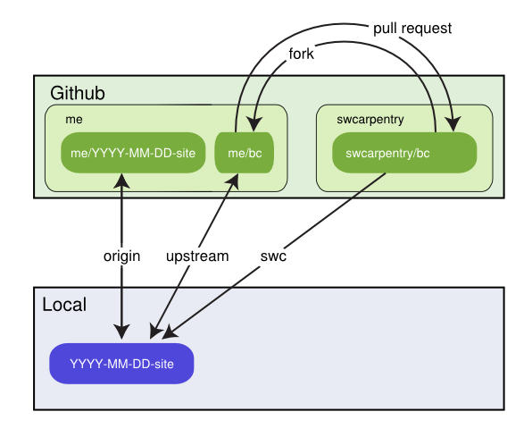

Contributing Boot Camp Material
===============================

Software Carpentry is an open source/open access project, and we
welcome contributions of all kinds.  By contributing, you are agreeing
that Software Carpentry may redistribute your work under
[these licenses][licenses].  Please see [this page][creators] for
a list of contributors to date.

Basic Instructions
------------------

We welcome improvements to the main `swcarpentry/bc` repository, which is used
as the template repository for new bootcamps. New and/or improved lesson
materials are particularly welcome.

Basic instructions for contributing are below. Before beginning this workflow,
we recommend that you open an issue in the `swcarpentry/bc` Issue Tracker to
get feedback on your ideas and coordinate with other developers.

1.  Fork the `swcarpentry/bc` repository on GitHub.

2.  If you are beginning from a local `YYYY-MM-DD-site` repository
    (for example, from a bootcamp that you taught), make your fork of
    `bc` a remote named "upstream" within this repo using:

        git remote add upstream https://github.com/<me>/bc.git

    (replacing 'me' with your GitHub username)

    

    If you do not wish to start with a `YYYY-MM-DD-site` repository
    copy, clone a local copy of your `bc` fork and replace all
    instances of `upstream` in the instructions below with `origin`.

3.  If you have not done so already, add the main `swcarpentry/bc` repository
    as a remote named "swcarpentry":

        git remote add swcarpentry https://github.com/swcarpentry/bc.git

4.  Isolate the changes you want to share in a branch and push them to your
    fork on Github. If you are making new changes, replace the `git
    cherry-pick` line below with your various `git commit` commands.

        git fetch swcarpentry
        git checkout -b improvements swcarpentry/master
        git cherry-pick <commits related to improvements on your bootcamp's gh-pages branch>
        git push upstream improvements

    The `gh-pages` branch in the `swcarpentry/bc` repository is currently being
    used as the production branch that provides the template for bootcamp
    teaching materials, while the `master` branch is currently being used for
    development and integration and may contain incomplete materials. In
    general, you should use `master` as the starting point for your
    `improvements` branch, although you may also use `gh-pages` for fully
    complete changes or new materials that should be introduced immediately
    into the teaching curriculum.

5.  Send a pull request to the `master` or `gh-pages` branch of
    `swcarpentry/bc` on GitHub.

If it is easier for you to send them to us some other way, please mail us at
[admin@software-carpentry.org](mailto:admin@software-carpentry.org).

More Information
----------------

Software Carpentry uses a development workflow similar to that of many
other open source projects.  For a graphical introduction to feature
branches as we use them, see GitHub's [workflow
guide][github-workflow].  For more information about getting started
with Git, see [our Git lesson][git-lesson].

[github-workflow]: http://guides.github.com/overviews/flow/
[git-lesson]: ./git/novice/index.md
[creators]: http://software-carpentry.org/badges/creator.html
[licenses]: http://software-carpentry.org/license.html
