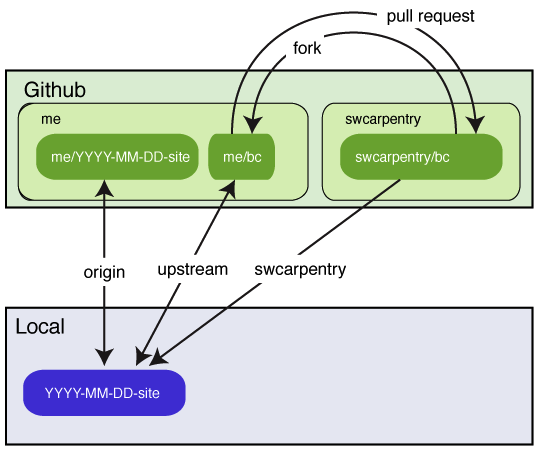

Software Carpentry Bootcamps
============================

This repository's `gh-pages` branch is the starting point for a bootcamp website.
It contains a template for your bootcamp's home page,
and the shared lesson materials we have developed.
The sections below explain how GitHub turns a repository into a web site,
how you can build a website for your bootcamp using this repo as a starting point,
what lessons we have,
where they're located,
and how you can incorporate them into your teaching.
Please submit corrections or additions as pull requests,
bug reports,
or by email to admin@software-carpentry.org.

**Note:**
If you are teaching Git in your bootcamp,
you should create *two* repositories:
one for your bootcamp's website,
and one for learners to clone and update during your lessons.
You should not try to use the same repo for both purposes because:

1.  your website repo is probably going to be fairly large, and
2.  you really don't want a learner accidentally overwriting your lessons
    while you're trying to teach.

Background
----------

There are a few things you need to know
in order to understand why we do things the way we do.
Most of them are specific to GitHub,
rather than Git itself.

1.  Git uses the term "clone" to mean
    "a copy of a repository".
    GitHub uses the term "fork" to mean,
    "a copy of a GitHub-hosted repo that is also hosted on GitHub",
    and the term "clone" to mean
    "a copy of a GitHub-hosted repo that's located on someone else's machine".
    In both cases,
    the duplicate has a remote called `origin`
    that points to the original repo;
    other remotes can be added manually.

2.  A user on GitHub can only have one fork of a particular repo.
    This is a problem for us because
    an instructor may be involved in several bootcamps,
    each of which has its own website repo.
    Those website repositories ought to be forks of this one,
    but GitHub since doesn't allow that,
    we've had to find a workaround.

3.  If a repository has a branch called `gh-pages`
    (which stands for "GitHub pages"),
    then GitHub uses the HTML and Markdown files in that branch
    to create a website for the repository.
    If the repository's URL is http://github.com/darwin/finches,
    the URL for the website is http://darwin.github.io/finches.
    HTML files and images are simply copied over;
    Markdown files are translated into HTML for copying.

4.  If an HTML or Markdown file has a header consisting of three dashes,
    some data about the page,
    and three more dashes,
    then GitHub doesn't just copy the file over verbatim.
    Instead,
    it runs the file through a translator called Jekyll
    that looks for specially-formatted commands embedded in the file.
    One of these commands is ``,
    which tells Jekyll to copy the contents of `somefile.html` into the file being translated;
    this is used to create standard headers and footers for pages.
    Another command is `{{variable}}`,
    which Jekyll replaces with the value of variable;
    this is used to insert things like a contact email address and the URL for our Twitter account.

5.  Jekyll gets variables from two places:
    a file called `_config.yml` located in the repo's root directory,
    and the header of each individual page.
    Variables from `_config.yml` are put in an object called `site`,
    and referred to as `site.variable`,
    so `{{site.twitter_name}}` in a page is replaced by `@swcarpentry`.
    Variables from the page's header are put in an object called `page`,
    and referred to as `page.variable`,
    so if a page's header defines a variable called `venue`,
    `{{page.venue}}` is replaced by "Euphoric State University"
    (or whatever value the variable has).

6.  If a page uses `` to include a snippet of HTML,
    Jekyll looks in a directory called `_includes` to find `something.html`.
    It always looks there,
    and nowhere else,
    so anything we want people to be able to include in their pages
    has to be stored in `_includes`
    (or in a directory within `_includes`).

7.  A repo can have another special directory called `_layouts`.
    If a page like `index.html` has a variable called `layout`,
    and that variable's value is `standard.html`,
    Jekyll loads the file `_layouts/standard.html`
    and copies the content of `index.html` into it,
    then expands the result.
    This is used to give the pages in a site a uniform appearance.

We have created two standard layouts for bootcamp pages.
The first, `bootcamp.html`,
is used for bootcamps' home pages:
it is the layout for the `index.html` page in your repo's root directory.
Its header defines several variables that *must* be present
in order for your bootcamp to be included in our main website.

The second layout,
`lesson.html`,
can be used to lay out pages for individual lessons.
You don't have to use it,
but all of the pages in this repo's `lessons` directory do.

Getting Started
---------------

To create a website for a new bootcamp:

1.  Create a [new repository on GitHub](https://github.com/new)
    with a name like YYYY-MM-DD-site, e.g., `2014-03-31-esu`.
    This repository must *not* be a fork of an existing repository
    (because as mentioned earlier,
    GitHub only allows a user to fork a repository once,
    but many instructors are involved in several bootcamps).
    Please use the same ID for your bootcamp
    that the Software Carpentry admins are using to identify it,
    i.e.,
    if the admins called the bootcamp `2014-03-31-esu`,
    please *don't* call your repo `euphoric-march-2014`.
2.  Clone this new repository to your local machine and `cd` into it.
    You can ignore the warning about cloning an empty repository:
    it won't stay empty long.


3.  Add the template repository `git@github.com:swcarpentry/bc.git` as a remote named `swcarpentry`:

        git remote add swcarpentry git@github.com:swcarpentry/bc.git


4.  Create a new branch in the local clone named `gh-pages`.

        git checkout -b gh-pages

5.  Pull content from the GitHub template repository into your desktop repository:

        git pull swcarpentry gh-pages

6.  Edit `index.html` to create the bootcamp home page (see below).
    Please double-check the information in the page's header (described below),
    as it is used to update the main website.
7.  Preview your changes (see below).
8.  (Optional) Delete these instructions from your bootcamp's `README.md` file
    and replace them with a paragraph describing your bootcamp.
9.  Push content to your YYYY-MM-DD-site repository:

        git push origin gh-pages

As soon as your repo has been pushed to GitHub, GitHub will render your pages
at the url:

    http://{your-github-username}.github.io/YYYY-MM-DD-site/

You may update your bootcamp's website whenever you want.

Previewing the Site
-------------------

To preview your bootcamp's page(s),
go into its root directory and run:

    make check

This will run `jekyll` to create the directory `./_site` with your rendered pages.
The `./_site/README.html` file this produces will not have any CSS styling applied:
GitHub will do that when the page is uploaded.
The `./_site/index.html` page,
on the other hand,
should have the Software Carpentry look and feel
and the information about your bootcamp.

You can also "preview" your pages by committing them to your repo
and then pushing to GitHub
so that GitHub does the translation.
If you do this,
be aware that it may take GitHub a couple of minutes to regenerate your web site,
and that you may need to clear your browser's cache
in order to display that page correctly.

**Note:**
you will need to install Jekyll 1.0.3 or later in order to preview things locally.
If you have Ruby installed on your computer,
this *should* be as simple as:

    gem install jekyll

We try to use the same MarkDown interpreters as GitHub does for
consistency.  On OS X, we suggest you use a recent Ruby to get access
to these.  If you don't have Homebrew or MacPorts installed, here's a
quick recipe to get started using HomeBrew.

```
ruby -e "$(curl -fsSL https://raw.github.com/mxcl/homebrew/go)"
brew install ruby
gem install jekyll
gem install redcarpet 
```

Layout and Variables
--------------------

The `_layouts` directory contains two files:

*   `bootcamp.html`: the layout for bootcamp home pages.
    The material in your bootcamp's `index.html` is used
    to fill in the `{{content}}` section of this page.
*   `lesson.html`: a minimal page for previewing lesson content.

Your bootcamp's `index.html` page (which uses the `bootcamp.html` layout)
must define the following values in its YAML header:

*   `layout` must be `bootcamp`.
*   `root` is the path to the repository's root directory.
    This is '.' if the page is in the root directory,
    '..' if it is one directory down, and so on.
    If you create subdirectories for different rooms in your bootcamp,
    or for different lessons,
    set `root` accordingly.
*   `venue` is the name of the institution or group hosting the bootcamp.
*   `address` is the bootcamp venue's street address.
*   `country` must be a hyphenated country name like 'United-States'.  This
    is used to look up flags for display in the main web site; see the
    `assets/flags` directory in the `site` repo for a full list of valid names.
*   `latlng` is the latitude and longitude of the bootcamp site
    (so we can put a pin on our map).
*   `humandate` is the human-friendly dates for the bootcamp (e.g., July 3-4, 2015).
*   `startdate` is the bootcamp's starting date in YYYY-MM-DD format.
*   `enddate` is the bootcamp's ending date in the same format.
*   `registration` is `open` (if anyone is allowed to sign up)
    or `restricted` (if only some people are allowed to take part).
    Please do *not* put HTML or links in here to explain
    who's allowed to enrol or how to go about doing it;
    that should go in the main body of your page.
*   `instructor` is a comma-separated list of instructor names.
    This *must* be enclosed in square brackets, as in
    `["Alan Turing","Grace Hopper"]`,
    and there must *not* be spaces after the commas
    (really: believe it or not, they can cause translation to fail).
*   `contact` is the contact email address to use for your bootcamp.

Include Files
-------------

The `_includes` directory contains the following `.html` files:

*   `header.html`: material for the page's head.
*   `banner.html`: the generic banner with the Software Carpentry logo.
*   `footer.html`: the generic footer with links to Software Carpentry's web presence.
*   `javascript.html`: JQuery and Bootstrap Javascript.

You normally won't need to worry about these:
they're included by `bootcamp.html` and `lesson.html`.

`_includes/bootcamps` also contains short pieces of standard text
that can be included in bootcamp pages using ``:

*   `what.html`: what bootcamps are.
*   `who.html`: our intended audience
*   `instructors.html`: creates a list of instructors' names.
*   `python.html`: a brief point-form syllabus for a bootcamp using Python.
*   `r.html`: a brief point-form syllabus for a bootcamp using R.
*   `requirements.html`: what people need to bring.
*   `contact.html`: how to reach the organizers.

If the information for your bootcamp is different,
you can either modify these files
or just copy their contents directly into your `index.html` page.

Instructors and Sponsors
------------------------

The `_includes` directory also contains directories called `people` and `orgs`
which hold short descriptions of people involved in Software Carpentry
and our financial sponsors respectively.
You can use `` to include these in your bootcamp home page;
they refer to head shots and logos in `img/people` and `img/orgs`,
and these should be included automatically.
Please send additions to the Software Carpentry administrators.

Lesson Material
---------------

Finally and most importantly,
`_includes` contains lesson material
that you can incorporate into your pages using ``.
Each lesson's material is in its own subdirectory:
for example,
the `guide-shell` lesson is the instructors' guide to the Unix shell,
and contains:

*   `instructors.html`: instructors' notes.
*   `opening.html`: opening motivational story.
*   `prereq.html`: discussion of pre-requisites.
*   `reference.html`: a cheat sheet for the subject.
*   `summary.html`: closing summary of the entire lesson.

It also contain subdirectories for various topics,
each of which has:

*   `title.md`: the topic title
*   `objectives.html`: the topic's learning objectives
*   `lesson.html`: a long-form prose version of the lesson
*   `summary.html`: the key points of the lesson
*   `challenges.html`: includes all the topic's challenge questions
*   `challenges/some-title.html`: a single challenge question

The images that these files refer to have not yet been created;
feel free to send us pull requests :-).

Other Lesson Material
---------------------

Jekyll doesn't turn the files in `_includes` into web pages
unless they're included somewhere,
so we have created pages in a directory called `lessons` that do this.
We have also put two other kinds of lesson materials in this directory:

*   lessons built around IPython Notebooks, and
*   lessons imported wholesale from other sources.

The file `[lessons/index.html](lessons/index.html)`
lists all of the lessons we currently have,
and includes links to the main page for each.

Improving This Material
-----------------------

We welcome improvements to the master copy of the bootcamp template repository,
particularly new lesson material.
To send them to us as a pull request:

1.  Fork the `bc` repository on GitHub.
2.  Make that a remote named "upstream" of your local YYYY-MM-DD-site repository:

        git remote add upstream git@github.com:<me>/bc.git

(replacing 'me' with your GitHub username)



3.  Isolate the changes you want to share in a branch and push them to GitHub:

        git fetch swcarpentry
        git checkout -t swcarpentry/gh-pages -b improvements
        git cherry-pick <commits related to improvements on your gh-pages branch>
        git push upstream improvements

4.  Send a pull request to the master repository on GitHub.

If it is easier for you to send them to us some other way,
please mail us at admin@software-carpentry.org.

FAQ
---

*   *Where can I get help?*
    <br/>
    Mail us at admin@software-carpentry.org,
    or join our [discussion list](http://software-carpentry.org/contrib/discuss.html)
    and ask for help there.

*   *Why does the bootcamp repository have to be created from scratch? Why not fork `bc` on GitHub?*
    <br/>
    Because any particular user can only have one fork of a repository,
    but instructors frequently need to work on several bootcamps at once.

*   *Why are the lesson and topic files HTML instead of Markdown?*
    <br/>
    Primarily convenience---that's what Greg Wilson had in hand to convert.
    These may be converted to Markdown in future.
    (Help would be welcome.)

*   *Why do files like `lessons/db.html` include everything explicitly?*
    <br/>
    Because Jekyll does not support parameterized includes like:
    <br/>
    ``
    <br/>
    so we can't loop over a set of topics.

*   *Then why use Jekyll?  Why not some other markup language and some other converter?*
    <br/>
    Because they're the defaults on GitHub.
    If we're going to teach people to use that site,
    we should teach them to use it as it is,
    not as we wish it was.

*   *Where should pages go if multiple boot camps are running at a site simultaneously?*
    <br/>
    Use subdirectories like `2013-07-01-esu/beginners`,
    so that main directory names always follow our four-part convention.
