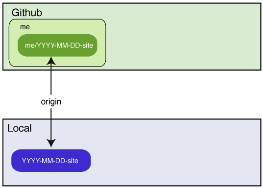
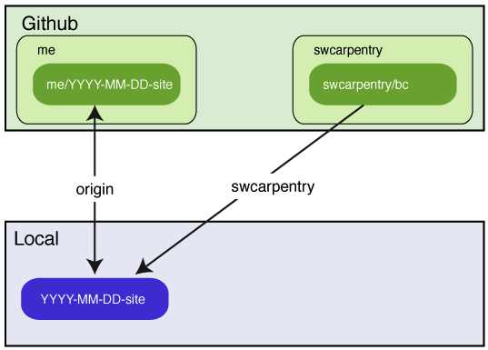

Software Carpentry Bootcamps
============================

This repository's `gh-pages` branch is the starting point for a bootcamp website:
it contains a template for your bootcamp's home page
and the shared lesson materials we have developed.
The sections below explain how GitHub turns a repository into a web site,
how you can build a website for your bootcamp using this repo as a starting point,
what lessons we have,
and where they're located.
To contribute corrections or additions to this repository, see the
[contribution guidelines](CONTRIBUTING.md).

**Note:**
If you are teaching Git in your bootcamp,
you should create *two* repositories:
one for your bootcamp's website,
and one for learners to clone and update during your lessons.
You should not try to use the same repo for both purposes because:

1.  your website repo is probably going to be fairly large, and
2.  you don't want a learner accidentally overwriting your lessons
    while you're trying to teach.


**Table of Contents**

[Background](#background)  
[Getting Started](#getting-started)  
[Previewing the Site](#previewing-the-site)  
[Layout and Variables](#layout-and-variables)  
[Include Files](#include-files)  
[Instructors and Sponsors](#instructors-and-sponsors)  
[Lesson Material](#lesson-material)  
[Other Lesson Material](#other-lesson-material)
[FAQ](#faq)

Background
----------

There are a few things you need to know
in order to understand why we do things the way we do.
Most of them are specific to GitHub,
rather than Git itself.

1.  Git uses the term "clone" to mean
    "a copy of a repository".
    GitHub uses the term "fork" to mean,
    "a copy of a GitHub-hosted repo that is also hosted on GitHub",
    and the term "clone" to mean
    "a copy of a GitHub-hosted repo that's located on someone else's machine".
    In both cases,
    the duplicate has a remote called `origin`
    that points to the original repo;
    other remotes can be added manually.

2.  A user on GitHub can only have one fork of a particular repo.
    This is a problem for us because
    an instructor may be involved in several bootcamps,
    each of which has its own website repo.
    Those website repositories ought to be forks of this one,
    but since GitHub doesn't allow that,
    we've had to find a workaround.

3.  If a repository has a file called `README.md` in its root directory,
    GitHub displays that file on the repository's home page.

4.  If a repository has a branch called `gh-pages`
    (which stands for "GitHub pages"),
    then GitHub uses the HTML and Markdown files in that branch
    to create a website for the repository.
    If the repository's URL is `http://github.com/darwin/finches`,
    the URL for the website is `http://darwin.github.io/finches`.

5.  If an HTML or Markdown file has a header consisting of three dashes,
    some data about the page,
    and three more dashes:

    ~~~
    ---
    key: value
    other_key: other_value
    ---
    Page Content
    ~~~

    then GitHub doesn't just copy the file over verbatim.
    Instead,
    it runs the file through a translator called Jekyll
    that looks for specially-formatted commands embedded in the file.

6.  Commands can be embedded in the body of a page.
    One is ``,
    which tells Jekyll to copy the contents of `somefile.html` into the file being translated;
    this is used to create standard headers and footers for pages.
    Another is `{{variable}}`:
    when Jekyll see this,
    it replaces it with the value of `variable`.
    This is used to insert things like a contact email address and the URL for our Twitter account.

7.  Jekyll gets variables from two places:
    a file called `_config.yml` located in the repo's root directory,
    and the header of each individual page.
    Variables from `_config.yml` are put in an object called `site`,
    and referred to as `site.variable`,
    so `{{site.twitter_name}}` in a page is replaced by `@swcarpentry`.
    Variables from the page's header are put in an object called `page`,
    and referred to as `page.variable`,
    so if a page's header defines a variable called `venue`,
    `{{page.venue}}` is replaced by "Euphoric State University"
    (or whatever value the variable has).

8.  If a page uses `` to include a snippet of HTML,
    Jekyll looks in a directory called `_includes` to find `something.html`.
    It always looks there,
    and nowhere else,
    so anything we want people to be able to include in their pages
    has to be stored in `_includes`.

9.  A repository can have another special directory called `_layouts`.
    If a page like `index.html` has a variable called `layout`,
    and that variable's value is `standard.html`,
    Jekyll loads the file `_layouts/standard.html`
    and copies the content of `index.html` into it,
    then expands the result.
    This is used to give the pages in a site a uniform appearance.

We have created three standard layouts for bootcamp pages:

*   `bootcamp.html` is used for bootcamps' home pages:
    it is the layout for the `index.html` page in your repo's root directory.
    Its header defines several variables (discussed below)
    that *must* be present in order for your bootcamp to be included in our main website.

*   `lesson.html` is used to lay out pages for individual lessons.
    You don't have to use it,
    but all of the pages in this repo's `lessons` directory do.

*   `slides.html` is used to format slideshows.
    It is still under development.

Getting Started
---------------

To create a website for a new bootcamp:

1.  Create a [new repository on GitHub](https://github.com/new)
    with a name like YYYY-MM-DD-site, e.g., `2014-03-31-esu`.
    This repository must *not* be a fork of an existing repository
    (because as mentioned earlier,
    GitHub only allows a user to fork a repository once,
    but many instructors are involved in several bootcamps).
    Please use the same ID for your bootcamp
    that the Software Carpentry admins are using to identify it
    (i.e.,
    if the admins called the bootcamp `2014-03-31-esu`,
    please *don't* call your repo `euphoric-march-2014`),
    and please use all lower-case
    (i.e., '2014-03-31-esu' instead of '2014-03-31-ESU').

2.  Clone this new repository to your local machine and `cd` into it.
    You can ignore the warning about cloning an empty repository:
    it won't stay empty long.



3.  Add the template repository `https://github.com/swcarpentry/bc.git` as a remote named `swc`:

    ~~~
    git remote add swc https://github.com/swcarpentry/bc.git
    ~~~



4.  Create a new branch in the local clone named `gh-pages`.

    ~~~
    git checkout -b gh-pages
    ~~~

5.  Pull content from the template repository's `gh-pages` branch into your desktop repository:

    ~~~
    git pull swc gh-pages
    ~~~

6.  Delete the `swc` remote so that you don't accidentally try
    to push your changes to the main `bc` repository:

    ~~~
    git remote rm swc
    ~~~

7.  Edit `index.html` to create the bootcamp home page (see below).
    Please double-check the information in the page's header (described below),
    as it is used to update the main website.

8.  Preview your changes (see below).

9.  Delete these instructions from your bootcamp's `README.md` file
    and replace them with a paragraph describing your bootcamp.

10. Push content to your YYYY-MM-DD-site repository:

    ~~~
    git push origin gh-pages
    ~~~

As soon as your repo has been pushed to GitHub, GitHub will render your pages
at the url:

~~~
http://{your-github-username}.github.io/YYYY-MM-DD-site/
~~~

You may update your bootcamp's website whenever you want.

Previewing the Site
-------------------

To preview your bootcamp's page(s),
go into its root directory and run:

~~~
make quick
~~~

This will run `jekyll` to create the directory `./_site`;
the `index.html` page in this directory
should have the Software Carpentry look and feel
and the information about your bootcamp.

**Note:**
you will need to install Jekyll 1.0.3 or later in order to preview things locally.
If you have Ruby installed on your computer,
this *should* be as simple as:

~~~
gem install github-pages
~~~

or if that doesn't work:

~~~
gem install jekyll
gem install kramdown
~~~

(We use Kramdown for translating Markdown instead of the default
Redcarpet because Kramdown will handle Markdown inside HTML blocks).
On OS X, we suggest you use a recent Ruby to get access to these.  If
you don't have Homebrew or MacPorts installed, here's a quick recipe
to get started using HomeBrew.

```
ruby -e "$(curl -fsSL https://raw.github.com/mxcl/homebrew/go)"
brew install ruby
```

and then `gem install` as above.  If you don't have `make` in your
machine, you can build the preview with:

~~~
jekyll -t build -d _site
~~~

or run:

~~~
make quick
~~~

which executes the same command.

Variables
---------

Your bootcamp's `index.html` page
(which uses the `bootcamp.html` layout from the `_layouts` directory)
*must* define the following values in its YAML header:

*   `layout` must be `bootcamp`.
*   `root` is the path to the repository's root directory.
    This is '.' if the page is in the root directory
    (which `index.html` is),
    '..' if it is one directory down, and so on.
    If you create subdirectories for different rooms in your bootcamp,
    or for different lessons,
    set `root` accordingly.
*   `venue` is the name of the institution or group hosting the bootcamp.
*   `address` is the bootcamp venue's street address.
*   `country` must be a hyphenated country name like 'United-States'.  This
    is used to look up flags for display in the main web site; see the
    `assets/flags` directory in the `site` repo for a full list of valid names.
*   `latlng` is the latitude and longitude of the bootcamp site
    (so we can put a pin on our map).
*   `humandate` is the human-friendly dates for the bootcamp (e.g., Jul 3-4, 2015).
    Please use three- or four-letter month names and abbreviations
    (e.g., `Dec` instead of `December`).
*   `startdate` is the bootcamp's starting date in YYYY-MM-DD format.
*   `enddate` is the bootcamp's ending date in the same format.
    If your bootcamp is only one day long,
    this field can be deleted.
*   `registration` is `open` (if anyone is allowed to sign up)
    or `restricted` (if only some people are allowed to take part).
    Please do *not* put HTML or links in here to explain
    who's allowed to enrol or how to go about doing it;
    that should go in the main body of your page.
*   `instructor` is a comma-separated list of instructor names.
    This *must* be enclosed in square brackets, as in
    `["Alan Turing","Grace Hopper"]`
*   `contact` is the contact email address to use for your bootcamp.

The header may optionally define the following:

*   `eventbrite` is the multi-digit Eventbrite registration key.
    If you are using something else for registration,
    it may be deleted.
    If you are using Eventbrite,
    the admins will set this key for you.

Include Files
-------------

The `_includes` directory contains the following `.html` files:

*   `header.html`: material for the page's head.
*   `banner.html`: the generic banner with the Software Carpentry logo.
*   `footer.html`: the generic footer with links to Software Carpentry's web presence.
*   `javascript.html`: JQuery and Bootstrap Javascript.
*   `setup.html`: common setup instructions.

You normally won't need to worry about the first four ---
they're included in the right places by our standard layouts ---
but you may want to edit the fifth,
or inline it in `index.html`.

Page Content
------------

The body of `index.html` contains
an explanation of what a bootcamp is and how it runs,
followed by setup instructions for our standard software.
Reorganize, rewrite, or delete this material as you think best.

Lesson Material
---------------

*   Our old lesson material
    is in the `lessons` directory.
    We plan to retire it in Spring 2014,
*   The new material for novices is in the directories under `novice`.
    The shell and Git materials are written in Markdown,
    while the Python and SQL use the IPython Notebook.
*   New material for intermediate learners is currently under development
    in directories under `intermediate`.

Site Map
--------

The most important files and directories are **highlighted**.

*   CITATION - how to cite Software Carpentry.
*   CONTRIBUTING.md - how to contribute new material.
*   LICENSE.md - our license.
*   Makefile - rebuild this site (type `make` on its own for a list of targets).
*   README.md - how to use this site.
*   bib.md - bibliography.
*   contents.md - site map used in place of `index.html` on the main web site.
*   etherpad.txt - starter text for the bootcamp's Etherpad.
*   **gloss.md** - glossary of terms.
*   **index.html** - template for bootcamp home pages.
*   intro.md - introduction to book version of this site.
*   rules.md - the rules of programming (used in the book version of this site).
*   **team.md** - who we are.
*   _config.yml - Jekyll configuration directives.
*   _includes/ - snippets of HTML that can be included in other files by Jekyll.
*   _layouts/ - Jekyll page layouts.
*   **_site/** - output directory (created when building the site locally).
*   _templates/ - template files for Pandoc conversion of IPython Notebooks.
*   bin/ - miscellaneous tools used in building the site.
*   branding/ - graphical assets related to Software Carpentry.
*   css/ - CSS files for this site.
*   data/ - miscellaneous data files used by examples.
*   img/ - images used throughout this site.
*   **intermediate/** - intermediate lesson material (under development).
*   js/ - Javascript files used in this site.
*   **lessons/** - old lesson material.
*   **novice/** - novice lesson material.
*   setup/ - setup tools for installing bootcamp software.
*   setup.md - setup instructions for software used in bootcamps.
*   slides/ - slideshows (under construction).

FAQ
---

*   *Where can I get help?*
    <br/>
    Mail us at [admin@software-carpentry.org](mailto:admin@software-carpentry.org),
    or join our [discussion list](http://software-carpentry.org/contrib/discuss.html)
    and ask for help there.

*   *Why does the bootcamp repository have to be created from scratch? Why not fork `bc` on GitHub?*
    <br/>
    Because any particular user can only have one fork of a repository,
    but instructors frequently need to work on several bootcamps at once.

*   *Why use Jekyll?  Why not some other markup language and some other converter?*
    <br/>
    Because it's the default on GitHub.
    If we're going to teach people to use that site,
    we should teach them to use it as it is,
    not as we wish it was.

*   *Why does `make site` take so long?*
    <br/>
    On a MacBook Air with pandoc 1.11.1 and Jekyll 1.3.0,
    making the site from scratch takes approximately 24 seconds,
    half of which is spent converting IPython Notebooks.
    Some other versions of Pandoc take much longer to translate our files,
    possibly because we are nesting Markdown inside `div` elements.
    We are investigating...

*   *What do I do if I see a `invalid byte sequence in ...` error when I run `make check`?*
    <br/>
    Declare the `en_US.UTF-8` locale in your shell:

    ~~~
    export LC_ALL=en_US.UTF-8
    export LANG=en_US.UTF-8
    ~~~

*   *What do I do if I see a `Conversion error` when I run `make check`?*
    <br/>
    The error message may look something like this:

    ~~~
    Configuration file: d:/OpenCourses/swc/2013-10-17-round6.4/_config.yml
            Source: d:/OpenCourses/swc/2013-10-17-round6.4
       Destination: _site
      Generating... c:/Ruby193/lib/ruby/gems/1.9.1/gems/posix-spawn-0.3.6/lib/posix/spawn.rb:162: wa
    rning: cannot close fd before spawn
    Conversion error: There was an error converting 'lessons/misc-biopython/fastq.md'.
    done.
    ~~~
        
    This is a [problem in Pygments.rb](http://stackoverflow.com/questions/17364028/jekyll-on-windows-pygments-not-working)
    Uninstall pygments.rb 0.5.1 or 0.5.2, install 0.5.0.  For example, here's how you would
    uninstall pygments 0.5.2 and restore version 0.5.0:

    ~~~    
    gem uninstall pygments.rb --version "=0.5.2"
    gem install pygments.rb --version "=0.5.0"
    ~~~

*   *What do I do if I see a `File not found: u'nbconvert'` when I run `make check`?*
    <br/>
    The output of `make check` looks like this:

    ~~~    
    WARNING: Unrecognized alias: 'output', it will probably have no effect.[TerminalIPythonApp] File not found: u'nbconvert'
    cp tmp/python/novice/01-numpy.html _site/python/novice/01-numpy.html
    cp: cannot stat ‘tmp/python/novice/01-numpy.html’: No such file or directory
    ~~~
    
    This means you don't have a recent enough version of IPython (below 1.0) and you should install a newer version.
    Installing a local version can be done with:
    
    ~~~
    pip install --upgrade --user ipython
    ~~~

    You might need `pip` that can be installed (under Ubuntu and alike) with:

    ~~~
    sudo apt-get install python-pip
    ~~~

*   *What if I get some missing packages messages when I run `make check`?*
    <br/>
    Some additional packages are required. They can be installed (under Ubuntu and alike) with:
    
    ~~~
    sudo apt-get install pandoc
    ~~~

*   *Where should pages go if multiple boot camps are running at a site simultaneously?*
    <br/>
    Use subdirectories like `2013-07-01-esu/beginners`,
    so that main directory names always follow our four-part convention.

