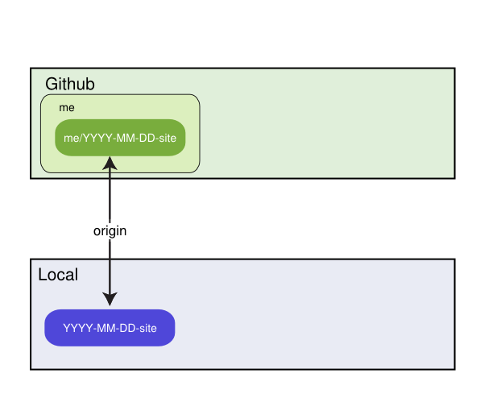
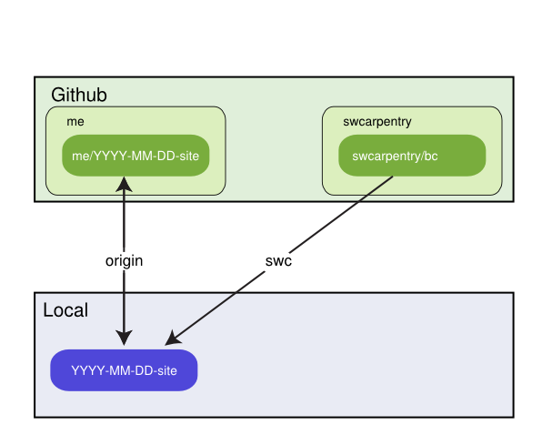

Software Carpentry Boot Camps
=============================

This repository's `gh-pages` branch is the starting point for a boot camp website.
You should *not* use this to create the repository students clone for exercises when learning Git:
that should be created from scratch.

Getting Started
---------------

To create a website for a new boot camp:

1.  Create a [new repository on GitHub](https://github.com/new)
    with a name like YYYY-MM-DD-site, e.g., `2014-03-31-ehu`.
    This repository must *not* be a fork of an existing repository.
2.  Clone this new repository to your local machine and `cd` into it. You can
    ignore the warning about cloning an empty repository, it won't stay empty
    long.

3.  Add the template repository `git@github.com:swcarpentry/bc.git` as a remote named `swcarpentry`.

        git remote add swcarpentry git@github.com:swcarpentry/bc.git

4.  Create a new branch in the local clone named `gh-pages`.

        git checkout -b gh-pages

5.  Pull content from the GitHub template repository:

        git pull swcarpentry gh-pages

6.  Edit `index.html` to create the boot camp home page (see below).
    Please double-check the information in the page's header (described below),
    as it is used to update the main website.
7.  Preview your changes (see below).
8.  Push content to your YYYY-MM-DD-site repository:

        git push origin gh-pages

As soon as your repo has been pushed to GitHub, GitHub will render your pages
at the url:

    http://{your-github-username}.github.io/YYYY-MM-DD-site/

You may update your boot camp's website whenever you want.

Previewing the Site
-------------------

To preview your boot camp's page(s),
go into its root directory and run:

    make check

This will run `jekyll` to create the directory `./_site` with your rendered pages.
The `./_site/README.html` file this produces will not have any CSS styling applied:
GitHub will do that when the page is uploaded.
The `./_site/index.html` page, on the other hand, should have the Software Carpentry look and feel.

Layout and Variables
--------------------

The `_layouts` directory contains two files:

*   `bootcamp.html`: the layout for bootcamp home pages.
    The material in your bootcamp's `index.html` will be used
    to fill in the {{content}} section of this page.
*   `lesson.html`: a minimal page for previewing lesson content.

Your bootcamp's `index.html` page (which uses the `bootcamp.html` layout)
must define the following values in its YAML header:

*   `layout` *must* be `bootcamp`.
*   `root` is the path to the repository's root directory (i.e., '.').
    If you create subdirectories for different rooms in your bootcamp,
    or for different lessons,
    set `root` accordingly.
*   `venue` is the name of the institution or group hosting the bootcamp.
*   `address` is the bootcamp venue's street address.
*   `country` must be a hyphenated country name like 'United-States'.  See
    the `assets/flags` directory in the `site` repo for a full list of
    valid names.
*   `latlng` is the latitude and longitude of the bootcamp site
    (so we can put a pin on our map).
*   `humandate` is the human-friendly dates for the bootcamp (e.g., July 3-4, 2015).
*   `startdate` is the bootcamp's starting date in YYYY-MM-DD format.
*   `enddate` is the bootcamp's ending date in the same format.
*   `registration` is `open` (if anyone is allowed to sign up)
    or `restricted` (if only some people are allowed to take part).
*   `instructor` is a comma-separated list of instructor names.
    This *must* be enclosed in square brackets, as in
    `["Alan Turing", "Grace Hopper"]`.
*   `contact` is the contact email address to use for your bootcamp.

Include Files
-------------

The `_includes` directory contains the following `.html` files:

*   `header.html`: material for the page's head.
*   `banner.html`: the generic banner with the Software Carpentry logo.
*   `footer.html`: the generic footer with links to Software Carpentry's web presence.
*   `javascript.html`: JQuery and Bootstrap Javascript.

The `_includes/bootcamps` directory contains short pieces of standard text
that can be included in boot camp pages using ``:

*   `what.html`: what boot camps are.
*   `who.html`: our intended audience
*   `instructors.html`: creates a list of instructors' names.
*   `python.html`: a brief point-form syllabus for a boot camp using Python.
*   `r.html`: a brief point-form syllabus for a boot camp using R.
*   `requirements.html`: what people need to bring.
*   `contact.html`: how to reach the organizers.

Instructors and Sponsors
------------------------

The `_includes` directory also contains directories called `people` and `orgs`
which hold short descriptions of people involved in Software Carpentry
and our financial sponsors respectively.
You can use  to include these in your bootcamp home page;
they refer to head shots and logos in `img/people` and `img/orgs`,
and these should be included automatically.
Please send additions to the Software Carpentry administrators.

Lesson Material
---------------

Finally,
`_includes` contains lesson material
that you can incorporate into your pages using ``.
Each lesson's material is in its own subdirectory,
and the file `lessons/index.html` describes each.
For example,
the `guide-shell`lesson is the instructors' guide to the Unix shell,
and contains:

*   `instructors.html`: instructors' notes.
*   `opening.html`: opening motivational story.
*   `prereq.html`: discussion of pre-requisites.
*   `reference.html`: a cheat sheet for the subject.
*   `summary.html`: closing summary of the entire lesson.

It also contain subdirectories for various topics,
each of which has:

*   `title.md`: the topic title
*   `objectives.html`: the topic's learning objectives
*   `lesson.html`: a long-form prose version of the lesson
*   `summary.html`: the key points of the lesson
*   `challenges.html`: includes all the topic's challenge questions
*   `challenges/some-title.html`: a single challenge question

The images that these files refer to have not yet been created.

Improving This Material
-----------------------

We welcome improvements to the master copy of the boot camp template
repository, particularly new lesson material. It will be easiest if you make
improvements you intend to share in their own commits, separate from commits
specific to your bootcamp.

To send them to us:

1.  Fork the `bc` repository on GitHub.
2.  Make that a remote named "upstream" of your local YYYY-MM-DD-site repository.

        git remote add upstream git@github.com:<me>/bc.git

(replace 'me' with your GitHub username)

3.  Isolate the changes you want to share in a branch and push them
    to GitHub.

        git fetch swcarpentry
        git checkout -t swcarpentry/gh-pages -b improvements
        git cherry-pick <commits related to improvements on your gh-pages branch>
        git push upstream improvements

4.  Send a pull request (PR) to the master repository on GitHub.

FAQ
---

*   *Why does the bootcamp repository have to be created from scratch? Why not fork `bc` on GitHub?*
     
    Because any particular user can only have one fork of a repository,
    but instructors frequently need to work on several bootcamps at once.

*   *Why are the lesson and topic files HTML instead of Markdown?*
     
    Primarily convenience---that's what Greg Wilson had in hand to convert.
    These may be converted to Markdown in future.

*   *Why do files like `lessons/db.html` include everything explicitly?*
     
    Because Liquid does not support parameterized includes like:
     
    ``
     
    so we can't loop over a set of topics.

*   *Then why use Liquid and Jekyll?  Why not \[some other markup language\] and \[some other converter\]?*
     
    Because they're the defaults on the site we're encouraging our learners to use.

*   *Where should pages go if multiple boot camps are running at a site simultaneously?*
     
    Use subdirectories like `2013-07-01-euphoric/beginners`,
    so that main directory names always follow our four-part convention.
