# Data visualization with ggplot2


## Review

Remember an earlier lesson where we introduced basic plotting commands using built-in data and base plotting tools. For example, we made a few plots using Edgar Anderson's famous iris dataset, which measured petal and sepal length and width for several different species of flower.


```coffee
# Load some data and look at the first few lines
data(iris)
head(iris)
```

```
##   Sepal.Length Sepal.Width Petal.Length Petal.Width Species
## 1          5.1         3.5          1.4         0.2  setosa
## 2          4.9         3.0          1.4         0.2  setosa
## 3          4.7         3.2          1.3         0.2  setosa
## 4          4.6         3.1          1.5         0.2  setosa
## 5          5.0         3.6          1.4         0.2  setosa
## 6          5.4         3.9          1.7         0.4  setosa
```

```coffee
# Make a basic scatter plot
with(iris, plot(Sepal.Length, Petal.Length))
```

 

When we call `plot` in this way, we are using built-in, or **base** graphics. R's base graphics are powerful and nearly infinitely customizable. 

## ggplot2 

### The Diamonds dataset

Now let's look at a bigger dataset. We're going to be using a data visualization package called **ggplot2** for drawing the plots, and the **ggplot2** package comes with some data we're going to use for this example. 

Recall how to install and load packages. Install the package if you haven't already:


```coffee
# Only need to do this once
install.packages("ggplot2")
```

Then load it:


```coffee
library(ggplot2)
```

Now let's load the diamonds dataset and take a look at the first few rows and it's structure with commands we learned previously. To learn more about this dataset you can also run `?diamonds`. 


```coffee
data(diamonds)
head(diamonds)
```

```
##   carat       cut color clarity depth table price    x    y    z
## 1  0.23     Ideal     E     SI2  61.5    55   326 3.95 3.98 2.43
## 2  0.21   Premium     E     SI1  59.8    61   326 3.89 3.84 2.31
## 3  0.23      Good     E     VS1  56.9    65   327 4.05 4.07 2.31
## 4  0.29   Premium     I     VS2  62.4    58   334 4.20 4.23 2.63
## 5  0.31      Good     J     SI2  63.3    58   335 4.34 4.35 2.75
## 6  0.24 Very Good     J    VVS2  62.8    57   336 3.94 3.96 2.48
```

```coffee
str(diamonds)
```

```
## 'data.frame':	53940 obs. of  10 variables:
##  $ carat  : num  0.23 0.21 0.23 0.29 0.31 0.24 0.24 0.26 0.22 0.23 ...
##  $ cut    : Ord.factor w/ 5 levels "Fair"<"Good"<..: 5 4 2 4 2 3 3 3 1 3 ...
##  $ color  : Ord.factor w/ 7 levels "D"<"E"<"F"<"G"<..: 2 2 2 6 7 7 6 5 2 5 ...
##  $ clarity: Ord.factor w/ 8 levels "I1"<"SI2"<"SI1"<..: 2 3 5 4 2 6 7 3 4 5 ...
##  $ depth  : num  61.5 59.8 56.9 62.4 63.3 62.8 62.3 61.9 65.1 59.4 ...
##  $ table  : num  55 61 65 58 58 57 57 55 61 61 ...
##  $ price  : int  326 326 327 334 335 336 336 337 337 338 ...
##  $ x      : num  3.95 3.89 4.05 4.2 4.34 3.94 3.95 4.07 3.87 4 ...
##  $ y      : num  3.98 3.84 4.07 4.23 4.35 3.96 3.98 4.11 3.78 4.05 ...
##  $ z      : num  2.43 2.31 2.31 2.63 2.75 2.48 2.47 2.53 2.49 2.39 ...
```

From this we can see this dataset has prices of nearly 54,000 diamonds along with various features about the diamonds, such as the weight, the quality of the cut, the color, the clarity, and measurements of various dimensions. 

### Plotting with ggplot2 using `qplot`

If we wanted to do some exploratory data analysis we might start by plotting the price versus the weight of the diamond.


```coffee
with(diamonds, plot(carat, price))
```

 

As we would expect there is definitely a relationship between the size of the diamond and its cost, but how do the other variables (cut, color, clarity) affect the price? We could examine the interrelationships of all these variables using base R graphics, but it could become extremely cumbersome. 

**ggplot2** is a widely used R package that extends R's visualization capabilities. It takes the hassle out of things like creating legends, mapping other variables to scales like color, or faceting plots into small multiples. We'll learn about what all these things mean shortly. To start with, let's produce the same plot as before, but this time using **ggplot2**'s `qplot` function. The `qplot` function is a quick and dirty convenience function to use **ggplot2**, and its syntax will be familiar if you're used to the base `plot` function. We'll cover advanced usage with the `ggplot` function later on.


```coffee
qplot(carat, price, data = diamonds)
```

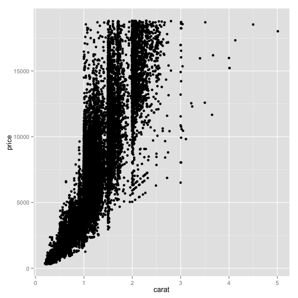 

The syntax is very similar to R's base graphics where you specify what's on the x and y axes, then give it the name of the data frame you want to use. We see again the strong relationship between the size of the diamond and its price, but the relationship doesn't appear linear. How does the diamond's clarity affect the weight-price relationship? 

#### Faceting and scaling

One option we could use is to color-code the points by their clarity. Here, we pass another `col=` argument with the variable we'd like to use for color-coding:


```coffee
qplot(carat, price, data = diamonds, col = clarity)
```

 

Examining the plot you can see that poor-clarity diamonds (included, small inclusions, etc) fetch a lower price per carat relative to more clear diamonds (very small inclusions, internally flawless, etc). We can see that **ggplot2** color-codes the points using a sensible default color scheme, and automatically draws a legend on the side for us. This requires a good deal of extra error-prone coding using base graphics.

However, with 54,000 points on this plot, there is a good deal of overplotting that obscures how clarity affects the nature of the weight-price relationship. How else might we visualize this data? This is where a *series of small multiples* is helpful. The idea of *small multiples* was popularized by data visualization expert Edward Tufte. The idea is that you create a large grid of small plots, where each plot shows a particular *facet* of the data. Here, each plot in the grid might be price vs. carat for each particular clarity level. You explain to your audience the axes and how to interpret each plot only once, and the audience will immediately understand the rest of the plots.

This can be accomplished easily using **ggplot2**:


```coffee
qplot(carat, price, data = diamonds, facets = ~ clarity)
```

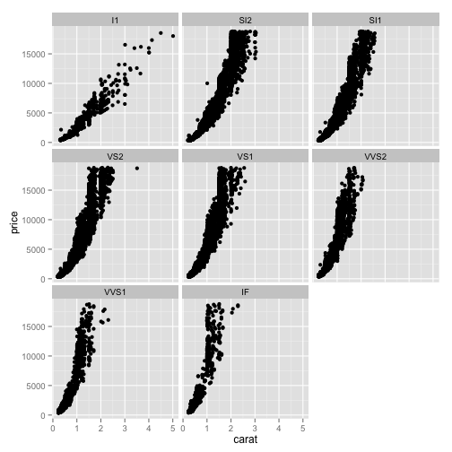 

Here, the `facets` argument expects a forumla object that's constructed with the `~` operator. Here, we've plotted the price vs. weight separately for each level of clarity. We can see what we suspected before. With dirty diamonds (included, and perhaps small inclusions), the weight-price relationship is linear or slightly quadratic. Large diamonds can be purchased rather cheaply. But for very clear diamonds (internally flawless), the relationship is quadratic or even exponential.

Let's examine the weight-price relationship for various color ratings:


```coffee
qplot(carat, price, data = diamonds, facets = ~ color)
```

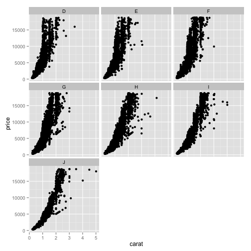 

Here we see that for whiter diamonds (D, E, F) the price rises more quickly with increasing weight than for yellower diamonds (H, I, J).

We can further facet the plot across two different categorical variables using the same syntax:


```coffee
qplot(carat, price, data = diamonds, facets = clarity ~ color)
```

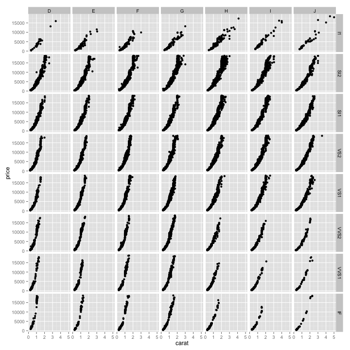 

Here we see that the price per carat rises very steeply for very white, very clear diamonds, while the relationship is nearly linear for yellower, more flawed diamonds. We can see that a perfect white diamond averages around $15,000 while a yellow included diamond can be had for only around $2,000.

Finally, we can combind both color-coding and faceting in the same plot. Let's use the same faceting scheme as last time, but color the points by the quality of the diamond's cut.


```coffee
qplot(carat, price, data = diamonds, facets = clarity ~ color, col = cut)
```

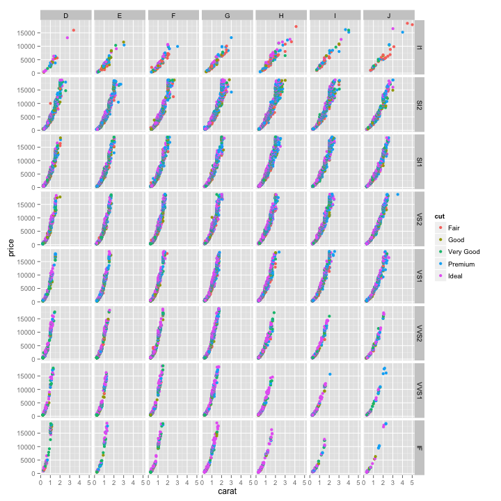 

This color-coding reveals that clearer, whiter diamonds *generally* have higher quality cuts, but the relationship doesn't appear strong, visually. Looking down the plot toward clearer diamonds you start to see more "Ideal" cuts than at the top, which are the more included diamonds. 

What we've done here in addition to faceting is map a feature of the data (here, the cut quality) onto a scale (here, color). This behavior will work differently depending on whether you're looking at categorical or continuous variables. We can also map features to other *scales* such as `size=`, `shape=`, `linetype=`, or even transparency using `alpha=`. All of these different scales can be combined with each other or with facets, and give you an extremely powerful and easy-to-use graphical toolbox for exploratory data analysis. 

#### Exercise

FIXME: Now, install the `xx` package, and load the `xx` dataset. Using the techniques we've learned here, use faceting and scaling options to explore how xx, xx, and xx affect the relationship between xx and xx.

### ggplot2 and the *Grammar of Graphics*

The **ggplot2** package provides an R implementation of Leland Wilkinson's *Grammar of Graphics* (1999). The *Grammar of Graphics* challenges data analysts to think beyond the garden variety plot types (e.g. scatter-plot, barplot) and the consider the components that make up a plot or graphic, such as how data are represented on the plot (as lines, points, etc.), how variables are mapped to coordinates or plotting shape or colour, what transformation or statistical summary is required, and so on. Specifically, **ggplot2** allows users to build a plot layer-by-layer by specifying:

 * a *geom**, which specifies how the data are represented on the plot (points, lines, bars, etc.),
 * *aesthetics* that map variables in the data to axes on the plot or to plotting size, shape, color, etc.,
 * a *stat*, a statistical transformation or summary of the data applied prior to plotting,
 * *facets*, which we've already seen above, that allow the data to be divided into chunks on the basis of other categorical or continuous variables and the same plot drawn for each chunk.

Because **ggplot2** implements a *layered* grammar of graphics, data points and additional information (scatterplot smoothers, confidence bands, etc.) can be added to the plot via additional layers, each of which utilize further geoms, aesthetics, and stats.

To make the best use of **ggplot2** it helps to understand the grammar and how it affects how plots are produced. In addition, it is important to note that **ggplot2** is not a general-purpose plotting tool-kit; you may not be able to achieve certain plots or additions to a figure of they do not map onto concepts included in the layered grammar.

#### Same plots as before, but using `ggplot`

In the examples above, we used **ggplot2**'s convenience function, `qplot`, because it's syntax should be familiar if you've already used base graphics. The `qplot` function did a lot of stuff for us: it created the plot object, added layers, plotted geoms, mapped features to aesthetics, created facets, and displayed the result. From here out, we'll use the `ggplot` function to build everything ourselves. 

The `ggplot` function has two required arguments: the *data* used for creating the plot, and an *aesthetic* mapping to describe how variables in said data are mapped to things we can see on the plot. Let's use `ggplot` to recreate some of the same plots we produced above. First, the simple scatterplot:


```coffee
# Using the qplot convenience function:
# qplot(carat, price, data = diamonds)

# Using ggplot:
ggplot(diamonds, aes(carat, price)) + geom_point()
```

 

Here, we've built our plot in layers. First, we create a canvas for plotting layers to come using the `ggplot` function, specifying which **data** to use (here, the *diamonds* data frame), and an **aesthetic mapping** of *carat* to the x-axis and *price* to the y-axis. We next add a layer to the plot, specifying a **geom**, or a way of visually representing the aesthetic mapping. Here we're using a point. Instead of using a point, we could use a different geom. We'll discuss that in more detail later on.

Getting back to our examples above, using the `ggplot` syntax we can map the color of the points (an aesthetic) onto one of the variables in our dataset.


```coffee
# Using the qplot convenience function:
# qplot(carat, price, data = diamonds, col = clarity) 
# Using ggplot:
ggplot(diamonds, aes(carat, price, col=clarity)) + geom_point()
```

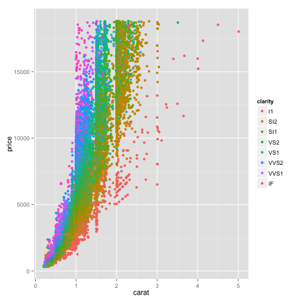 

We can also create a faceted plot as we did above using the `ggplot` function adding another layer with `facet_grid`.


```coffee
# Using the qplot convenience function:  
# qplot(carat, price, data = diamonds, facets = clarity ~ color)   
# Using ggplot:
ggplot(diamonds, aes(carat, price)) + geom_point() + facet_grid(clarity ~ color)
```

 

#### Other ways of dealing with overplotting

In the examples above we used colors and facets to help get around the overplotting problem when we used point geoms. A simpler way to try to tackle this problem is to lower the opacity of each point. Here, `alpha=1/5` sets the opacity of each point to 20%. In other words, 5 points would have to overlap to result in a completely solid point. Note that in this case we're not *mapping* the alpha level aesthetic to some other variable as we did above with color -- we're setting it to a static value of 0.20 for all points in the layer.


```coffee
ggplot(diamonds, aes(carat, price)) + geom_point(alpha=1/5)
```

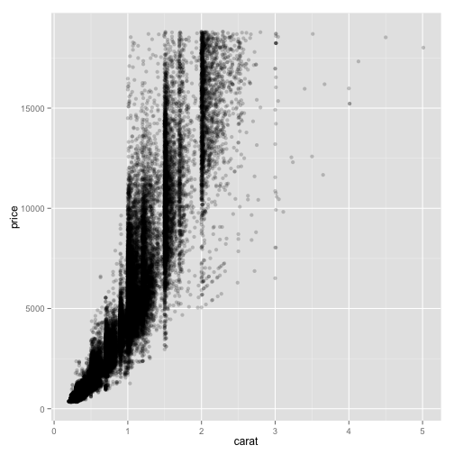 

Alternatively, we might choose to use a different geom instead of points. Here, let's use [hexagonal binning](http://cran.r-project.org/web/packages/hexbin/vignettes/hexagon_binning.pdf) instead of a point (you'll need the **hexbin** package installed for this to work).


```coffee
ggplot(diamonds, aes(carat, price)) + geom_hex()
```

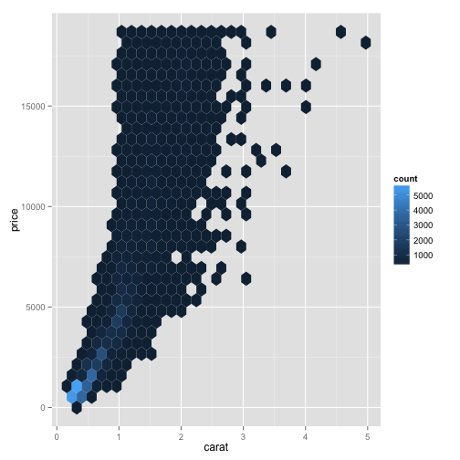 

Here, each bin represents a segment of the plotting surface with lighter blue colors representing more density in that segment. The number of bins can be adjusted as an argument to the `geom_hex()` function. This is one method of solving the overplotting problem we have in this plot without doing any faceting. Another way to accomplish this by plotting a **stat** rather than a geom itself. Here, we'll plot a two-dimensional histogram representing the density of points in a given area (think of this like contour lines on a map).


```coffee
ggplot(diamonds, aes(carat, price)) + stat_density2d()
```

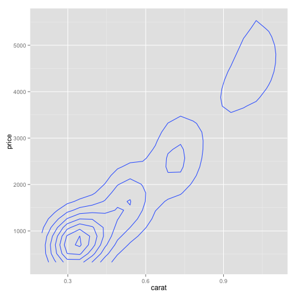 

#### Expanding your graphical repertoire 

Now that we've got a basic understanding of the `ggplot` syntax, let's explore different geoms for different types of data, and adding additional layers to our plots. Let's get back to our example with the iris dataset. Let's create a simple plot looking at sepal length by the three species.


```coffee
ggplot(iris, aes(Species, Sepal.Length)) + geom_point()
```

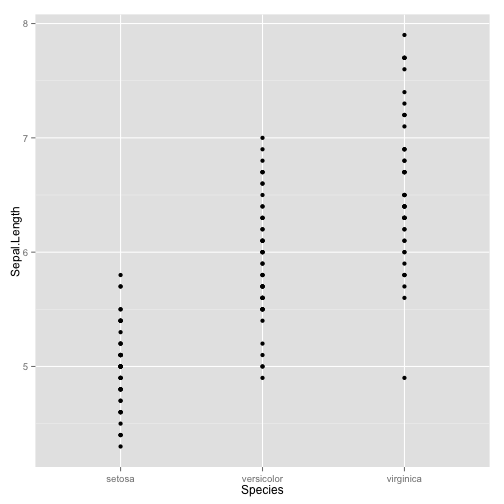 

In this simple "strip plot" of a continuous variable by a categorical variable, points stack up on one another, and the density of the points and over-plotting may obscure the relationship. Let's try jittering the points (spreading them out horizontally in each direction by some random amount). In the first example we'll use the jitter geom. In the second example, we'll change the shape of the point depending on the Species. Finally, because points near each other for each species look similar, we'll further color the points by Species.


```coffee
ggplot(iris, aes(Species, Sepal.Length)) + geom_jitter()
```

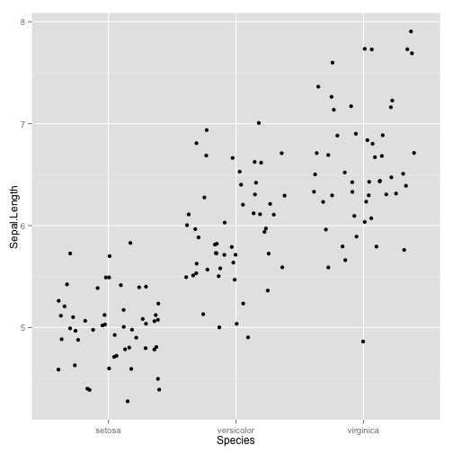 

```coffee
ggplot(iris, aes(Species, Sepal.Length)) + geom_jitter(aes(shape=Species), size=3)
```

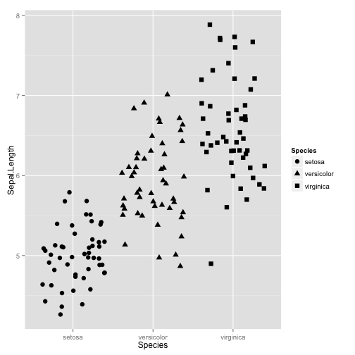 

```coffee
ggplot(iris, aes(Species, Sepal.Length)) + geom_jitter(aes(shape=Species, colour=Species), size=3)
```

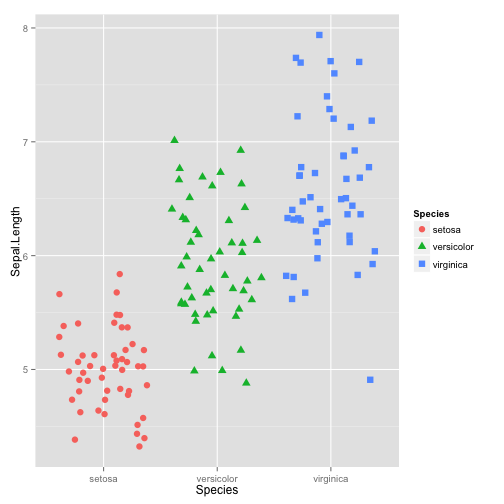 

There are other geoms that allow you to summarize the distribution of a continuous variable by levels of a categorical variable. You're probably most familiar with a box plot. In the first plot, let's add the boxplot geom. 


```coffee
ggplot(iris, aes(Species, Sepal.Length)) + geom_boxplot()
```

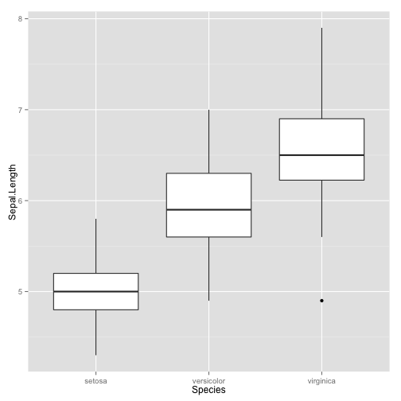 

Alternatively, we could create a [violin plot](http://en.wikipedia.org/wiki/Violin_plot) with the violin geom. A violin plot is a sort of like a box plot, but also displays the density of the data  at different values. The violin plot shows an abundance of sepal lengths of around 5cm for the *Iris setosa* species. 


```coffee
ggplot(iris, aes(Species, Sepal.Length)) + geom_violin()
```

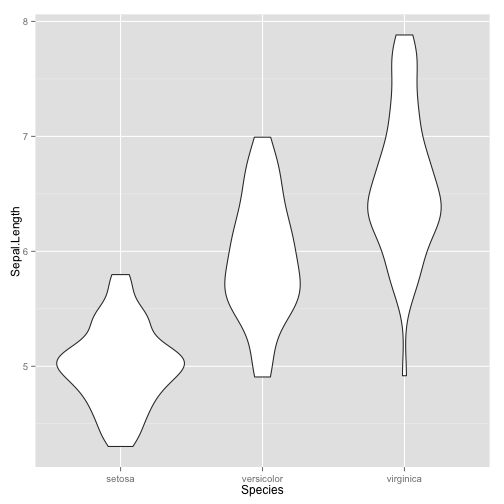 

Box plots and violin plots are great for summarizing the distribution of a continuous variable by a categorical variable, but what if we wanted to simultaneously view both a summary as well as the actual data? No problem - with **ggplot2** we can simply add more geoms as layers to the plot we've already created. Here, let's combine  jittered strip plots (showing the actual data points) with the violin plots (showing the summary). As above, let's map the color and shape of the points to the species, and lets reduce the opacity of the violin plot to make it less visually prominent.


```coffee
ggplot(iris, aes(Species, Sepal.Length)) + geom_violin(alpha=.5) + geom_jitter(aes(shape=Species, colour=Species), size=3)
```

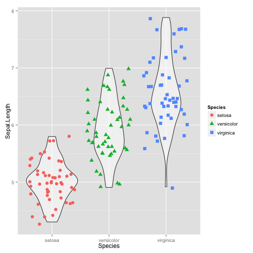 

In the first part of this lesson, we created scatter plots of two continuous variables. We can also add multiple layers to scatter plots. Here, let's plot sepal length by width, coloring by Species. Let's add another layer with a smoothed conditional mean to summarize the relationship:


```coffee
ggplot(iris, aes(Sepal.Width, Sepal.Length, color=Species)) + geom_point() + geom_smooth()
```

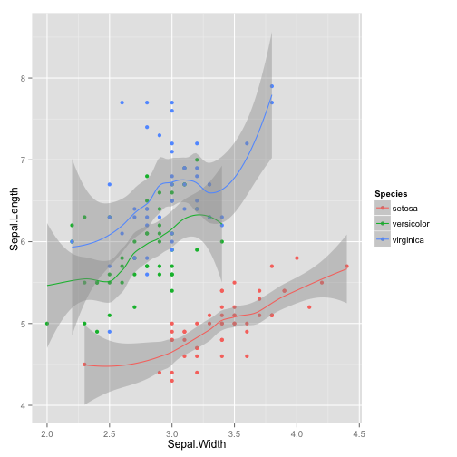 

We're told that since we didn't specify which method to use with `geom_smooth`, because we had less than 1000 samples, **ggplot2** defaulted to [loess](http://en.wikipedia.org/wiki/Local_regression) (LOcally wEighted Scatterplot Smoothing). We could specify "loess" manually or choose another method. Let's use a linear model instead:


```coffee
ggplot(iris, aes(Sepal.Width, Sepal.Length, color=Species)) + geom_point() + geom_smooth(method="lm")
```

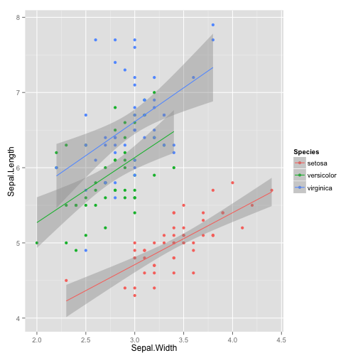 

Even with a small amount of data this plot becomes crowded. Let's make the same plot but this time facet by Species as well.


```coffee
ggplot(iris, aes(Sepal.Width, Sepal.Length, color=Species)) + geom_point() + facet_wrap(~Species) + geom_smooth(method="lm")
```

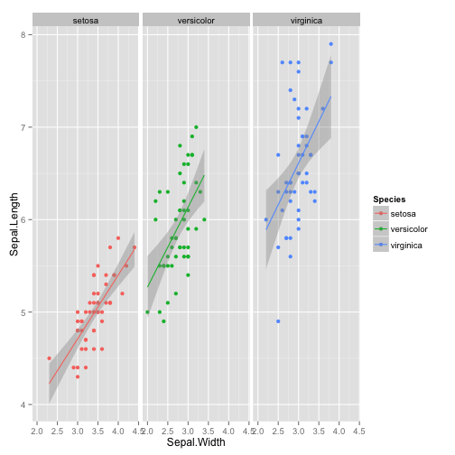 

Finally, let's demonstrate an advanced use case where instead of plotting data directly, we plot our own summary statistics derived from the data. First, we'll need to load the **plyr** package to get access to the `baseball` dataset. Take a look with `str` and `head`, and see what the columns mean with `?baseball`.


```coffee
library(plyr)
str(baseball)
```

```
## 'data.frame':	21699 obs. of  22 variables:
##  $ id   : chr  "ansonca01" "forceda01" "mathebo01" "startjo01" ...
##  $ year : int  1871 1871 1871 1871 1871 1871 1871 1872 1872 1872 ...
##  $ stint: int  1 1 1 1 1 1 1 1 1 1 ...
##  $ team : chr  "RC1" "WS3" "FW1" "NY2" ...
##  $ lg   : chr  "" "" "" "" ...
##  $ g    : int  25 32 19 33 29 29 29 46 37 25 ...
##  $ ab   : int  120 162 89 161 128 146 145 217 174 130 ...
##  $ r    : int  29 45 15 35 35 40 36 60 26 40 ...
##  $ h    : int  39 45 24 58 45 47 37 90 46 53 ...
##  $ X2b  : int  11 9 3 5 3 6 5 10 3 11 ...
##  $ X3b  : int  3 4 1 1 7 5 7 7 0 0 ...
##  $ hr   : int  0 0 0 1 3 1 2 0 0 0 ...
##  $ rbi  : int  16 29 10 34 23 21 23 50 15 16 ...
##  $ sb   : int  6 8 2 4 3 2 2 6 0 2 ...
##  $ cs   : int  2 0 1 2 1 2 2 6 1 2 ...
##  $ bb   : int  2 4 2 3 1 4 9 16 1 1 ...
##  $ so   : int  1 0 0 0 0 1 1 3 1 0 ...
##  $ ibb  : int  NA NA NA NA NA NA NA NA NA NA ...
##  $ hbp  : int  NA NA NA NA NA NA NA NA NA NA ...
##  $ sh   : int  NA NA NA NA NA NA NA NA NA NA ...
##  $ sf   : int  NA NA NA NA NA NA NA NA NA NA ...
##  $ gidp : int  NA NA NA NA NA NA NA NA NA NA ...
```

```coffee
head(baseball)
```

```
##            id year stint team lg  g  ab  r  h X2b X3b hr rbi sb cs bb so
## 4   ansonca01 1871     1  RC1    25 120 29 39  11   3  0  16  6  2  2  1
## 44  forceda01 1871     1  WS3    32 162 45 45   9   4  0  29  8  0  4  0
## 68  mathebo01 1871     1  FW1    19  89 15 24   3   1  0  10  2  1  2  0
## 99  startjo01 1871     1  NY2    33 161 35 58   5   1  1  34  4  2  3  0
## 102 suttoez01 1871     1  CL1    29 128 35 45   3   7  3  23  3  1  1  0
## 106 whitede01 1871     1  CL1    29 146 40 47   6   5  1  21  2  2  4  1
##     ibb hbp sh sf gidp
## 4    NA  NA NA NA   NA
## 44   NA  NA NA NA   NA
## 68   NA  NA NA NA   NA
## 99   NA  NA NA NA   NA
## 102  NA  NA NA NA   NA
## 106  NA  NA NA NA   NA
```

This data frame has batting statistics from a subset of players from 1871 through 2007. Let's take a look at the number of home runs that were hit over the years.


```coffee
ggplot(baseball, aes(year, hr)) + geom_point()
```

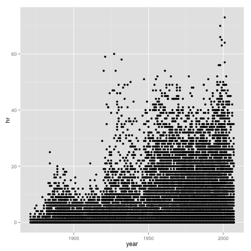 

This plot isn't so useful because there are multiple records for each year corresponding to the number of players recorded for that year. If we were interested in the trend of the number of home runs hit averaging across all players, we would normally have to do some analysis on the data and plot the results of that analysis. However, **ggplot2** allows us to plot a statistic derived from the data directly. Here let's plot a line plot where the value plotted will be the mean number of home runs where the value plotted will be the mean of y for each value of x.


```coffee
ggplot(baseball, aes(year, hr)) + stat_summary(fun.y=mean, geom="line")
```

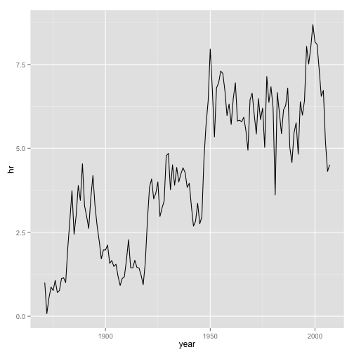 

We can get even fancier with `stat_summary` by adding even more summary statistics. In this example, we'll plot the same line as above using the mean of y for each value of x. We'll add another layer with `stat_summary`, this time passing in a function that produces a data frame with a minimum and maximum value to plot. These max and min values will be the mean number of home runs that year plus/minus the standard deviation. We'll make this geom a ribbon, color it blue, and reduce the transparency. From this we can see that the average number of home runs has increased, but the standard deviation is probably still too high in this subset of data to draw any inferences about that trend.


```coffee
mystats <- function(x) {
  data.frame(ymin=mean(x)-sd(x), ymax=mean(x)+sd(x))
}
ggplot(baseball, aes(year, hr)) + stat_summary(fun.y=mean, geom="line") + stat_summary(fun.data="mystats", geom="ribbon", alpha=.2, fill="steelblue")
```

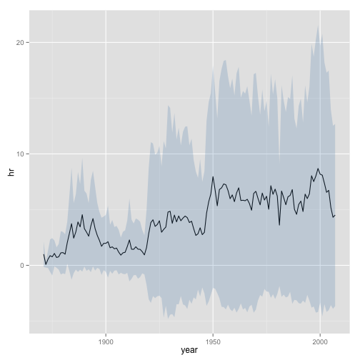 

#### Non-traditional graphics

By combining multiple layers with aesthetic mappings to different scales, **ggplot2** provides a foundation for producing a wide range of statistical graphics beyond simple "named" plots like scatter plots, histograms, bar plots, etc.

First, we could create a simple histogram of the price of diamonds in the `diamonds` data.frame:


```coffee
ggplot(diamonds, aes(price)) + geom_histogram(binwidth=200)
```

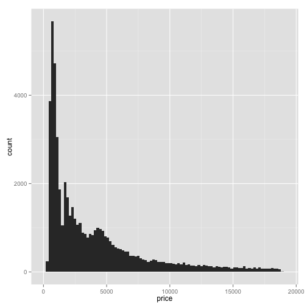 

But what about a stacked histogram, mapping the fill color of the stacked histogram to levels of the *clarity* variable?


```coffee
ggplot(diamonds, aes(price, fill=clarity)) + geom_histogram(position="fill", binwidth=200)
```

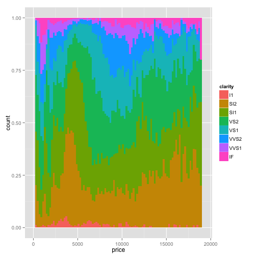 

Or what about box plots of the price grouped separately by the quality of the cut, color-coded by the color of the diamond, with the price on the y-axis being on the log (base 10) scale? Simple:


```coffee
ggplot(diamonds, aes(cut, price)) + geom_boxplot(aes(fill=color)) + scale_y_log10()
```

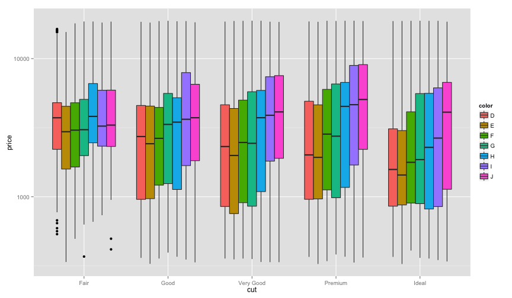 

Or what about a kernel density plot (think about a smooth histogram) of the diamond's table depth in different semitransparent curves with the color fill mapped to each level of *cut*, all on the same facet limited to depths between 55 and 70, with a title and a proper axis labels? This also shows the syntax of building up a plot one step at a time. We first initialize the plot with `ggplot`, giving it the data we're working with, and aesthetic mappings. We then add a `geom_density` layer, limit the x-axis displayed, and finally give it a title and axis labels. The plot is in the **g** object here; we can simply enter `g` and the plot will be displayed.


```coffee
g <- ggplot(diamonds, aes(depth, fill=cut)) 
g <- g + geom_density(alpha=1/4) 
g <- g + xlim(55, 70)
g <- g + ggtitle("Table Depths by Cut Quality")
g <- g + xlab("Table Depth") + ylab("Density")
g
```

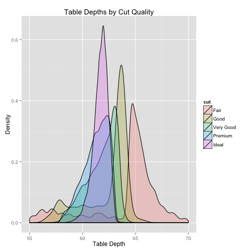 

Finally, we can save the plot created using the `ggsave` function:


```coffee
ggsave(filename="~/Desktop/table-depth-density.png", plot=g)
```

**Important:** There are endless ways to combine aesthetic mappings with different geoms and multiple layers. Read about other **geom**s, mappings, scales, and other layer options at the links at the bottom of the lesson. Just remember - just because you *can* produce a figure doesn't necessarily mean you *should*. The stacked histogram above was just a demonstration of how you might map a categorical variable to colors in a histogram, but this probably isn't the best way to display this data. Always think about what you're trying to show and the best way to display the data to support your claims before toying around with non-traditional mappings, scales, faceting, and aesthetics.

## Further **ggplot2** resources

* <http://docs.ggplot2.org/current/>: The official **ggplot2** documentation.
* <http://www.amazon.com/o/ASIN/0387981403/ref=nosim/gettgenedone-20>: The **ggplot2** book, by the developer, Hadley Wickham.
* <https://groups.google.com/forum/#!forum/ggplot2>: The **ggplot2** Google Group (mailing list, discussion forum).
* <https://github.com/swcarpentry/bc/tree/master/intermediate/r/data-visualization>: Intermediate Software Carpentry lesson on data visualization with **ggplot2**.
* <http://learnr.wordpress.com/>: A blog with a good number of posts describing how to reproduce various kind of plots using **ggplot2**.
* <http://stackoverflow.com/questions/tagged/ggplot2>: Thousands of questions and answers tagged with "ggplot2" on Stack Overflow, a programming Q&A site.
