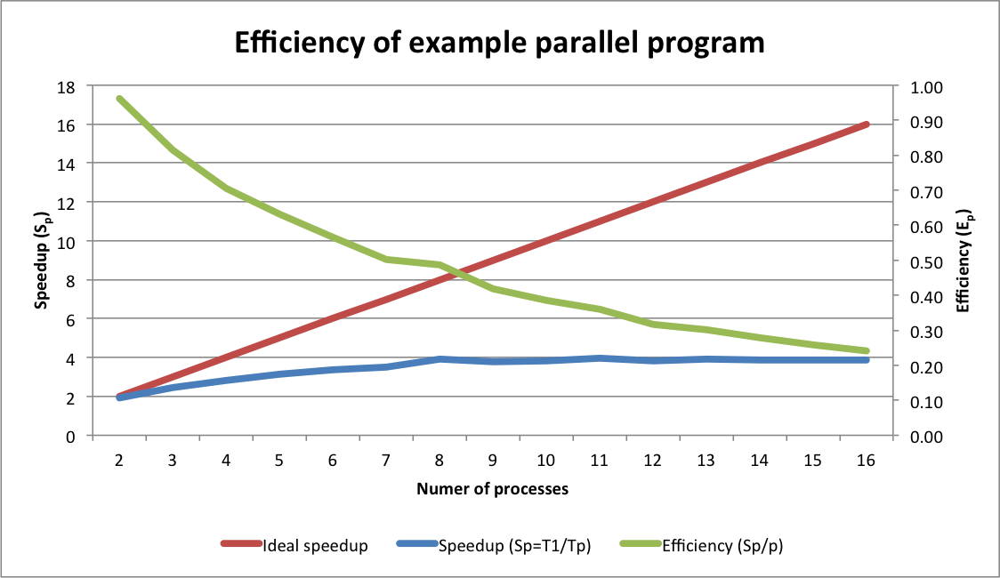

# Parallel programming with Python's multiprocessing library

In this lesson, you will learn how to write programs that perform
several tasks in parallel using Python's built-in <a
href="https://docs.python.org/2.7/library/multiprocessing.html"
target="_blank">multiprocessing</a> library. You are encouraged to
consult the <a
href="https://docs.python.org/2.7/library/multiprocessing.html"
target="_blank">documentation</a> to learn more, or to answer any
detailed questions as we will only cover a small subset of the
library's functionality.

This lesson assumes you have completed the [Programming with
Python](../../novice/python/index.html) lessons or have some
familiarity with using functions, loops, conditionals, command line
argument processing, NumPy, and matplotlib (though don't worry if you
don't know NumPy and matplotlib well).

> The code in this lesson was written against Python 2.7, but should work 
> with little or no modification under Python 3.

## Objectives

- Understand the major parallel programming models
- Learn how to implement simple multiprocessor parallelization
- Evaluate the performance speedup gained from parallelization

## Parallel programming models

Parallel programming has been important to scientific computing for
decades as a way to decrease program run times, making more complex
analyses possible (e.g. climate modeling, gene sequencing,
pharmaceutical development, aircraft design).

One of the motivations for parallel programming has been the
diminishing marginal increases in single CPU performance with each new
generation of CPU (see <a
href="http://www.gotw.ca/publications/concurrency-ddj.htm"
target="_blank">The Free Lunch is over</a>).  In response, computer
makers have introduced multi-core processors that contain more than
one processing core.  It's not uncommon for desktop, laptop, and even
tablets and smart phones to have two or more CPU cores.

### GPU and heterogeneous computing

In addition to multi-core CPUs, Graphics Processing Units (GPU) have
become more powerful recently (often having hundreds of parallel
execution units). GPUs are increasingly being use not just for drawing
graphics to the screen, but for general purpose computation.  GPUs can
even be used in conjunction with CPUs to boost parallel computing
performance (this is known as heterogeneous computing).  GPUs are best
suited to applying the same computation over arrays of data, while
CPUs are better suited to algorithms that include conditional branches
of execution (e.g. different paths through the code based on if
statements). Emerging tools, such as <a
href="http://en.wikipedia.org/wiki/OpenCL" target="_blank">OpenCL</a>
help coordinate parallel execution across heterogeneous computer
platforms that contain differing CPU and GPU resources.

### CPU multi-processing / Distributed-memory parallelism

Unfortunately, most computer programs cannot take advantage of
performance increases offered by GPUs or multi-core CPUs unless we
modify these programs.  In this lesson we will develop an example
program that uses the Python multiprocessing library to simultaneously
execute tasks on a multi-core CPU, decreasing the overall program run
time.

Multi-processing is one way to execute tasks in parallel on a
multi-core CPU, or across multiple computers in a computing cluster.
In multi-processing, each task runs in its own process; each program
running on your computer is represented by one or more processes. For
example, if you are running a web browser, a text editor, and an
e-mail client, you are running at least three processes (and likely
many more background processes). On modern operating systems, each
process gets its own portion of your computer's memory, ensuring that
no process can interfere with the execution of another (though tools
like <a href="http://en.wikipedia.org/wiki/Message_Passing_Interface"
target="_blank">MPI</a> and even Python's multiprocessing library can
be used to share data between processes running locally or in
distributed computing environments).

### CPU multi-threading (shared memory parallelism)

Multi-processing is not to be confused with multi-threading, or
shared-memory parallelism. In modern operating systems, each process
contains one or more threads of execution.  These threads share the
same portion of memory assigned to their parent process; each thread
can run in parallel if the computer has more than one CPU core. For
certain algorithms, multi-threading can be more efficient than
multi-processing (though multi-processing solutions such as MPI often
scale better to larger problem sizes).  However, multi-threading is
more error-prone to program and is generally only done directly by
expert systems programmers.  Tools such as <a
href="http://openmp.org/" target="_blank">OpenMP</a> should in general
be used for multi-threading in scientific computing.

## Example application

In our example application, we'll show how to parallelize the plotting
of randomly generated data using multiple processors.  You can find
the complete solution <a href="plot_rand_mp.py"
target="_blank">here</a>.  Key portions of the code will be discussed
below.  

Due to the design of the multiprocessing library, the code portions
generally will not work in interactive interpreters such as IPython.
Consult the <a
href="https://docs.python.org/2.7/library/multiprocessing.html"
target="_blank">documentation</a> for details. To run the example
application, download it <a href="plot_rand_mp.py"
target="_blank">here</a>, and then, from your command line interface,
type:

    python plot_rand_mp.py --help

for usage instructions. We suggest you create an output directory
called "temp" to store the plots in (to make deletion easier).

### Defining the work to be done

Before running code in parallel, we need to define the work to be
done. In multiprocessing, this work is defined as a *callable* object,
usually a Python function.  Here is the function we'll use:

    def plotData(outputDir, plotNum):
        outFilename = "plot_%d.pdf" % (plotNum,)
        outFilepath = os.path.join(outputDir, outFilename)
        
        # Plot some random data
        # Adapted from: http://matplotlib.org/examples/shapes_and_collections/scatter_demo.html
        N = 500
        # First we need to re-initialize the random number generator for each worker
        # See: https://groups.google.com/forum/#!topic/briansupport/9ErDidIBBFM
        np.random.seed( int( time() ) + plotNum )
        x = np.random.rand(N)
        y = np.random.rand(N)
        area = np.pi * (15 * np.random.rand(N))**2 # 0 to 15 point radiuses

        print("\tMaking plot %d" % (plotNum,) )
        plt.scatter(x, y, s=area, alpha=0.5)
        plt.savefig(outFilepath)
        # Clear figure so that the next plot this worker makes will not contain
        # data from previous plots
        plt.clf() 
        
        return (plotNum, outFilepath)

This function takes as input the path of the output directory to which
plots should be saved, and the unique identifier of the plot we are
creating; the function returns the path of the PDF file to which the
plotted data were written, as well as the plot identifier.  The reason
for returning the plot identifier will be described below.

Don't worry if you are not familiar with NumPy or matplotlib.  All
we're doing here is making a scatter plot of random data.  As is, this
is not a very useful task, however it could easily be extended to plot
actual data.

**The key thing to note about this function is that when executing code
in parallel environments, weird behavior can result unless special
care is taken in your code** (even when doing multi-processing
programming where each process has its own memory space).  In this
case, there are two special things we must do.

First, we must force NumPy's random number generator to
re-initialize for each call of the parallel function, this is
accomplished by:

    np.random.seed( int( time() ) + plotNum )

Where we use the current system time and the plot identifier as a *seed*
for the random number generator.  If we don't do this, each worker
process will use the same random number generator as it makes the
plots it is responsible for.  Thus, all plots made by Worker 1 would
contain the same sequence of "random" data.

Second, we need to tell matplotlib to clear the current figure
context after each plot is generated:

    plt.clf()

Otherwise, each plot made by Worker 1 would contain the data from all
previous plots created by Worker 1.

### Creating a pool of workers

Now that we have defined the work to be done, we can write the code to
execute in tasks in parallel.  There are several ways to use Python's
multiprocessing library to execute tasks in parallel.  In this lesson
we'll use a <a
href="https://docs.python.org/2.7/library/multiprocessing.html#using-a-pool-of-workers"
target="_blank">pool of worker processes</a>.

Assuming we import the multiprocessing library as follows:

    import multiprocessing

we can create a pool by:

    pool = multiprocessing.Pool( args.numProcessors )

In our example, we're passing in the number of processors to use via
an optional command line argument called `numProcessors`.  If the user
doesn't specify the number of processors on the command line, the
default value is determined using the cpu_count() method of
multiprocessing:

    multiprocessing.cpu_count()

> We're using the <a
> href="https://docs.python.org/2.7/library/argparse.html"
> target="_blank">argparse</a> library, a standard part of Python 2.7
> and later, to manage command line arguments.

### Build a list of tasks

Okay.  We have a pool of workers, and a we have a description of how
workers should perform a task in the abstract.  Before we can run any
tasks we need to make a list of specific tasks to be performed
(i.e. plots to be created).  We do this as follows:

    tasks = []
    plotNum = 0
    while plotNum < args.numPlots:
        plotNum += 1
        tasks.append( (args.outputDir, plotNum, ) )

Each task is simply a tuple of the path where plot PDF files should be
saved and as well as the current plot identifier.  We store these
tuples in a list called `tasks`, thus our tasks are described as a
list of tuples.

### Run tasks in parallel

To run our tasks in parallel across all workers, we use the
[`apply_async`](https://docs.python.org/2.7/library/multiprocessing.html#multiprocessing.pool.multiprocessing.Pool.apply_async)
method of the worker pool class:

    results = [pool.apply_async( plotData, t ) for t in tasks]

here we call `apply_async` from a list comprehension for convenience, but
you could also iterate over the tasks:

    results = []
    for t in tasks:
        results.append( pool.apply_async( plotData, t) )

In either case, we pass our `plotData` function as well as the
individual task tuple to `plot_async`.  The multiprocessing library
will take care of dispatching our tasks to each worker so that the
tasks can be performed in parallel.

### Getting results

Once we've dispatched all tasks we'll want to get the results returned
by each task and do something with those results:

    for result in results:
        (plotNum, plotFilename) = result.get()
        print("Result: plot %d written to %s" % (plotNum, plotFilename) )

We get the results for each task by calling the `get` method on that
task's result object.  Calls to `get` will wait until there are
results available (this is called "blocking").  You can optionally set
a timeout after which an exception will be raised if a result is not
returned (this is useful if your task involves network activity).

Remember that our task function `plotData` returns a tuple of the plot
identifier as well as the filename of the plot generated.  You might
be asking yourself why would we need to return the plot identifier
when the plot identifier was passed into the worker function, and did
not change in the worker function.  This is necessary because the
worker pool makes no guarantee that workers will complete their tasks
in any particular order.  Indeed, in a more realistic application, each
tasks' workload may vary, so there is no way to know how long each task
will take to complete.

In our example we simply print out the plot identifier and the name of
file produced.  If the worker function were performing a numerical
computation, we could instead do something with that result, such as
adding the result to the results obtained from other tasks.

## Typical output

Here is the output that our example program should produce:

    $ ./plot_rand_mp.py -o temp -n 4
    Making 4 plots of random data using 8 processors...
           Making plot 1
           Making plot 2
           Making plot 3
           Making plot 4
    Result: plot 1 written to temp/plot_1.pdf
    Result: plot 2 written to temp/plot_2.pdf
    Result: plot 3 written to temp/plot_3.pdf
    Result: plot 4 written to temp/plot_4.pdf

## Speedup

Whenever we decide to parallelize a task, it is important to evaluate
the runtime savings and efficiency of our parallel program.  <a
href="http://en.wikipedia.org/wiki/Speedup" target="_blank">Speedup
and efficiency</a> are common ways of doing this.

> Before decided parallelize or otherwise optimize a program, you
> should first use a <a
> href="http://en.wikipedia.org/wiki/Profiling_(computer_programming)"
> target="_blank">profiler</a> to identify what proportion of runtime
> your program is spending in each function or component. This will
> help you to prioritize optimization or parallelization to maximize
> runtime reductions.

Speedup (Sp) is defined as the ratio of runtime for a sequential
algorithm (T1) to runtime for a parallel algorithm with *p* processors
(Tp). That is, Sp = T1 / Tp. Ideal speedup results when Sp = p.
Speedup is formally derived from <a
href="http://en.wikipedia.org/wiki/Amdahl's_law"
target="_blank">Amdahl's law</a>, which considers the portion of a
program that is serial vs. the portion that is parallel when
calculating speedup.

Efficiency (Ep) is defined as the ratio of speedup for p processors (Sp) to
the number of processors p, or Ep = Sp / p.

Below is a graph comparing the speedup and efficiency that resulted when
running the example program to create 64 plots using a range of
processors on computer with a 4-core processor (each data point
represents the average of three runs).

> Note that the comparison here is not quite fair because a sequential
> version of the program was not written.  The runtime for the
> sequential version were approximated by running the parallel version
> using a single processor.  The single processor runtime was likely
> longer than that of a sequential version of the same program due to
> the overhead needed to create the worker pool and dispatch a single
> task to a worker.  Thus these results slightly overstate the
> parallel speedup and efficiency.

First note that the slope of the speedup curve is low, and grows
farther away from the ideal speedup line as the number of processors
increases.  Some divergence between actual and ideal speedup is
typical.  However our example program isn't strictly computational and
involves input/output (I/O) to the filesystem (i.e. writing the plot).
I/O-bound tasks do not typically parallelize well because I/O
resources (e.g. disks, network, memory) are shared across processors,
and because I/O operations, especially to disk, usually take orders of
magnitude more time to complete than computational operations.
However, even I/O-bound tasks can see moderate speedup due to the
effects of "pipelining" (see <a
href="http://en.wikipedia.org/wiki/Pipeline_(computing)"
target="_blank">here</a>).

Efficiency, which ranges from 0 to 1, is a bit easier to interpret
than speedup. With two processors, efficiency was over 90% (i.e. our
two workers were 90% utilized, doing useful work far more than they
were waiting for I/O). As processors were added to the worker pool,
the efficiency dropped, which is expected for a task dependent on I/O.
However, the speedup continued increasing up to and including eight
processors; that is, runtimes continued to drop until we added more
than eight workers.  Thus, even though efficiency was decreasing, we
were still able to save time by adding more workers, up to a point.
Efficiency is especially important in enterprise computing
environments, where concerns like providing equitable access shared
resources and reducing energy consumption may dictate the use of fewer
processors to maintain higher processor utilization.

> Despite our computer having only 4-cores, why did runtime continue
> to decrease between four and eight processors?  This was in part
> because the computer we ran the tests on had a feature call
> "HyperThreading."  HyperThreading is the marketing name of a
> technology that enables each physical core of a CPU to appear as two
> virtual cores to your operating system.  These virtual cores can
> improve performance, but are rarely as effective as additional
> physical cores.

## Communication between the processes

Running a computation in multiple processes requires some
communication between these processes. One of the nice aspects of
multiprocessing in Python is that most of the time you do not need to
know *how* this communication is handled: it just works. However, it
is useful to understand the basics of this mechanism in order to
figure out how to solve two kinds of problems: unexpected errors, and
bad performance.

Communication between processes takes the form of streams of bytes
that travel through specific communication channels. To send an object
from one process to another, Python has to convert it to a stream of
bytes, and assemble the object back at the receiving end.  Python's
mechanism for doing these conversions was originally designed for
storing objects in files and is implemented in the <a
href="https://docs.python.org/2.7/library/pickle.html"
target="_blank">pickle</a> module. Every argument that is passed to a
Python function running in another process is pickled and then
unpickled. The result of the function undergoes the same process on
its way back.

There are two things you need to know about pickle in the context of
multiprocessing. First, most objects can be pickled but some cannot.
Second, pickling and unpickling take time and can sometimes add
considerable overhead to your multiprocessing.

The objects that cannot be pickled come in two varieties: those for
which pickling does not make sense, and those for which it has simply
not been implemented. A good example for the first category is file
objects. The second category contains mainly object types defined in
extension modules whose authors didn't implement pickling. If you use
an old release of NumPy, you may discover that its array-aware
functions are not picklable, making it impossible to use such a
function directly as a task in multiprocessing. For Python's built-in
objects, there is one important restriction that is due to the
implementation details of pickle: functions and classes can only be
pickled if they are defined at the top level of a module. This means,
for example, that if you define a function inside another function,
you cannot pickle it and thus not pass it to a multiprocessing task.

The performance implications of pickling are rather obvious: you
should try to pass as few arguments as possible to your tasks, and
make sure you pass no more data than you really need to.  For example,
rather than passing a huge list and the index of the item that your
taks is supposed to process, you should pass only that item.

## Challenge

Run the <a href="plot_rand_mp.py" target="_blank">example
application</a> on your computer several times.  Each time, vary the
number of processors to use and note how the computation efficiency
varies.  You can use the Unix `time` program to measure execution
times.

## Key Points

- CPU multi-processing is a parallel programming technique that can
  harness the power of modern computers to help you perform more
  analyses more quickly.

- The Python multiprocessing library allows you to create a pool of
  workers to carry out tasks in parallel

- Tasks are easy to describe using Python functions

- Care needs to be taken when executing code in parallel environments
  to avoid strange program behavior and wrong computations

- You can combine results from individual tasks allowing each worker
  to share in the computational load

- It is important to use profiling before optimizing computer programs

- Metrics such as speedup and efficiency aid in evaluating the
  performance and utility of parallel programs

## Next steps

Using the <a href="plot_rand_mp.py" target="_blank">example
program</a> as a starting point, you should be able to create your own
parallel program that will save you time and help you to get more
performance out of your existing computer hardware (which you've
already paid for!).
