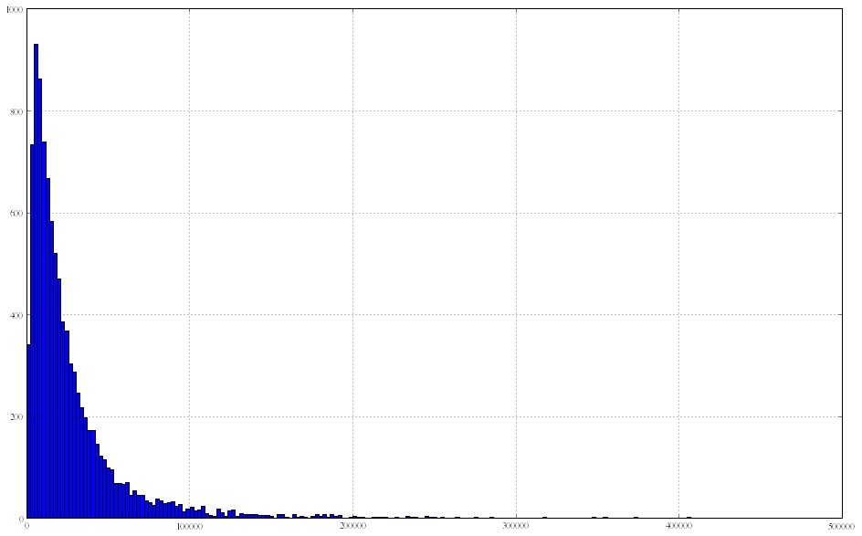

<pre>%matplotlib inline
from matplotlib import pylab as plt
import pandas as pd
df = pd.read_csv(&#34;discharges.csv&#34;)</pre>

<pre>df.columns</pre>

<pre>Index([u&#39;Unnamed: 0&#39;, u&#39;Hospital Service Area&#39;, u&#39;Hospital County&#39;, u&#39;Operating Certificate Number&#39;, u&#39;Facility Id&#39;, u&#39;Facility Name&#39;, u&#39;Age Group&#39;, u&#39;Zip Code - 3 digits&#39;, u&#39;Gender&#39;, u&#39;Race&#39;, u&#39;Ethnicity&#39;, u&#39;Length of Stay&#39;, u&#39;Admit Day of Week&#39;, u&#39;Type of Admission&#39;, u&#39;Patient Disposition&#39;, u&#39;Discharge Year&#39;, u&#39;Discharge Day of Week&#39;, u&#39;CCS Diagnosis Code&#39;, u&#39;CCS Diagnosis Description&#39;, u&#39;CCS Procedure Code&#39;, u&#39;CCS Procedure Description&#39;, u&#39;APR DRG Code&#39;, u&#39;APR DRG Description&#39;, u&#39;APR MDC Code&#39;, u&#39;APR MDC Description&#39;, u&#39;APR Severity of Illness Code&#39;, u&#39;APR Severity of Illness Description&#39;, u&#39;APR Risk of Mortality&#39;, u&#39;APR Medical Surgical Description&#39;, u&#39;Source of Payment 1&#39;, u&#39;Source of Payment 2&#39;, u&#39;Source of Payment 3&#39;, u&#39;Attending Provider License Number&#39;, u&#39;Operating Provider License Number&#39;, u&#39;Other Provider License Number&#39;, u&#39;Birth Weight&#39;, u&#39;Abortion Edit Indicator&#39;, u&#39;Emergency Department Indicator&#39;, u&#39;Total Charges&#39;], dtype=&#39;object&#39;)</pre>

<pre>import string
tbl = string.maketrans(&#34;&#34;, &#34;&#34;)

df[&#39;Total Charges&#39;] = df[&#39;Total Charges&#39;].apply(lambda x: float(x.translate(tbl, &#34;$&#34;)))</pre>

<pre>df[&#34;Total Charges&#34;].sum()</pre>

<pre>289176082.43999934</pre>

<pre>df[&#39;Total Charges&#39;].hist(bins=300, figsize=(16., 10.))</pre>

<pre>&lt;matplotlib.axes.AxesSubplot at 0x501acd0&gt;

</pre>

<pre>len(df)</pre>

<pre>10000</pre>

<pre>df[df[&#39;Total Charges&#39;] &lt; 25000][&#39;Total Charges&#39;].hist(bins=200 ,figsize=(16., 10.))</pre>

<pre>&lt;matplotlib.axes.AxesSubplot at 0x5929590&gt;

</pre>

<pre>
df[df[&#39;Total Charges&#39;] &lt; 500000][&#39;Total Charges&#39;].hist(bins=200 ,figsize=(16., 10.))</pre>

<pre>&lt;matplotlib.axes.AxesSubplot at 0x6530bd0&gt;

</pre>

<pre>from pprint import pprint
pprint(list(df.columns))</pre>

<pre>[&#39;Unnamed: 0&#39;,
 &#39;Hospital Service Area&#39;,
 &#39;Hospital County&#39;,
 &#39;Operating Certificate Number&#39;,
 &#39;Facility Id&#39;,
 &#39;Facility Name&#39;,
 &#39;Age Group&#39;,
 &#39;Zip Code - 3 digits&#39;,
 &#39;Gender&#39;,
 &#39;Race&#39;,
 &#39;Ethnicity&#39;,
 &#39;Length of Stay&#39;,
 &#39;Admit Day of Week&#39;,
 &#39;Type of Admission&#39;,
 &#39;Patient Disposition&#39;,
 &#39;Discharge Year&#39;,
 &#39;Discharge Day of Week&#39;,
 &#39;CCS Diagnosis Code&#39;,
 &#39;CCS Diagnosis Description&#39;,
 &#39;CCS Procedure Code&#39;,
 &#39;CCS Procedure Description&#39;,
 &#39;APR DRG Code&#39;,
 &#39;APR DRG Description&#39;,
 &#39;APR MDC Code&#39;,
 &#39;APR MDC Description&#39;,
 &#39;APR Severity of Illness Code&#39;,
 &#39;APR Severity of Illness Description&#39;,
 &#39;APR Risk of Mortality&#39;,
 &#39;APR Medical Surgical Description&#39;,
 &#39;Source of Payment 1&#39;,
 &#39;Source of Payment 2&#39;,
 &#39;Source of Payment 3&#39;,
 &#39;Attending Provider License Number&#39;,
 &#39;Operating Provider License Number&#39;,
 &#39;Other Provider License Number&#39;,
 &#39;Birth Weight&#39;,
 &#39;Abortion Edit Indicator&#39;,
 &#39;Emergency Department Indicator&#39;,
 &#39;Total Charges&#39;]
</pre>

<pre>df.groupby([&#39;Hospital County&#39;, &#39;Type of Admission&#39;]).size()</pre>

<pre>Hospital County  Type of Admission
Albany           Elective             163
                 Emergency            359
                 Newborn               44
                 Urgent                51
Allegheny        Elective               2
                 Emergency             12
                 Newborn                2
                 Urgent                 5
Broome           Elective              72
                 Emergency            172
                 Newborn               26
                 Urgent                29
Cattaraugus      Elective              18
                 Emergency             30
                 Newborn               10
...
Schoharie        Emergency              4
Schuyler         Elective               2
                 Emergency              7
St Lawrence      Elective              16
                 Emergency             66
                 Newborn               15
                 Not Available          1
                 Urgent                25
Steuben          Elective               1
                 Emergency             17
                 Urgent                 1
Suffolk          Elective              44
                 Emergency            199
                 Newborn               35
                 Urgent                70
Length: 162, dtype: int64</pre>

<pre>df</pre>

<pre>      Unnamed: 0 Hospital Service Area Hospital County  \
0              1        Capital/Adiron          Albany   
1            101        Capital/Adiron          Albany   
2            201        Capital/Adiron          Albany   
3            301        Capital/Adiron          Albany   
4            401        Capital/Adiron          Albany   
5            501        Capital/Adiron          Albany   
6            601        Capital/Adiron          Albany   
7            701        Capital/Adiron          Albany   
8            801        Capital/Adiron          Albany   
9            901        Capital/Adiron          Albany   
10          1001        Capital/Adiron          Albany   
11          1101        Capital/Adiron          Albany   
12          1201        Capital/Adiron          Albany   
13          1301        Capital/Adiron          Albany   
14          1401        Capital/Adiron          Albany   
15          1501        Capital/Adiron          Albany   
16          1601        Capital/Adiron          Albany   
17          1701        Capital/Adiron          Albany   
18          1801        Capital/Adiron          Albany   
19          1901        Capital/Adiron          Albany   
20          2001        Capital/Adiron          Albany   
21          2101        Capital/Adiron          Albany   
22          2201        Capital/Adiron          Albany   
23          2301        Capital/Adiron          Albany   
24          2401        Capital/Adiron          Albany   
25          2501        Capital/Adiron          Albany   
26          2601        Capital/Adiron          Albany   
27          2701        Capital/Adiron          Albany   
28          2801        Capital/Adiron          Albany   
29          2901        Capital/Adiron          Albany   
...          ...                   ...             ...   
9970      997001        Capital/Adiron       Schoharie   
9971      997101        Capital/Adiron       Schoharie   
9972      997201          Finger Lakes        Schuyler   
9973      997301          Finger Lakes        Schuyler   
9974      997401          Finger Lakes        Schuyler   
9975      997501          Finger Lakes        Schuyler   
9976      997601          Finger Lakes        Schuyler   
9977      997701          Finger Lakes        Schuyler   
9978      997801          Finger Lakes        Schuyler   
9979      997901          Finger Lakes        Schuyler   
9980      998001          Finger Lakes        Schuyler   
9981      998101          Finger Lakes         Steuben   
9982      998201          Finger Lakes         Steuben   
9983      998301          Finger Lakes         Steuben   
9984      998401          Finger Lakes         Steuben   
9985      998501          Finger Lakes         Steuben   
9986      998601          Finger Lakes         Steuben   
9987      998701          Finger Lakes         Steuben   
9988      998801          Finger Lakes         Steuben   
9989      998901          Finger Lakes         Steuben   
9990      999001          Finger Lakes         Steuben   
9991      999101          Finger Lakes         Steuben   
9992      999201          Finger Lakes         Steuben   
9993      999301          Finger Lakes         Steuben   
9994      999401          Finger Lakes         Steuben   
9995      999501          Finger Lakes         Steuben   
9996      999601          Finger Lakes         Steuben   
9997      999701          Finger Lakes         Steuben   
9998      999801          Finger Lakes         Steuben   
9999      999901          Finger Lakes         Steuben   

      Operating Certificate Number  Facility Id  \
0                           101000            1   
1                           101000            1   
2                           101000            1   
3                           101000            1   
4                           101000            1   
5                           101000            1   
6                           101000            1   
7                           101000            1   
8                           101000            1   
9                           101000            1   
10                          101000            1   
11                          101000            1   
12                          101000            1   
13                          101000            1   
14                          101000            1   
15                          101000            1   
16                          101000            1   
17                          101000            1   
18                          101000            1   
19                          101000            1   
20                          101000            1   
21                          101000            1   
22                          101000            1   
23                          101000            1   
24                          101000            1   
25                          101000            1   
26                          101000            1   
27                          101000            1   
28                          101000            1   
29                          101000            1   
...                            ...          ...   
9970                       4720001          851   
9971                       4720001          851   
9972                       4823700          858   
9973                       4823700          858   
9974                       4823700          858   
9975                       4823700          858   
9976                       4823700          858   
9977                       4823700          858   
9978                       4823700          858   
9979                       4823700          858   
9980                       4823700          858   
9981                       5001000          866   
9982                       5001000          866   
9983                       5001000          866   
9984                       5001000          866   
9985                       5001000          866   
9986                       5001000          866   
9987                       5001000          866   
9988                       5001000          866   
9989                       5001000          866   
9990                       5001000          866   
9991                       5001000          866   
9992                       5001000          866   
9993                       5001000          866   
9994                       5001000          866   
9995                       5001000          866   
9996                       5001000          866   
9997                       5001000          866   
9998                       5001000          866   
9999                       5001000          866   

                       Facility Name    Age Group Zip Code - 3 digits Gender  \
0     Albany Medical Center Hospital  70 or Older                 120      F   
1     Albany Medical Center Hospital     30 to 49                 122      M   
2     Albany Medical Center Hospital      0 to 17                 121      M   
3     Albany Medical Center Hospital     30 to 49                 120      M   
4     Albany Medical Center Hospital     50 to 69                 121      F   
5     Albany Medical Center Hospital      0 to 17                 121      F   
6     Albany Medical Center Hospital     18 to 29                 120      F   
7     Albany Medical Center Hospital     30 to 49                 125      M   
8     Albany Medical Center Hospital      0 to 17                 123      M   
9     Albany Medical Center Hospital     50 to 69                 121      F   
10    Albany Medical Center Hospital     50 to 69                 120      M   
11    Albany Medical Center Hospital      0 to 17                 112      M   
12    Albany Medical Center Hospital  70 or Older                 120      M   
13    Albany Medical Center Hospital      0 to 17                 122      F   
14    Albany Medical Center Hospital     50 to 69                 120      F   
15    Albany Medical Center Hospital  70 or Older                 121      M   
16    Albany Medical Center Hospital     50 to 69                 122      F   
17    Albany Medical Center Hospital     50 to 69                 120      M   
18    Albany Medical Center Hospital     30 to 49                 120      F   
19    Albany Medical Center Hospital     30 to 49                 121      M   
20    Albany Medical Center Hospital     50 to 69                 122      M   
21    Albany Medical Center Hospital  70 or Older                 122      F   
22    Albany Medical Center Hospital     50 to 69                 128      M   
23    Albany Medical Center Hospital  70 or Older                 122      F   
24    Albany Medical Center Hospital     50 to 69                 123      F   
25    Albany Medical Center Hospital     50 to 69                 120      F   
26    Albany Medical Center Hospital  70 or Older                 123      F   
27    Albany Medical Center Hospital     18 to 29                 121      M   
28    Albany Medical Center Hospital  70 or Older                 120      M   
29    Albany Medical Center Hospital     50 to 69                 124      F   
...                              ...          ...                 ...    ...   
9970    Cobleskill Regional Hospital     50 to 69                 120      M   
9971    Cobleskill Regional Hospital     50 to 69                 121      F   
9972               Schuyler Hospital     50 to 69                 148      M   
9973               Schuyler Hospital     50 to 69                 148      F   
9974               Schuyler Hospital     18 to 29                 148      F   
9975               Schuyler Hospital  70 or Older                 148      F   
9976               Schuyler Hospital     50 to 69                 145      M   
9977               Schuyler Hospital     30 to 49                 148      F   
9978               Schuyler Hospital  70 or Older                 148      F   
9979               Schuyler Hospital  70 or Older                 148      M   
9980               Schuyler Hospital     50 to 69                 148      F   
9981                Corning Hospital     50 to 69                 148      M   
9982                Corning Hospital     50 to 69                 148      F   
9983                Corning Hospital  70 or Older                 148      F   
9984                Corning Hospital     50 to 69                 148      M   
9985                Corning Hospital  70 or Older                 148      F   
9986                Corning Hospital  70 or Older                 148      F   
9987                Corning Hospital     50 to 69                 148      M   
9988                Corning Hospital  70 or Older                 148      M   
9989                Corning Hospital  70 or Older                 148      M   
9990                Corning Hospital  70 or Older                 148      M   
9991                Corning Hospital     50 to 69                 148      F   
9992                Corning Hospital  70 or Older                 148      F   
9993                Corning Hospital  70 or Older                 148      F   
9994                Corning Hospital     50 to 69                 OOS      M   
9995                Corning Hospital     50 to 69                 148      F   
9996                Corning Hospital     50 to 69                 148      M   
9997                Corning Hospital     18 to 29                 148      F   
9998                Corning Hospital  70 or Older                 148      F   
9999                Corning Hospital     30 to 49                 148      F   

                        Race           ...              Source of Payment 1  \
0                      White           ...                         Medicare   
1                      White           ...                         Medicare   
2                 Other Race           ...                         Medicaid   
3                      White           ...                       Blue Cross   
4                      White           ...                Insurance Company   
5     Black/African American           ...                Insurance Company   
6                      White           ...                       Blue Cross   
7     Black/African American           ...                Insurance Company   
8                      White           ...                       Blue Cross   
9                      White           ...                Insurance Company   
10                     White           ...                         Medicare   
11    Black/African American           ...                       Blue Cross   
12                     White           ...                         Medicare   
13                     White           ...                Insurance Company   
14                     White           ...                Insurance Company   
15                     White           ...                       Blue Cross   
16                     White           ...                Insurance Company   
17                     White           ...                       Blue Cross   
18                     White           ...                Insurance Company   
19                     White           ...                Insurance Company   
20                     White           ...                Insurance Company   
21                     White           ...                         Medicare   
22                     White           ...                       Blue Cross   
23                     White           ...                         Medicare   
24                     White           ...                Insurance Company   
25    Black/African American           ...                         Medicare   
26                     White           ...                         Medicare   
27                     White           ...             Workers Compensation   
28                     White           ...                Insurance Company   
29                     White           ...                Insurance Company   
...                      ...           ...                              ...   
9970                   White           ...                Insurance Company   
9971                   White           ...                         Medicare   
9972                   White           ...                         Medicare   
9973                   White           ...                         Medicare   
9974                   White           ...                       Blue Cross   
9975                   White           ...                         Medicare   
9976                   White           ...            Other Federal Program   
9977                   White           ...                         Medicaid   
9978                   White           ...                         Medicare   
9979                   White           ...                         Medicare   
9980                   White           ...                         Self-Pay   
9981                   White           ...                         Medicare   
9982                   White           ...                       Blue Cross   
9983                   White           ...                         Medicare   
9984                   White           ...                         Medicare   
9985                   White           ...                         Medicare   
9986                   White           ...                         Medicare   
9987                   White           ...                       Blue Cross   
9988                   White           ...                         Medicare   
9989                   White           ...                         Medicare   
9990                   White           ...                         Medicare   
9991                   White           ...                         Medicare   
9992                   White           ...                         Medicare   
9993                   White           ...                         Medicare   
9994                   White           ...                         Self-Pay   
9995                   White           ...                       Blue Cross   
9996                   White           ...                         Medicare   
9997                   White           ...                       Blue Cross   
9998                   White           ...                         Medicare   
9999                   White           ...                         Medicaid   

        Source of Payment 2 Source of Payment 3  \
0                  Medicaid            Self-Pay   
1                  Medicaid            Self-Pay   
2                   Unknown                 NaN   
3                   Unknown                 NaN   
4                  Self-Pay                 NaN   
5                  Medicaid            Self-Pay   
6                  Self-Pay                 NaN   
7                  Medicaid            Self-Pay   
8                  Self-Pay                 NaN   
9                  Self-Pay                 NaN   
10        Insurance Company            Self-Pay   
11                 Self-Pay                 NaN   
12               Blue Cross            Self-Pay   
13                 Medicaid            Self-Pay   
14                 Self-Pay                 NaN   
15                 Medicare            Self-Pay   
16                  Unknown                 NaN   
17                 Self-Pay                 NaN   
18                 Medicaid             Unknown   
19                 Medicaid            Self-Pay   
20                 Self-Pay                 NaN   
21        Insurance Company            Self-Pay   
22                 Self-Pay                 NaN   
23               Blue Cross            Self-Pay   
24                 Self-Pay                 NaN   
25                 Medicaid            Self-Pay   
26                 Medicare             Unknown   
27                 Self-Pay                 NaN   
28               Blue Cross            Medicare   
29        Insurance Company            Medicaid   
...                     ...                 ...   
9970                    NaN                 NaN   
9971               Medicaid                 NaN   
9972  Other Federal Program                 NaN   
9973               Medicaid                 NaN   
9974                    NaN                 NaN   
9975  Other Federal Program                 NaN   
9976                    NaN                 NaN   
9977                    NaN                 NaN   
9978  Other Federal Program                 NaN   
9979      Insurance Company                 NaN   
9980                    NaN                 NaN   
9981               Self-Pay                 NaN   
9982               Self-Pay                 NaN   
9983               Medicaid                 NaN   
9984               Self-Pay                 NaN   
9985      Insurance Company                 NaN   
9986      Insurance Company                 NaN   
9987               Self-Pay                 NaN   
9988      Insurance Company                 NaN   
9989      Insurance Company                 NaN   
9990      Insurance Company                 NaN   
9991      Insurance Company                 NaN   
9992               Self-Pay                 NaN   
9993               Medicare                 NaN   
9994                    NaN                 NaN   
9995               Self-Pay                 NaN   
9996               Self-Pay                 NaN   
9997               Self-Pay                 NaN   
9998      Insurance Company                 NaN   
9999               Self-Pay                 NaN   

     Attending Provider License Number Operating Provider License Number  \
0                               263087                               NaN   
1                               237382                            237382   
2                               222416                               NaN   
3                                 3814                            205269   
4                               261103                               NaN   
5                               265285                               NaN   
6                               265038                               NaN   
7                               253982                            228744   
8                               146395                               NaN   
9                               236885                               NaN   
10                              253378                               NaN   
11                              204436                               NaN   
12                              236885                            147471   
13                              264898                               NaN   
14                                3623                               NaN   
15                              248788                               NaN   
16                              252582                               NaN   
17                              216951                            216951   
18                                3623                            260692   
19                              170254                            170254   
20                                3774                              3774   
21                              263087                               NaN   
22                                3774                            135402   
23                              259048                               NaN   
24                              194958                            242380   
25                              236885                               NaN   
26                              200271                            237006   
27                              218155                            216772   
28                              216951                               NaN   
29                              265285                            258924   
...                                ...                               ...   
9970                            218373                            218373   
9971                            211403                            211403   
9972                            196510                               NaN   
9973                            260591                               NaN   
9974                            181109                            181109   
9975                            250729                            250729   
9976                            178890                               NaN   
9977                            260591                               NaN   
9978                            178890                               NaN   
9979                            260591                            260591   
9980                            260591                               NaN   
9981                            243860                               NaN   
9982                            262066                               NaN   
9983                            151614                               NaN   
9984                            262066                            153771   
9985                            153771                               NaN   
9986                            153771                               NaN   
9987                            151614                               NaN   
9988                            151614                            202336   
9989                            262066                               NaN   
9990                            249990                               NaN   
9991                            153771                            171866   
9992                            249990                            178316   
9993                            249990                               NaN   
9994                            151614                               NaN   
9995                            252316                               NaN   
9996                            151614                               NaN   
9997                            258271                            258271   
9998                            171192                               NaN   
9999                            171192                            178316   

      Other Provider License Number Birth Weight  Abortion Edit Indicator  \
0                               NaN            0                        N   
1                               NaN            0                        N   
2                               NaN            0                        N   
3                               NaN            0                        N   
4                               NaN            0                        N   
5                               NaN            0                        N   
6                               NaN            0                        N   
7                               NaN            0                        N   
8                               NaN            0                        N   
9                               NaN            0                        N   
10                              NaN            0                        N   
11                              NaN            0                        N   
12                              NaN            0                        N   
13                              NaN            0                        N   
14                              NaN            0                        N   
15                              NaN            0                        N   
16                              NaN            0                        N   
17                              NaN            0                        N   
18                              NaN            0                        N   
19                              NaN            0                        N   
20                              NaN            0                        N   
21                              NaN            0                        N   
22                              NaN            0                        N   
23                              NaN            0                        N   
24                              NaN            0                        N   
25                              NaN            0                        N   
26                              NaN            0                        N   
27                              NaN            0                        N   
28                              NaN            0                        N   
29                              NaN            0                        N   
...                             ...          ...                      ...   
9970                            NaN            0                        N   
9971                            NaN            0                        N   
9972                            NaN            0                        N   
9973                            NaN            0                        N   
9974                            NaN            0                        N   
9975                            NaN            0                        N   
9976                         250729            0                        N   
9977                            NaN            0                        N   
9978                            NaN            0                        N   
9979                         157471            0                        N   
9980                            NaN            0                        N   
9981                            NaN            0                        N   
9982                            NaN            0                        N   
9983                            NaN            0                        N   
9984                            NaN            0                        N   
9985                            NaN            0                        N   
9986                         244514            0                        N   
9987                         177443            0                        N   
9988                         153671            0                        N   
9989                            NaN            0                        N   
9990                         234124            0                        N   
9991                         172789            0                        N   
9992                         222906            0                        N   
9993                         142060            0                        N   
9994                            NaN            0                        N   
9995                         208550            0                        N   
9996                         172789            0                        N   
9997                         258271            0                        N   
9998                            NaN            0                        N   
9999                            NaN            0                        N   

     Emergency Department Indicator  Total Charges  
0                                 Y       62328.96  
1                                 Y       30063.34  
2                                 Y       14315.22  
3                                 Y       32244.05  
4                                 Y       28109.18  
5                                 Y       21159.98  
6                                 Y        8800.68  
7                                 Y       71088.71  
8                                 Y       18795.74  
9                                 Y        5931.00  
10                                Y       29129.62  
11                                Y       41506.95  
12                                Y       42735.52  
13                                Y       12221.78  
14                                Y       12417.50  
15                                Y       18519.71  
16                                Y       25445.40  
17                                Y       37624.47  
18                                Y       26166.66  
19                                Y       54876.95  
20                                Y       49091.48  
21                                Y       31718.42  
22                                Y      137673.37  
23                                Y       17304.63  
24                                Y       26631.91  
25                                Y       14764.46  
26                                Y       31116.11  
27                                Y       44902.41  
28                                Y       48036.38  
29                                Y       17321.10  
...                             ...            ...  
9970                              Y       11929.88  
9971                              Y        6929.94  
9972                              N        2915.51  
9973                              N        4327.66  
9974                              N        6682.82  
9975                              N        4439.98  
9976                              Y       10109.62  
9977                              Y        4576.64  
9978                              N        1279.01  
9979                              N        8947.41  
9980                              Y        6621.28  
9981                              Y       12446.00  
9982                              Y        7948.50  
9983                              Y       11899.75  
9984                              Y       16784.75  
9985                              N       16147.25  
9986                              Y        4430.25  
9987                              Y        7625.00  
9988                              Y       27442.00  
9989                              Y        8311.00  
9990                              Y        6299.25  
9991                              Y       10041.75  
9992                              Y       15825.75  
9993                              Y        8662.50  
9994                              Y        4422.00  
9995                              N        8134.25  
9996                              Y       18369.50  
9997                              N        1895.25  
9998                              Y       10532.75  
9999                              Y       11569.50  

[10000 rows x 39 columns]</pre>

<pre>import numpy as np
from IPython.html.widgets import interact

plt.rcParams.update({&#39;font.size&#39;: 20, &#39;font.family&#39;: &#39;STIXGeneral&#39;, &#39;mathtext.fontset&#39;: &#39;stix&#39;})

def by_county(county=&#39;Albany&#39;):
    status_counts = df.groupby([&#39;Hospital County&#39;, &#39;Type of Admission&#39;]).size().ix[county]

    cmap = plt.cm.summer
    colors = cmap(np.linspace(0., 1., len(status_counts)))

    fig, ax = plt.subplots(figsize=(10.0, 10.0))

    ax.pie(status_counts, autopct=lambda p: &#39;{0:.1f}% ({1:})&#39;. format(p, int(p * sum(status_counts) / 100)), 
               labels=status_counts.index, colors=colors)
    fig.suptitle(&#34;{}&#34;.format(county))
    plt.show()
    
    
# by_county(&#34;Albany&#34;)
i = interact(by_county, county=list(df[&#39;Hospital County&#39;].dropna().unique()))</pre>

<pre>

</pre>

<pre>df[&#39;Age Group&#39;].unique()</pre>

<pre>array([70 or Older, 30 to 49, 0 to 17, 50 to 69, 18 to 29], dtype=object)</pre>

<pre>def by_county_with_0to17(county=&#39;Albany&#39;):
    status_counts = df.groupby([&#39;Hospital County&#39;, &#39;Type of Admission&#39;]).size().ix[county]
    status_counts_17 = df[df[&#39;Age Group&#39;] == &#39;0 to 17&#39;].groupby([&#39;Hospital County&#39;, &#39;Type of Admission&#39;]).size().ix[county]
        
    cmap = plt.cm.summer
    colors = cmap(np.linspace(0., 1., len(status_counts)))

    fig, axs = plt.subplots(1, 2, figsize=(16.0, 8.0))

    axs[0].pie(status_counts, autopct=lambda p: &#39;{0:.1f}% ({1:})&#39;. format(p, int(p * sum(status_counts) / 100)), 
               labels=status_counts.index, colors=colors)
    
    axs[1].pie(status_counts_17, autopct=lambda p: &#39;{0:.1f}% ({1:})&#39;. format(p, int(p * sum(status_counts_17) / 100)), 
               labels=status_counts_17.index, colors=colors)
    
    
    fig.suptitle(&#34;{}&#34;.format(county))
    plt.show()

i = interact(by_county_with_0to17, county=list(df[&#39;Hospital County&#39;].dropna().unique()))</pre>

<pre>

</pre>

<pre>df.groupby(&#39;Admit Day of Week&#39;).size().plot(kind=&#34;bar&#34;, figsize=(16.0, 10.0), grid=False, colormap=plt.cm.summer)</pre>

<pre>&lt;matplotlib.axes.AxesSubplot at 0x66f4510&gt;

</pre>

<pre>df.groupby([&#39;Admit Day of Week&#39;, &#39;Type of Admission&#39;]).size().unstack(&#39;Type of Admission&#39;).plot(kind=&#34;bar&#34;, 
                                                                       figsize=(16.0, 10.0), 
                                                                       grid=False, 
                                                                       colormap=plt.cm.summer)</pre>

<pre>&lt;matplotlib.axes.AxesSubplot at 0x6f40f50&gt;

</pre>

<pre>big_df = df[df[&#34;Total Charges&#34;] &gt;= 100000]</pre>

<pre>list(big_df.columns)</pre>

<pre>[&#39;Unnamed: 0&#39;,
 &#39;Hospital Service Area&#39;,
 &#39;Hospital County&#39;,
 &#39;Operating Certificate Number&#39;,
 &#39;Facility Id&#39;,
 &#39;Facility Name&#39;,
 &#39;Age Group&#39;,
 &#39;Zip Code - 3 digits&#39;,
 &#39;Gender&#39;,
 &#39;Race&#39;,
 &#39;Ethnicity&#39;,
 &#39;Length of Stay&#39;,
 &#39;Admit Day of Week&#39;,
 &#39;Type of Admission&#39;,
 &#39;Patient Disposition&#39;,
 &#39;Discharge Year&#39;,
 &#39;Discharge Day of Week&#39;,
 &#39;CCS Diagnosis Code&#39;,
 &#39;CCS Diagnosis Description&#39;,
 &#39;CCS Procedure Code&#39;,
 &#39;CCS Procedure Description&#39;,
 &#39;APR DRG Code&#39;,
 &#39;APR DRG Description&#39;,
 &#39;APR MDC Code&#39;,
 &#39;APR MDC Description&#39;,
 &#39;APR Severity of Illness Code&#39;,
 &#39;APR Severity of Illness Description&#39;,
 &#39;APR Risk of Mortality&#39;,
 &#39;APR Medical Surgical Description&#39;,
 &#39;Source of Payment 1&#39;,
 &#39;Source of Payment 2&#39;,
 &#39;Source of Payment 3&#39;,
 &#39;Attending Provider License Number&#39;,
 &#39;Operating Provider License Number&#39;,
 &#39;Other Provider License Number&#39;,
 &#39;Birth Weight&#39;,
 &#39;Abortion Edit Indicator&#39;,
 &#39;Emergency Department Indicator&#39;,
 &#39;Total Charges&#39;]</pre>

<pre>big_df[big_df[&#39;Age Group&#39;] == &#39;0 to 17&#39;].groupby([&#39;Hospital County&#39;, &#39;Facility Name&#39;]).size()</pre>

<pre>Hospital County  Facility Name                                 
Albany           Albany Medical Center Hospital                    4
Erie             Women And Children&#39;s Hospital Of Buffalo          2
Monroe           Strong Memorial Hospital                          1
Nassau           Mercy Medical Center                              1
                 North Shore University Hospital                   2
                 Winthrop-University Hospital                      1
Onondaga         University Hospital SUNY Health Science Center    1
Suffolk          University Hospital                               3
dtype: int64</pre>

<pre>len(big_df[big_df[&#39;Age Group&#39;] == &#39;0 to 17&#39;]) / float(len(big_df))</pre>

<pre>0.03588516746411483</pre>

<pre>len(df[df[&#39;Age Group&#39;] == &#39;0 to 17&#39;]) / float(len(df))</pre>

<pre>0.1253</pre>

<pre>pd.set_option(&#39;display.max_columns&#39;, None)
big_df[big_df[&#39;Age Group&#39;] == &#39;0 to 17&#39;]</pre>

<pre>      Unnamed: 0 Hospital Service Area Hospital County  \
174        17401        Capital/Adiron          Albany   
178        17801        Capital/Adiron          Albany   
190        19001        Capital/Adiron          Albany   
275        27501        Capital/Adiron          Albany   
2184      218401            Western NY            Erie   
2219      221901            Western NY            Erie   
3090      309001           Long Island         Suffolk   
3093      309301           Long Island         Suffolk   
3186      318601           Long Island         Suffolk   
4310      431001          Finger Lakes          Monroe   
5098      509801           Long Island          Nassau   
5485      548501           Long Island          Nassau   
6489      648901           Long Island          Nassau   
6515      651501           Long Island          Nassau   
7905      790501            Central NY        Onondaga   

      Operating Certificate Number  Facility Id  \
174                         101000            1   
178                         101000            1   
190                         101000            1   
275                         101000            1   
2184                       1401014          208   
2219                       1401014          208   
3090                       5151001          245   
3093                       5151001          245   
3186                       5151001          245   
4310                       2701005          413   
5098                       2908000          511   
5485                       2909000          513   
6489                       2951001          541   
6515                       2951001          541   
7905                       3301007          635   

                                       Facility Name Age Group  \
174                   Albany Medical Center Hospital   0 to 17   
178                   Albany Medical Center Hospital   0 to 17   
190                   Albany Medical Center Hospital   0 to 17   
275                   Albany Medical Center Hospital   0 to 17   
2184        Women And Children&#39;s Hospital Of Buffalo   0 to 17   
2219        Women And Children&#39;s Hospital Of Buffalo   0 to 17   
3090                             University Hospital   0 to 17   
3093                             University Hospital   0 to 17   
3186                             University Hospital   0 to 17   
4310                        Strong Memorial Hospital   0 to 17   
5098                    Winthrop-University Hospital   0 to 17   
5485                            Mercy Medical Center   0 to 17   
6489                 North Shore University Hospital   0 to 17   
6515                 North Shore University Hospital   0 to 17   
7905  University Hospital SUNY Health Science Center   0 to 17   

     Zip Code - 3 digits Gender                    Race          Ethnicity  \
174                  128      F                   White  Not Span/Hispanic   
178                  OOS      M                   White  Not Span/Hispanic   
190                  123      M                   White  Not Span/Hispanic   
275                  122      F                   White  Not Span/Hispanic   
2184                 143      M              Other Race  Not Span/Hispanic   
2219                 140      M                   White  Not Span/Hispanic   
3090                 119      F              Other Race  Not Span/Hispanic   
3093                 117      M              Other Race  Not Span/Hispanic   
3186                 117      M                   White  Not Span/Hispanic   
4310                 146      M  Black/African American   Spanish/Hispanic   
5098                 118      M                   White  Not Span/Hispanic   
5485                 114      M              Other Race   Spanish/Hispanic   
6489                 113      M                   White   Spanish/Hispanic   
6515                 114      M                   White  Not Span/Hispanic   
7905                 130      M                   White  Not Span/Hispanic   

     Length of Stay Admit Day of Week Type of Admission  \
174              24               TUE          Elective   
178              40               SUN           Newborn   
190              48               TUE           Newborn   
275              69               FRI           Newborn   
2184             29               FRI         Emergency   
2219             12               WED         Emergency   
3090             31               MON           Newborn   
3093              5               MON            Urgent   
3186             11               SAT         Emergency   
4310             10               TUE         Emergency   
5098             46               TUE           Newborn   
5485             41               WED           Newborn   
6489             13               MON           Newborn   
6515             12               FRI           Newborn   
7905              5               WED          Elective   

               Patient Disposition  Discharge Year Discharge Day of Week  \
174              Home or Self Care            2012                   FRI   
178   Home w/ Home Health Services            2012                   FRI   
190              Home or Self Care            2012                   MON   
275                        Expired            2012                   THU   
2184  Home w/ Home Health Services            2012                   SAT   
2219             Home or Self Care            2012                   MON   
3090           Short-term Hospital            2012                   THU   
3093             Home or Self Care            2012                   SAT   
3186             Home or Self Care            2012                   WED   
4310             Home or Self Care            2012                   FRI   
5098             Home or Self Care            2012                   SAT   
5485             Home or Self Care            2012                   TUE   
6489             Home or Self Care            2012                   SUN   
6515             Home or Self Care            2012                   WED   
7905  Home w/ Home Health Services            2012                   MON   

      CCS Diagnosis Code CCS Diagnosis Description  CCS Procedure Code  \
174                  237   DEVICE/IMPLNT/GRFT COMP                   4   
178                  218                  LIVEBORN                  99   
190                  218                  LIVEBORN                 216   
275                  218                  LIVEBORN                  61   
2184                 202      RHEUMATOID ARTHRITIS                  65   
2219                 236    OPEN WOUND EXTREMITIES                 157   
3090                 218                  LIVEBORN                 216   
3093                  99      HYPERTENSION W/COMPL                 105   
3186                 237   DEVICE/IMPLNT/GRFT COMP                 148   
4310                  99      HYPERTENSION W/COMPL                 105   
5098                 218                  LIVEBORN                 216   
5485                 218                  LIVEBORN                 216   
6489                 218                  LIVEBORN                 216   
6515                 218                  LIVEBORN                 231   
7905                 212        OTHER BONE DISEASE                 158   

     CCS Procedure Description  APR DRG Code  \
174      DIAGNOSTIC SPINAL TAP           721   
178         OT OR GI THER PRCS           609   
190     RESP INTUB/MECH VENTIL           607   
275    OT OR PRCS VES NOT HEAD           588   
2184        BONE MARROW BIOPSY           346   
2219   AMPUTATE LOWER EXTRMITY           305   
3090    RESP INTUB/MECH VENTIL           591   
3093         KIDNEY TRANSPLANT           440   
3186    OT FRACTURE/DISLOC PRC           317   
4310         KIDNEY TRANSPLANT           440   
5098    RESP INTUB/MECH VENTIL           611   
5485    RESP INTUB/MECH VENTIL           612   
6489    RESP INTUB/MECH VENTIL           621   
6515    OTHER THERAPEUTIC PRCS           614   
7905             SPINAL FUSION           303   

                                    APR DRG Description  APR MDC Code  \
174   POST-OPERATIVE, POST-TRAUMATIC, OTHER DEVICE I...            18   
178            NEONATE BWT 1500-2499G W MAJOR PROCEDURE            15   
190   NEONATE BWT 1250-1499G W RESP DIST SYND/OTH MA...            15   
275                NEONATE BWT &lt;1500G W MAJOR PROCEDURE            15   
2184                        CONNECTIVE TISSUE DISORDERS             8   
2219               AMPUTATION OF LOWER LIMB EXCEPT TOES             8   
3090       NEONATE BIRTHWT 500-749G W/O MAJOR PROCEDURE            15   
3093                                  KIDNEY TRANSPLANT            11   
3186      TENDON, MUSCLE &amp; OTHER SOFT TISSUE PROCEDURES             8   
4310                                  KIDNEY TRANSPLANT            11   
5098         NEONATE BIRTHWT 1500-1999G W MAJOR ANOMALY            15   
5485  NEONATE BWT 1500-1999G W RESP DIST SYND/OTH MA...            15   
6489             NEONATE BWT 2000-2499G W MAJOR ANOMALY            15   
6515  NEONATE BWT 1500-1999G W OR W/O OTHER SIGNIFIC...            15   
7905  DORSAL &amp; LUMBAR FUSION PROC FOR CURVATURE OF BACK             8   

                                    APR MDC Description  \
174   Infectious and Parasitic Diseases, Systemic or...   
178   Newborns and Other Neonates with Conditions Or...   
190   Newborns and Other Neonates with Conditions Or...   
275   Newborns and Other Neonates with Conditions Or...   
2184  Diseases and Disorders of the Musculoskeletal ...   
2219  Diseases and Disorders of the Musculoskeletal ...   
3090  Newborns and Other Neonates with Conditions Or...   
3093  Diseases and Disorders of the Kidney and Urina...   
3186  Diseases and Disorders of the Musculoskeletal ...   
4310  Diseases and Disorders of the Kidney and Urina...   
5098  Newborns and Other Neonates with Conditions Or...   
5485  Newborns and Other Neonates with Conditions Or...   
6489  Newborns and Other Neonates with Conditions Or...   
6515  Newborns and Other Neonates with Conditions Or...   
7905  Diseases and Disorders of the Musculoskeletal ...   

      APR Severity of Illness Code APR Severity of Illness Description  \
174                              4                             Extreme   
178                              3                               Major   
190                              3                               Major   
275                              4                             Extreme   
2184                             3                               Major   
2219                             4                             Extreme   
3090                             4                             Extreme   
3093                             1                               Minor   
3186                             2                            Moderate   
4310                             3                               Major   
5098                             3                               Major   
5485                             4                             Extreme   
6489                             2                            Moderate   
6515                             2                            Moderate   
7905                             3                               Major   

     APR Risk of Mortality APR Medical Surgical Description  \
174                  Major                          Medical   
178                  Major                         Surgical   
190                  Minor                          Medical   
275                Extreme                         Surgical   
2184              Moderate                          Medical   
2219                 Major                         Surgical   
3090               Extreme                          Medical   
3093              Moderate                         Surgical   
3186                 Minor                         Surgical   
4310              Moderate                         Surgical   
5098              Moderate                          Medical   
5485                 Major                          Medical   
6489              Moderate                          Medical   
6515                 Minor                          Medical   
7905                 Minor                         Surgical   

     Source of Payment 1 Source of Payment 2 Source of Payment 3  \
174           Blue Cross            Self-Pay                 NaN   
178             Medicaid            Self-Pay                 NaN   
190    Insurance Company            Medicaid             Unknown   
275    Insurance Company            Self-Pay                 NaN   
2184   Insurance Company            Self-Pay                 NaN   
2219   Insurance Company            Self-Pay                 NaN   
3090            Self-Pay                 NaN                 NaN   
3093            Self-Pay            Medicare            Medicaid   
3186          Blue Cross                 NaN                 NaN   
4310            Medicaid            Medicaid                 NaN   
5098          Blue Cross                 NaN                 NaN   
5485            Medicaid            Medicaid                 NaN   
6489          Blue Cross                 NaN                 NaN   
6515          Blue Cross                 NaN                 NaN   
7905   Insurance Company            Medicaid                 NaN   

      Attending Provider License Number  Operating Provider License Number  \
174                              162491                             208542   
178                              164357                             223982   
190                              194643                             213633   
275                              164357                             218128   
2184                             234304                             230423   
2219                           40003893                             127609   
3090                             122627                             122627   
3093                             251662                             251662   
3186                             206630                             206630   
4310                             253366                             253366   
5098                             169592                             236597   
5485                             203584                             203584   
6489                             241931                             241931   
6515                             224893                             224893   
7905                             146522                             146522   

      Other Provider License Number  Birth Weight Abortion Edit Indicator  \
174                          208542             0                       N   
178                          259973          1600                       N   
190                             NaN          1300                       N   
275                             NaN           400                       N   
2184                         240148             0                       N   
2219                       40003893             0                       N   
3090                            NaN           600                       N   
3093                            NaN             0                       N   
3186                            NaN             0                       N   
4310                            NaN             0                       N   
5098                            NaN          1800                       N   
5485                            NaN          1500                       N   
6489                            NaN          2000                       N   
6515                            NaN          1600                       N   
7905                            NaN             0                       N   

     Emergency Department Indicator  Total Charges  
174                               N      207005.55  
178                               N      316424.16  
190                               N      332675.61  
275                               N      721063.83  
2184                              Y      117743.94  
2219                              Y      102515.84  
3090                              N      348198.51  
3093                              N      128280.24  
3186                              Y      108848.35  
4310                              Y      123752.72  
5098                              N      209036.82  
5485                              N      201611.00  
6489                              N      140611.34  
6515                              N      121050.56  
7905                              N      145412.15  </pre>

<pre>big_df.groupby(&#39;APR Medical Surgical Description&#39;).size()</pre>

<pre>APR Medical Surgical Description
Medical                             163
Surgical                            255
dtype: int64</pre>

<pre>big_young_df = big_df[big_df[&#39;Age Group&#39;] == &#39;0 to 17&#39;]</pre>

<pre>list(big_young_df.columns)</pre>

<pre>[&#39;Unnamed: 0&#39;,
 &#39;Hospital Service Area&#39;,
 &#39;Hospital County&#39;,
 &#39;Operating Certificate Number&#39;,
 &#39;Facility Id&#39;,
 &#39;Facility Name&#39;,
 &#39;Age Group&#39;,
 &#39;Zip Code - 3 digits&#39;,
 &#39;Gender&#39;,
 &#39;Race&#39;,
 &#39;Ethnicity&#39;,
 &#39;Length of Stay&#39;,
 &#39;Admit Day of Week&#39;,
 &#39;Type of Admission&#39;,
 &#39;Patient Disposition&#39;,
 &#39;Discharge Year&#39;,
 &#39;Discharge Day of Week&#39;,
 &#39;CCS Diagnosis Code&#39;,
 &#39;CCS Diagnosis Description&#39;,
 &#39;CCS Procedure Code&#39;,
 &#39;CCS Procedure Description&#39;,
 &#39;APR DRG Code&#39;,
 &#39;APR DRG Description&#39;,
 &#39;APR MDC Code&#39;,
 &#39;APR MDC Description&#39;,
 &#39;APR Severity of Illness Code&#39;,
 &#39;APR Severity of Illness Description&#39;,
 &#39;APR Risk of Mortality&#39;,
 &#39;APR Medical Surgical Description&#39;,
 &#39;Source of Payment 1&#39;,
 &#39;Source of Payment 2&#39;,
 &#39;Source of Payment 3&#39;,
 &#39;Attending Provider License Number&#39;,
 &#39;Operating Provider License Number&#39;,
 &#39;Other Provider License Number&#39;,
 &#39;Birth Weight&#39;,
 &#39;Abortion Edit Indicator&#39;,
 &#39;Emergency Department Indicator&#39;,
 &#39;Total Charges&#39;]</pre>

<pre>big_young_df.groupby(&#39;CCS Diagnosis Description&#39;).size()</pre>

<pre>CCS Diagnosis Description
DEVICE/IMPLNT/GRFT COMP      2
HYPERTENSION W/COMPL         2
LIVEBORN                     8
OPEN WOUND EXTREMITIES       1
OTHER BONE DISEASE           1
RHEUMATOID ARTHRITIS         1
dtype: int64</pre>

<pre>big_young_df.groupby([&#34;CCS Diagnosis Description&#34;, &#34;Patient Disposition&#34;]).size()</pre>

<pre>CCS Diagnosis Description  Patient Disposition         
DEVICE/IMPLNT/GRFT COMP    Home or Self Care               2
HYPERTENSION W/COMPL       Home or Self Care               2
LIVEBORN                   Expired                         1
                           Home or Self Care               5
                           Home w/ Home Health Services    1
                           Short-term Hospital             1
OPEN WOUND EXTREMITIES     Home or Self Care               1
OTHER BONE DISEASE         Home w/ Home Health Services    1
RHEUMATOID ARTHRITIS       Home w/ Home Health Services    1
dtype: int64</pre>

<h2 id="patient-disposition-frequency-distribution">Patient Disposition Frequency Distribution</h2>

Give an explination here

<pre>big_young_df.groupby(&#39;Patient Disposition&#39;).size()</pre>

<pre>Patient Disposition
Expired                          1
Home or Self Care               10
Home w/ Home Health Services     3
Short-term Hospital              1
dtype: int64</pre>

<pre></pre>

