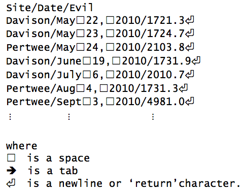

A couple of years after the Death Star exploded, a hot-shot reporter at
the Daily Planet heard that children in the Shire were starting to act
strangely. Our supervisor sent some grad students off to find out what
was going on. Every student's notebook containing measurements of background evil levels (in milliVaders)
at various locations in the Shire was later transcribed and stored as a data file.

Our job is to read 20 or 30 of these data files, each of which contains several
hundred measurements of background evil levels, and convert them into a
uniform format for further processing. Each of the readings has the name
of the site where the reading was taken, the date the reading was taken
on, and of course the background evil level in milliVaders. The problem
is, these files are formatted in different ways. Here is the first one:

 

A single tab character divides the fields in each row into columns. The
site names contain spaces, and the dates are in international standard
format: four digits for the year, two for the month, and two for the
day.

Here is that same table with those characters visualised. Note how we have a not-too-helpful mix of tabs and spaces in the different lines of the file.

 

## Tabs vs. Spaces

Remember typewriters? Heavy mechanical devices that used physical force to ram a piece of type on the end of a stick at a page, squashing down an inky ribbon to leave a stamped image of a letter or number. Laying out tables on these machines was a time consuming task that required a lot of patient and accurate use of the space and backspace keys. Pretty soon, typewriter manufacturers invented the `tabulate` or `tab` key, a single button that moved the current printing position a specified distance and really reduced the work that was done to layout a rudimentary table. The `tab` lives on in modern computer keyboards and has pretty much the same function: it represents a gap between columns in a table and (usually) moves the cursor a much greater number of pixels than the space bar does. The tab key usually lives in the upper left of the keyboard.

(source: [Wikipedia](http://commons.wikimedia.org/wiki/File:Keyboard-left_keys.jpg#mediaviewer/File:Keyboard-left_keys.jpg))

Since `tab` and `space` are two different keys on the keyboard, the coded message the keyboard sends through to the computer when each key is pressed is completely different, the code for the `tab` key is represented `\t` while the code for the space character is usually represented `\s` (the slashes differentiate them from the usual `t` and `s` characters). This means that in strings `tabs` and `spaces` are different things to the computer. 

A fly in this ointment is that the program that is showing the text strings through the screen is able to render the `\t` and `\s` however it likes. Sometimes the program will show the `\t` as say, 40 empty pixels and the  `\s` as 10 pixels but could display them both as 10. It could even choose to show them as completely different characters, a common thing is to show `\t` as arrows. So we can't trust what we see on screen, until we *really* know the program we are using to edit text. When we need to process the programatically we need to be very aware of the encoding differences between `tab` - `\t` and `space` - `\s` to express clearly what we want of the computer program.   

Let's have a look at the second notebook:

 

Clearly this is very different to the first. It uses slashes as separators. There don't appear to be spaces in the
site names, but the month names and day numbers vary in length. What's
worse, the months are text, and the order is month-day-year rather than
year-month-day.

We could parse these files using basic string operations, but it would
be difficult. A better approach is to use [regular
expressions](../../gloss.html#regular-expression). A regular expression is
just a pattern that can match a string. They are actually very common:
when we say `*.txt` to a computer, we mean, "Match all of the filenames
that end in `.txt`." The `*` is a regular expression: it matches any
number of characters.

The rest of this chapter will look at what regular expressions can do,
and how we can use them to handle our data. A warning before we go any
further, though: the notation for regular expressions is ugly, even by
the standards of programming. Se're writing patterns to match strings,
but we're writing those patterns *as* strings using only the symbols
that are on the keyboard, instead of inventing new symbols the way
mathematicians do. The good news is that regular expressions work more
or less the same way in almost every programming language. We will
present examples in Python, but the ideas and notation transfer directly
to Perl, Java, MATLAB, C\#, and Fortran.
