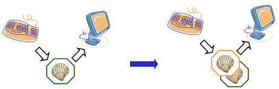

## Objectives
*   FIXME

## Lesson

The shell is just a program, and like other programs, it has variables.
Those variables control its execution, and by changing their values, you
can change how the shell and other programs behave.

Let's start by running the command `set` and looking at some of the
variables in a typical shell session:

~~~
$ set
COMPUTERNAME=TURING
HOME=/home/vlad
HOMEDRIVE=C:
HOSTNAME=TURING
HOSTTYPE=i686
NUMBER_OF_PROCESSORS=4
OS=Windows_NT
PATH=/usr/local/bin:/usr/bin:/bin:/cygdrive/c/Windows/system32:/cygdrive/c/Windows:/cygdrive/c/bin:/cygdrive/c/Python27
PWD=/home/vlad
UID=1000
USERNAME=vlad
...
~~~

As you can see, there are quite a few—in fact, four or five times more
than what's shown on this slide. And yes, using `set` to *show* things
might seem a little strange, even for Unix, but if you don't give it any
arguments, it might as well show you things you *could* set.

Every variable has a name. By convention, variables that are always
present are given upper-case names. All shell variables' values are
strings, even those (like `UID`) that look like numbers. it's up to
programs to convert these strings to other types when necessary. For
example, if a program wanted to find out how many processors the
computer had, it would convert the value of the `NUMBER_OF_PROCESSORS`
variable from a string to an integer.

Similarly, some variables (like `PATH`) store lists of values. In this
case, the convention is to use a colon ':' as a separator. If a program
wants the individual elements of such a list, it's the program's
responsibility to split the variable's string value into pieces.

Let's have a closer look at that `PATH` variable. Its value defines the
shell's [search path](glossary.html#search-path), i.e., the directories
that the shell looks in for runnable programs. If you recall, when we
type a command like `./analyze` that has a specific directory in the
path, the shell runs the program that path specifies. Similarly, if we
type `/bin/analyze`, the shell runs that specific program: we've
provided a specific path, so it knows what to do. But which one should
the shell do if we just type `analyze`?

The rule is simple: the shell checks each directory in the `PATH`
variable in turn, looking for a program with the requested name in that
directory. As soon as it finds a match, it stops searching and runs the
program.

To show how this works, here are the components of `PATH` broken out one
per line:

~~~
/usr/local/bin
/usr/bin
/bin
/cygdrive/c/Windows/system32
/cygdrive/c/Windows
/cygdrive/c/bin
/cygdrive/c/Python27
~~~

On our computer, there are actually three programs called `analyze` in
three different directories: `/bin/analyze`, `/usr/local/bin/analyze`,
and `/users/vlad/analyze`. Since the shell searches the directories in
order, it finds the one in `/bin`, not either of the others. Notice that
it will *never* find the program `/users/vlad/analyze`, since the
directory `/users/vlad` isn't in our path.

Before we explore variables any further, let's introduce one more
command: `echo`. All it does is print out its arguments. This doesn't
sound very exciting, but we can use it to show variables' values. First,
let's make sure it works:

~~~
$ echo hello transylvania!
hello transylvania!
~~~

Now let's try to show the value of the variable `HOME`:

~~~
$ echo HOME
HOME
~~~

That just prints "HOME", which isn't what we wanted. Let's try this
instead: `echo $HOME`:

~~~
$ echo $HOME
/home/vlad
~~~

The dollar sign tells the shell to replace the variable's name with its
value. This works just like wildcards: the shell does the replacement
*before* running the program we've asked for. Thanks to this expansion,
what we actually run is `echo /home/vlad`, which displays the right
thing.

Creating a variable is easy: just assign a value to a name using "=":

~~~
$ SECRET_IDENTITY=Dracula

$ echo $SECRET_IDENTITY
Dracula
~~~

To change the value, just assign a new one:

~~~
$ SECRET_IDENTITY=Camilla

$ echo $SECRET_IDENTITY
Camilla
~~~

Now for the complicated bit. Assignment only changes a variable's value
in the current shell, not in any other shells that are currently
running, or in any shells that are started later. To see what this
means, let's go back and set our secret identity once again:

~~~
$ SECRET_IDENTITY=Dracula

$ echo $SECRET_IDENTITY
Dracula
~~~

Once it's set, let's run a fresh copy of the shell by typing the command
`bash`. Remember, the shell is just another program: asking it to run a
fresh instance of itself in a new process is no different from asking it
to run `ls`, `ps`, or anything else.

~~~
$ bash
~~~

Nothing seems to have happened, but we now have two copies of the shell
running. We don't see anything signalling this on the screen because the
new shell prints the same prompt as the old one, but our keyboard input
and screen output are now tied to the child shell.

If we `echo $SECRET_IDENTITY` in the child shell, nothing is printed,
because the variable doesn't have a value in the child shell: it was
only set in the original shell. But if we exit the child shell and
return to the original, we can see that yes, the variable does exist.
Here's the whole sequence of commands with the ones executed in the
child shell highlighted:

~~~
$ SECRET_IDENTITY=Dracula

$ echo $SECRET_IDENTITY
Dracula

$ bash

$ echo $SECRET_IDENTITY

$ exit

$ echo $SECRET_IDENTITY
Dracula
~~~

If we really want the shell to pass a variable to the processes it
creates, we must use the `export` command. Let's try the secret identity
example again. After giving `SECRET_IDENTITY` a value, we give the shell
the command `export SECRET_IDENTITY`:

~~~
$ SECRET_IDENTITY=Dracula

$ export SECRET_IDENTITY
~~~

Note that it's *not* `export $SECRET_IDENTITY` with a dollar sign: if we
typed that, the shell would expand `SECRET_IDENTITY`, and our `export`
command would actually be `export Dracula`, which would do nothing,
because there's no variable called `Dracula`.

Now let's run a new shell, and type `echo $SECRET_IDENTITY`. There's our
variable. And of course, exiting brings us back to our original shell.

~~~
$ bash

$ echo $SECRET_IDENTITY
Dracula

$ exit
~~~

If we want to set some variables' values automatically every time we run
a shell, we can put the command to do this in a file called `.bashrc` in
our home directory. (The '.' character at the front prevents `ls` from
listing this file unless we specifically ask it to using `-a`: we
normally don't want to worry about it. The "rc" at the end is an
abbreviation for "run control", which meant something really important
decades ago, and is now just a convention everyone follows without
understanding why.) For example, here are two lines in Vlad's `.bashrc`
file, which is in `/home/vlad/.bashrc`:

~~~
export SECRET_IDENTITY=Dracula
export TEMP_DIR=/tmp
export BACKUP_DIR=$TEMP_DIR/backup
~~~

These two lines create the variables `SECRET_IDENTITY` and `BACKUP_DIR`,
give them values, and export them so that any programs the shell runs
can see them as well. Notice that `BACKUP_DIR`'s definition relies on
the value of `TEMP_DIR`, so that if we change where we put temporary
files, our backups will be relocated automatically.

While we're here, it's also common to use the `alias` command to create
shortcuts for things we frequently type. For example, we can define the
alias `backup` to run `/bin/zback` with a specific set of arguments:

~~~
alias backup=/bin/zback -v --nostir -R 20000 $HOME $BACKUP_DIR
~~~

As you can see, aliases can save us a lot of typing, and hence a lot of
typing mistakes.

## Key Points
*   FIXME

## Challenges

1.  FIXME

