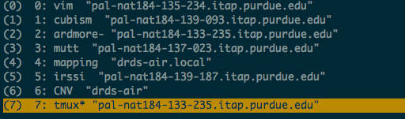
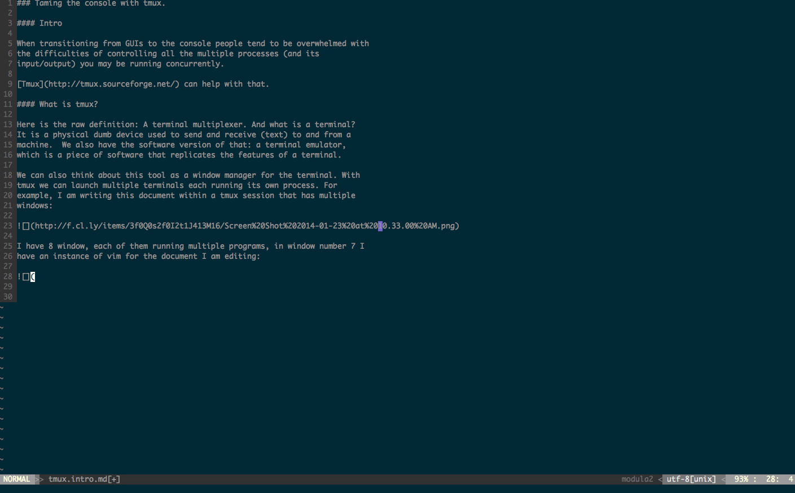
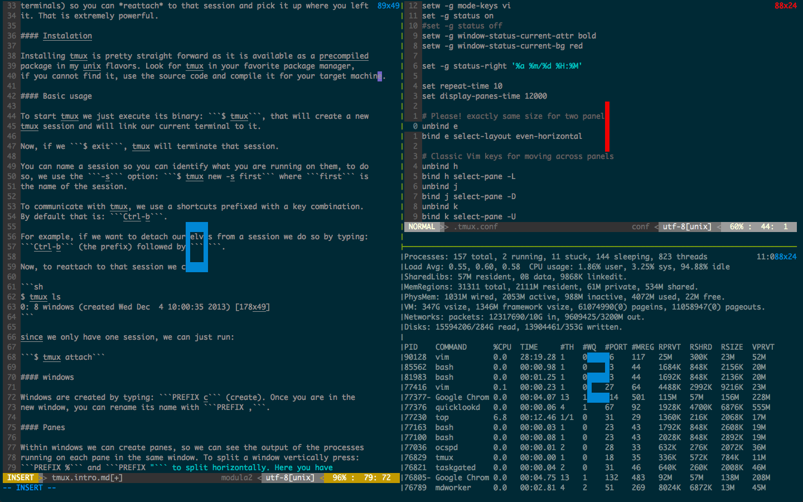

### Taming the console with tmux.

#### Intro

Controlling I/O from multiple processes can be overwhelming when working in the
console. [Tmux](http://tmux.sourceforge.net/) can help with that.

#### What is tmux?

Here is the raw definition: A terminal multiplexer.

And what is a terminal?  It is a physical dumb device used to send and receive
(text) to and from a machine.

We also have the software version of that: a terminal emulator, which is a
piece of software that replicates the features of a terminal.

We can also think about this tool as a window manager for the terminal. With
tmux we can launch multiple terminals each running its own process.

For example, I am writing this document within a tmux session that has multiple
windows:

I have 8 window, each of them running multiple programs, in window number 7 I
have an instance of vim for the document I am editing:

There is one more feature I want to point out about tmux: *detaching* from a
session.

You can have leave (detach) an active tmux session, when doing that, tmux will
take care of the output from the different windows (and its terminals) so you
can *reattach* to that session and pick it up where you left it. That is
extremely powerful.

#### Installation

Installing tmux is pretty straight forward as it is available as a precompiled
package in my unix flavors. Look for tmux in your favorite package manager, if
you cannot find it, use the source code and compile it for your target machine.

#### Basic usage

To start tmux we just execute its binary: `$ tmux`, that will create a new
tmux session and will link our current terminal to it.

Now, if we `$ exit`, tmux will terminate that session.

You can name a session so you can identify what you are running on them, to do
so, we use the `-s` option: `$ tmux new -s first` where `first` is
the name of the session.

To communicate with tmux, we use a shortcuts prefixed with a key combination.
By default that is: `Ctrl-b`.

For example, if we want to detach ourselves from a session we do so by typing:
`Ctrl-b` (the prefix) followed by `d`.

Now, to reattach to that session we can:

`sh
$ tmux ls
0: 8 windows (created Wed Dec  4 10:00:35 2013) [178x49]
`

since we only have one session, we can just run:

`$ tmux attach`

#### windows

Windows are created by typing: `PREFIX c` (create).

Once you are in the new window, you can rename its name with `PREFIX ,`.

#### Panes

Within windows we can create panes, so we can see the output of the processes
running on each pane in the same window. To split a window vertically press:
`PREFIX %` and `PREFIX "` to split horizontally.

Here you have a tmux window, within a session that has 3 panes. In number 0
we are doing some editing with, same in number 1 (but for a different file) and
in pane number 2 we have the `top` command running.

#### Final remarks

In this brief introduction we have just scratched the power of tmux. Refer to
the reference section if you want to learn more about this great tool.

### References

1. [Tmux site](http://tmux.sourceforge.net/).
