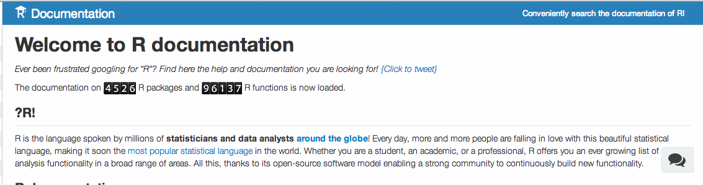
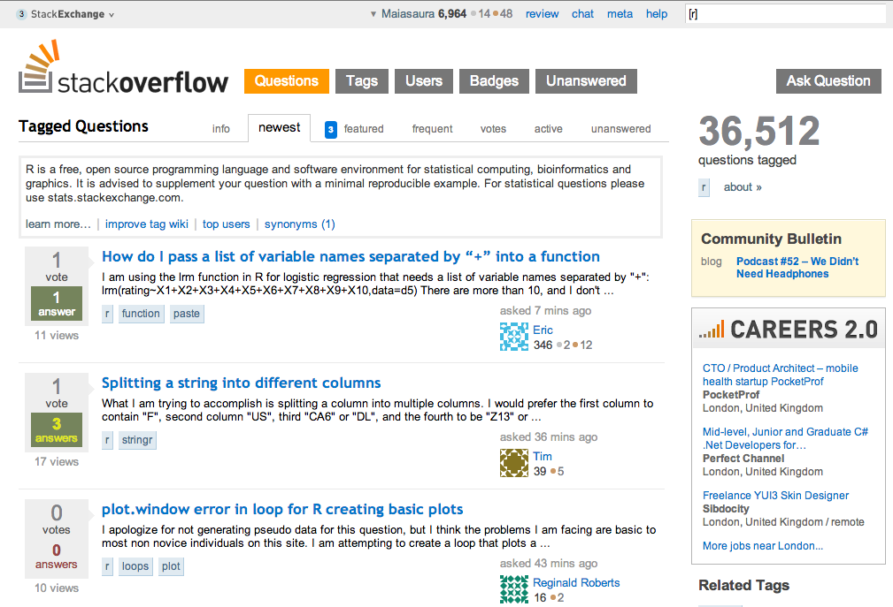

```{r, include = FALSE}
source("../chunk_options.R")
```

# Diagnostic functions in R

**Super helpful functions**  
* `str()` - Compactly display the internal structure of an R object. Perhaps the most uesful diagnostic function in R.
* `class()` *Retrieves the internal class of an object*
* `mode()` *Get or set the type or storage mode of an object.*
* `length()` *Retrieve or set the dimension of an object.*  
* `dim()` *Retrieve or set the dimension of an object.*
* `R -- vanilla` - *Allows you to start a clean session of R. A great way to test whether your code is reproducible.*
* `sessionInfo()` *Print version information about R and attached or loaded packages.*  
* `options()` *Allow the user to set and examine a variety of global options which affect the way in which R computes and displays its results.*

`str()` is your best friend

`str` is short for structure. You can use it on any object. Try the following:

```{r, eval = TRUE}
x <- 1:10
class(x)
mode(x)
str(x)
```


---

# Seeking help

There are various ways to seek help on R.

If you are searching for help on a specific function that is in a package loaded into your namespace:

```
?function_name
```

If you're not sure what package it belongs to:

```
??function_name
```

This will search across all installed packages in your library and pop up several options

Another recent package that's really useful in this context is called `Rdocumentation`. It searches across all packages on CRAN even if you do not have it installed locally.



to install:

```{r, eval = FALSE}
library("devtools")
install_github("Rdocumentation","jonathancornelissen");
library("Rdocumentation")
# then all ?function searches go through the web
# If you do load this package and want to remove it because of lack of internet, use
detach("Rdocumentation")
```


# Seeking help from peers

* Always share some example data to help others replicate your problem.

for example, the function `dput()` can help recreate R objects by simply pasting the output into another R terminal. Just `dput` a few rows for testing purposes.

e.g.

```{r, eval = TRUE}
dput(head(iris))

structure(list(Sepal.Length = c(5.1, 4.9, 4.7, 4.6, 5, 5.4), 
    Sepal.Width = c(3.5, 3, 3.2, 3.1, 3.6, 3.9), Petal.Length = c(1.4, 
    1.4, 1.3, 1.5, 1.4, 1.7), Petal.Width = c(0.2, 0.2, 0.2, 
    0.2, 0.2, 0.4), Species = structure(c(1L, 1L, 1L, 1L, 1L, 
    1L), .Label = c("setosa", "versicolor", "virginica"), class = "factor")), .Names = c("Sepal.Length", 
"Sepal.Width", "Petal.Length", "Petal.Width", "Species"), row.names = c(NA, 
6L), class = "data.frame")
```


* Use the `sessionInfo()` function to share your current namespace and package versions. Super helpful for others to help debug your issues.

The `knitr` function `stitch()` automatically includes this information. Try it on any example R script.

```{r, eval = FALSE}
stitch("my_script.R")
```


## search StackOverflow

9 times out of 10, the answers you are seeking have already been answered on stack overflow. Search using the `[r]`

[http://stackoverflow.com/questions/tagged/r](http://stackoverflow.com/questions/tagged/r)




## Other resources

CRAN task Views: [http://cran.at.r-project.org/web/views](http://cran.at.r-project.org/web/views)


