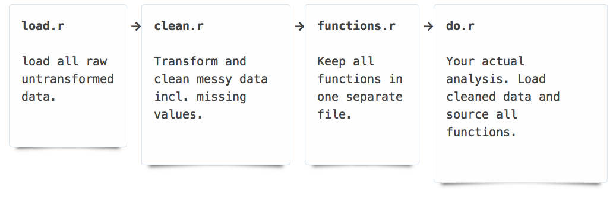

```{r, include = FALSE}
source("../chunk_options.R")
```

# A short tutorial on how to read and clean messy data

Raw data from various ecological studies can be poorly formatted and/or may lack appropriate details of the study. Correcting data in place can be a dangerous exercise since the original raw data would get overwritten and there would be no way to audit this process or recover from mistakes made during this time. A good data practice would be to maintain the original data, but use a programmatic script to clean it, fix mistakes and save that cleaned dataset for further analysis. 




## Tidy data

* Tidy data vs Clean data

### Most common problems:


1. Values as columns  (melt to long format)
2. Multiple values in a single cell (some regexpr to split em)
3. Variables in rows (cast)


### A warm-up example


```{r, eval = TRUE}
dat <- data.frame(males = c(injured = 4, uninjured = 2), females = c(injured = 1, uninjured = 5))
dat
```

Rowames as a column we can manipulate

```{r, eval = TRUE}
dat <- cbind(dat, status = rownames(dat)) 
dat
```

Get values out of columns, variables as columns:

```{r , eval = TRUE}
library("reshape2")
dat <- melt(dat, "status") 
```

Add some nice metadata that was absent before:

```{r, eval = TRUE}
names(dat) <- c("status", "sex", "count")
dat
```

---

## More messy: non-standard input formats


In the example below, we use a data file obtained as plain text and clean up incorrect spacing and separators. Then we look up the appropriate metadata 

```{r, load_data}
library("stringr")
# If you don't have this package simply run install.packages("stringr")
rawData <- readLines("data/messy_data.txt")
rawData
```

```{r examine_data}
# Count number of lines (make sure it's what you're expecting)
length(rawData)
```

We've got two issues here. First, we need to split the dates into two separate fields. Next we need to remove the uneven spaces and split the remaining data into individual cells. We can write functions to accomplish both tasks.


```{r clean_up}
# First we use a function in the stringr package to locate where the dashes are.
# Note that we are not just searching for the dash but a string that includes the space before and after.
dashes <- str_locate_all(rawData, " - ")
# Let's make sure it looks right
rawData[1]
dashes[1]
```

```{r functions}
# -----------------------------------------------
# A function to remove extra spaces and split the dates
# -------------------------------------------
splitByDate <- function(str, start, finish) {

    beginning <- str_sub(str, 1, start - 6)
    dates <- str_sub(str, start - 5, finish + 5)
    end <- str_sub(str, finish + 6, str_length(str))

    beginning <- str_trim(beginning)
    dates <- str_split(dates, " - ")

    while(str_detect(end, "  ")) {
       end <- str_replace_all(str_trim(end), "  ", " ")    
    }

    end <- str_split(end, " ")
    return(c(unlist(beginning), unlist(dates), unlist(end)))
}

# A function to return a nicely formatted dataset
# -------------------------------------------
formatData  <- function(rawD) {
    longest_row <- max(sapply(rawD, length))
    # If any rows have missing data, we pad it with NAs so we get a clean data.frame
    results <- sapply(rawD, function(y) {
        if(length(y) < longest_row)
            c(y, rep(NA, longest_row - length(y))) 
        else 
            y
    })

    return(as.data.frame(t(results)))
} 
```

```{r, clean_data}
first_pass <- sapply(1:length(rawData), function(x) {
    splitByDate(rawData[x], dashes[[x]][1], dashes[[x]][2])
})

cleaned_data <- formatData(first_pass)
names(cleaned_data) <- c("observer", "date_first", "date_last", "id", "distance", "direction", "speed", "measurex", "measurey", "migratory_status", "times_observed")
```

```{r, fix_dates}
# str is short for structure
str(cleaned_data)
cleaned_data$date_first
# oops, we forgot to add the year. All these data were collected in 2012
cleaned_data$date_first  <- paste0(cleaned_data$date_first, "/12")
cleaned_data$date_last  <- paste0(cleaned_data$date_last, "/12")

# Now let's typecast these data as a Date class
cleaned_data$date_first <- as.Date(cleaned_data$date_first, "%m/%d/%y")
cleaned_data$date_last <- as.Date(cleaned_data$date_last, "%m/%d/%y")
```


We can examine the data to make sure everything looks ok.

```{r, examine}
head(cleaned_data)
tail(cleaned_data)
```

Now we can confidently save these data into a separate file which we called `cleaned_data.csv`. In a real world use case your file name would be more descriptive.


```{r save_data}
write.csv(cleaned_data, file = "data/cleaned_data.csv")
```

As you can see in the `data` folder, we now have both the original untransformed raw data and also the cleaned data which is now read for further analysis. If there's ever any questions about the cleanup process, this script will provide a way to audit all the steps. The original data are always there untouched. Now you are free to proceed with the analysis and the reporting.


