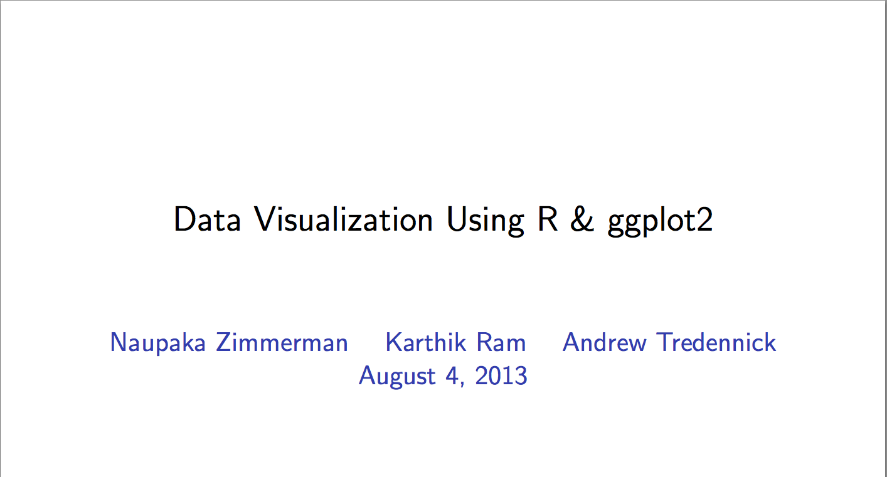

# Data visualization with ggplot2

Author: [Karthik Ram](mailto:karthik.ram+ggplot2@gmail.com), [Naupaka Zimmerman](naupaka@gmail.com) 

These slides will cover the introductory material for the workshop. Please open the `ggplot.pdf` in this folder. All the R code in the slides are in the `ggplot.R` file. 


[](https://raw.github.com/karthik/esa_data_viz/master/introduction/slides.png)


----

Slides based on a talk [originally run on Berkeley campus](https://github.com/karthik/ggplot-lecture) on April 7th. If you'd like to generate this presentation locally, first install the lastest version of `knitr`

```coffee
install.packages("knitr")
```

Then Run

```coffee
make slides
```  

Note: You'll need to have LaTex setup locally. See [additional_software] page in the root of this repository.
 
# License  
<a rel="license" href="http://creativecommons.org/licenses/by/2.0/">Creative Commons Attribution 2.0 Generic License</a>.
