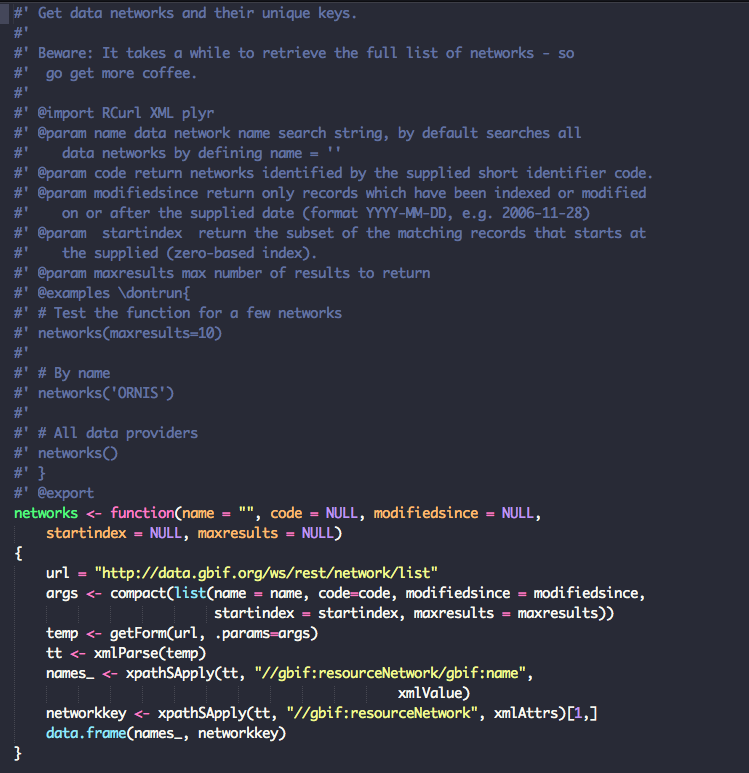
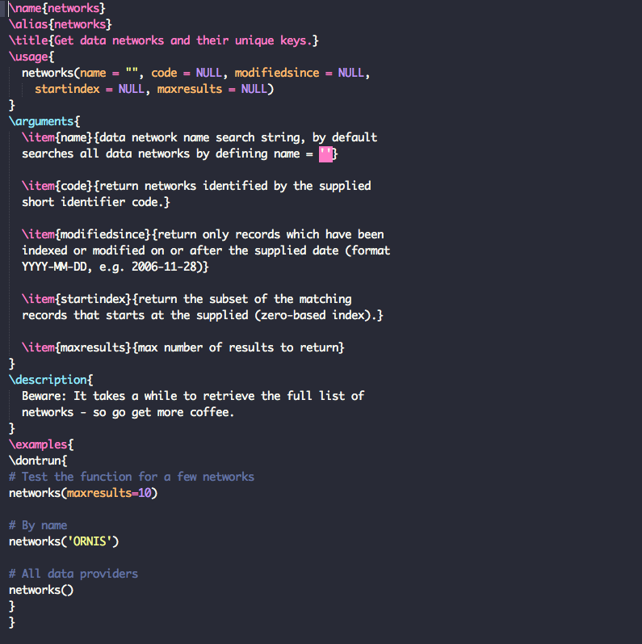
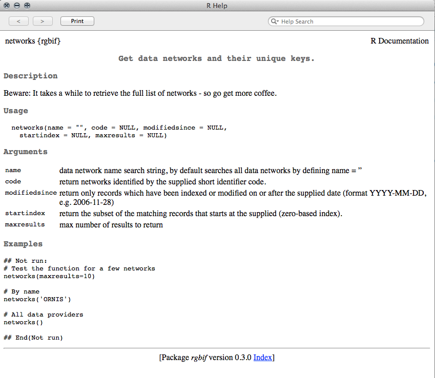

# Document your code and generate man files with `roxygen2`

**Why document your code?**

Without clear and concise documentation, it becomes impossible for anyone (including yourself after some time) to make sense of what your code does. It's always good practice to write plenty of comments in your functions. In addition to inline comments (anything to the right of a `#`), the package `roxygen2` provides an easy way to document your functions right inside a script and use it to generate help files.

Inline documentation makes it easy to keep everything up-to-date as you work through your code.



After this markup has been processed by `roxygen2` you get a file with the same name and extension `.Rd` (R documentation) in the `man/` folder.



Once you build your package, the final help files that you see when you run `?function_name` look like this.




---

roxygen2 documentation always begins with this syntax:

```
#'
```

| `roxygen2` document tags | What they mean |
| ------------------  | -------------  |
|  `@title`           | Function title | 
|  `@description`     | A clear yet concise description fo what your package does | 
|  `@details`           | A longer description (optional) | 
|  `@param`           | An arugment that a function takes as input. Usage is `@param arg description` | 
|  `@keywords`           | Any keywords that your function might take | 
|  `@export`           | Adding this tag will make a function visible outside the package. Otherwise it will only be available internally | 
|  `@seealso`           | List any other related functions here. You can also link to them using `\link[package]{function}` | 
|  `@import`           | Import any other packages whose functions you might require here | 
|  `@importFrom`           | Import only specific functions to use | 
|  `@return`           | Type of object that the function returns | 
|  `@examples`           | Simple yet clear examples demonstrating how someone might use your function | 
|  `@docType`           | Function, data or method | 
|  `@name`           | Name of package, method or dataset | 
|  `@author`         | Add authors in this format →  `Firstname Lastname <email@@address.com>` | 

**Additional notes**
* Leave blank lines between sections with an empty `#'`
* Use `\code{text}` to highlight code.
* Use `\strong{text}` to bold any text.
* Use `\emph{text}` to italicize text.
* Links outside your documentation: `\email{email_address}`, `\url{url}`, `\href{url}{text}`

**Example**
A trivial function with documentation.

```coffee
#'addNums
#'
#' Adds two numbers
#' @param x First number. Must be \code{numeric} or \code{integer}
#' @param  y Second number. Must also be \code{numeric} or \code{integer}
#' @param  ... Optional additional arguments
#' @export
#' @keywords addition
#' @seealso subtractNums
#' @return integer or numeric
#' @examples \dontrun{
#' addNums(1, 4)
#' addNums(1.2 , 4.5)
#'}
addNums <- function(x, y, ...) {
    return(x + y)
```


## Exercise:

Please take the next 20 minutes to document the functions we've written so far. We'll discuss this as a group as soon as you are done. 
*Please place a green post-it on your laptop when you're done.*


