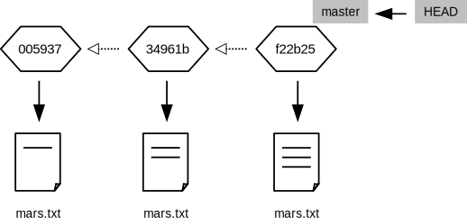
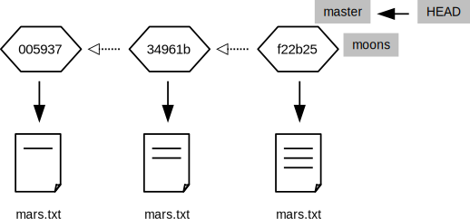
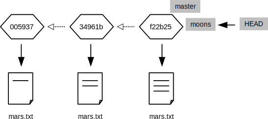
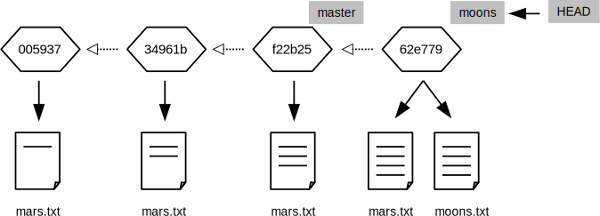
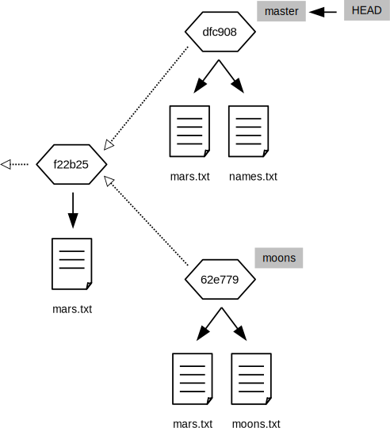
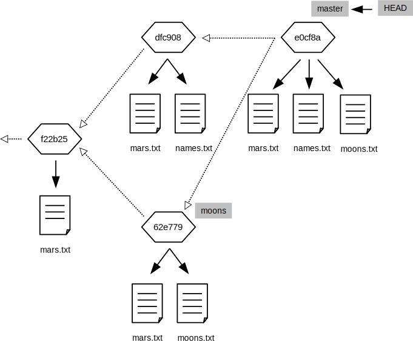

Here's where we are right now:

~~~
$ git log
~~~

~~~
commit 005937fbe2a98fb83f0ade869025dc2636b4dad5
Author: Vlad Dracula <vlad@tran.sylvan.ia>
Date:   Thu Aug 22 10:14:07 2013 -0400

    Thoughts about the climate

commit 34961b159c27df3b475cfe4415d94a6d1fcd064d
Author: Vlad Dracula <vlad@tran.sylvan.ia>
Date:   Thu Aug 22 10:07:21 2013 -0400

    Concerns about Mars's moons on my furry friend

commit f22b25e3233b4645dabd0d81e651fe074bd8e73b
Author: Vlad Dracula <vlad@tran.sylvan.ia>
Date:   Thu Aug 22 09:51:46 2013 -0400

    Starting to think about Mars

$ cat mars.txt
Cold and dry, but everything is my favorite color
The two moons may be a problem for Wolfman
But the Mummy will appreciate the lack of humidity
~~~

We can draw the history of the repository like this
(we'll see in a second why there's a box called `master`):

Let's run this command:

~~~
$ git branch moons
~~~

It appears to do nothing,
but behind the scenes it has created a new [branch](../../gloss.html#branch) called `moons`:

~~~
$ git branch
~~~

~~~
* master
  moons
~~~

Git is now maintaining two named bookmarks in our history:
`master`,
which was created automatically when we set up the repository,
and `moons`,
which we just made.
They both point to the same revision right now,
but we can change that.
Let's make `moons` the active branch:

~~~
$ git checkout moons
~~~

~~~
Switched to branch 'moons'
~~~

~~~
$ git branch
~~~

~~~
  master
* moons
~~~

Our file looks the same:

~~~
$ cat mars.txt
~~~

~~~
Cold and dry, but everything is my favorite color
The two moons may be a problem for Wolfman
But the Mummy will appreciate the lack of humidity
~~~

because it *is* the same:
Let's add another line to it:

~~~
$ echo "Maybe we should put the base on one of the moons instead?" >> mars.txt
~~~

and add an entirely new file:

~~~
$ echo "Phobos is larger than Deimos" > moons.txt
$ ls
~~~

~~~
mars.txt    moons.txt
~~~

Git now tells us that we have one changed file and one new file:

~~~
$ git status
~~~

~~~
# On branch moons
# Changes not staged for commit:
#   (use "git add <file>..." to update what will be committed)
#   (use "git checkout -- <file>..." to discard changes in working directory)
#
#    modified:   mars.txt
#
# Untracked files:
#   (use "git add <file>..." to include in what will be committed)
#
#    moons.txt
no changes added to commit (use "git add" and/or "git commit -a")
~~~

Let's add and commit those changes
(the `-A` flag to `git commit` means "add everything"):

~~~
$ git add -A
$ git status
~~~

~~~
# On branch moons
# Changes to be committed:
#   (use "git reset HEAD <file>..." to unstage)
#
#    modified:   mars.txt
#    new file:   moons.txt
#
~~~

~~~
$ git commit -m "Thinking about the moons"
~~~

~~~
[moons 62e7791] Thinking about the moons
 2 files changed, 2 insertions(+)
 create mode 100644 moons.txt
~~~

Our repository is now in the state shown below:

The `moons` branch has advanced to record the changes we just made,
but `master` is still where it was.
If we switch back to `master`:

~~~
$ git checkout master
~~~

our changes seem to disappear:

~~~
$ ls
~~~

~~~
mars.txt
~~~

~~~
$ cat mars.txt
~~~

~~~
Cold and dry, but everything is my favorite color
The two moons may be a problem for Wolfman
But the Mummy will appreciate the lack of humidity
~~~

They're still in the repository&mdash;they're just not in
the revision that `master` is currently pointing to.
In essence,
we've created a parallel timeline that shares some history with the original one before diverging.

Let's make some changes in the `master` branch to further illustrate this point:

~~~
$ echo "Should we go with a classical name like Ares Base?" > names.txt
$ git status
~~~

~~~
# On branch master
# Untracked files:
#   (use "git add <file>..." to include in what will be committed)
#
#    names.txt
nothing added to commit but untracked files present (use "git add" to track)
~~~

~~~
$ git add names.txt
$ git commit -m "We will need a cool name for our secret base"
~~~

~~~
[master dfcf908] We will need a cool name for our secret base
 1 file changed, 1 insertion(+)
 create mode 100644 names.txt
~~~

Our repository is now in this state:

`master` and `moons` have both moved on from their original common state,
but in different ways.
They could continue independent existence indefinitely,
but at some point we'll probably want to [merge](../../gloss.html#merge) our changes.
Let's do that now:

~~~
$ git branch
~~~

~~~
* master
  moons
~~~

~~~
$ git merge moons
~~~

When we run the `git merge` command,
Git opens an editor to let us write a log entry about what we're doing.
The editor session initially contains this:

~~~
Merge branch 'moons'

# Please enter a commit message to explain why this merge is necessary,
# especially if it merges an updated upstream into a topic branch.
#
# Lines starting with '#' will be ignored, and an empty message aborts
# the commit.
~~~

If we notice that something is wrong and decide not to complete the merge,
we must delete everything in the file&mdash;Git interprets an empty log message to mean,
"Don't proceed."
Otherwise,
everything that isn't marked as a comment with `#` will be saved to the log.
In this case,
we'll stick with the default log message.
When we save the file and exit the editor, Git displays this:

~~~
Merge made by the 'recursive' strategy.
 mars.txt  | 1 +
 moons.txt | 1 +
 2 files changed, 2 insertions(+)
 create mode 100644 moons.txt
~~~

We now have all of our changes in one place:

~~~
$ ls
~~~

~~~
mars.txt    moons.txt    names.txt
~~~

and our repository looks like this:

We can ask Git to draw a diagram of the repository's history with this command:

~~~
$ git log --oneline --topo-order --graph
~~~

~~~
*   e0cf8ab Merge branch 'moons'
|\
| * 62e7791 Thinking about the moons
* | dfcf908 We will need a cool name for our secret base
|/
* 005937f Thoughts about the climate
* 34961b1 Concerns about Mars's moons on my furry friend
* f22b25e Starting to think about Mars
~~~

This ASCII art is fine for small sets of changes,
but for anything significant,
it's much better to use a GUI
that can draw graphs using lines instead of characters.

Branching strikes most newcomers as unnecessary complexity,
particularly for single-author projects.
After all,
if we need to make some changes to a project,
what do we gain by creating parallel universes?

The answer is that branching makes it easy for us to concentrate on one thing at a time.
Suppose we are part-way through rewriting a function that calculates spatial correlations
when we realize that the task would be easier if our file I/O routines always stored things as complex numbers.
Most people would put the spatial correlation changes aside,
change the file I/O,
then (hopefully) come back to the original task.

The problem with this is that we have to remember what we were doing,
even if we realize halfway through rewriting file I/O that we should also rewrite our error handling.
It's quite common to wind up with half a dozen tasks stacked on top of one another,
and quite hard to them all straight.
Branching allows us to put what we're doing in a safe place,
solve the new problem,
then resume our earlier work.

In practice,
most developers never make changes directly in the `master` branch.
Instead,
they create a new branch from it for every change they want to make,
then merge those branches back to `master` when the work is complete.
Returning to our hypothetical example,
we would:

1.  create a branch called something like `better-spatial-correlation` for those changes;
2.  go back to master and create another branch called `file-input-produces-complex-values` for *those* changes;
3.  merge `file-input-produces-complex-values` into `master`;
4.  merge `master` into `better-spatial-correlation`; and
5.  finish work on the spatial correlation function and merge it all back into `master`.

And if,
partway through this process,
our supervisor asked us to change the graph-plotting routines to conform to the university's new style guide,
we would simply switch back to `master`,
create a branch for that,
make the changes,
produce the desired graphs,
and leave the changes parked in that branch until we were ready to merge them.
