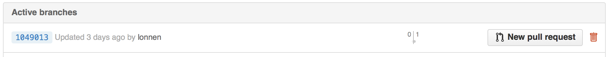

There are many ways to improve the quality of software,
and the most effective of them is [code review](../../gloss.html#code-review).
GitHub uses the [pull request](../../gloss.html#pull-request)
to facilitate code review within and between projects.

Pull requests are a way of proposing a merge,
from one [branch](../../gloss.html#branch) to another.
These branches can be in the same repository
or in different [forks](../../gloss.html#fork) of the same project.
It's an enhancement of the [branching lesson](../extras/01-branching.html)
for working effectively with other people.

Let's revisit Wolfman,
who has made some changes locally
in a branch
that he wants to contribute back
into Dracula's project.
He pushes the branch with the changes to GitHub.
He could push them to the original repository,
or to his fork
if he doesn't have access to the original repository.
Wolfman can then load the repository's page in a web browser,
and open a pull request.
If Wolfman does this within a few minutes,
recently modified branches will be highlighted in the header of the repository
with a button to open a pull request.

If Wolfman wants to open a pull request
from a branch that is no longer highlighted
he can use the link in the repository header
to load an overview of all the branches.

From the branch overview, each branch will have a button
that can be used to open a pull request.

When Dracula views the pull request online,
he will be able to see the changes Wolfman wants to make.
Dracula can leave comments on individual lines of the code,
or make comments on the larger pull request
to give feedback to Wolfman.
Wolfman can make changes to his local code,
and push them to the branch.
The pull request will automatically update to reflect the changes.

The feedback you receive on a pull request
may be extensive, or minimal.
Initially it may be focused on elements of style --
where to put your line breaks,
naming conventions for variables,
or idiomatic code transformations.
Later it could cover your implementation --
how your code is organized
into functions and modules.
Importantly,
the reviewer may ask you to break up your work
into smaller, logical pieces.
This makes your changes easier to review,
easier integrate into the project,
and less likely to cause bugs.

Reviewing code can be complex.
There are a number of tools that can assist in the task:
software linters are tools to verify that code complies with a style guide,
and automatic tests can ensure no old bugs have resurfaced.
No tool is as effective as having a careful review by a peer, though.
A good heuristic is to look for and scrutinize sources of surprise
as you read through the changes.
Reviews are more difficult than initially writing the code,
and a reviewer's effectiveness diminishes rapidly after the first hour.
Lines of code are a good approximate measure
for how long a patch will take to review.

The process is similar to peer review of scientific publications,
though usually much faster.
In large open source projects
it's very common for a pull request to be updated several times before finally being accepted and merged.
Working this way not only helps maintain the quality of the code,
it is also a very effective way to transfer knowledge.

While Wolfman waits for review to his first modification,
he can continue to work by creating a new branch in his local repository.
From this new branch,
he can make new changes,
push them to GitHub,
and issue a second pull request from that.
This is an important way that Git, Mercurial, and other modern version control systems use branching.
It helps people work together,
but on their own time.
It might take Dracula several days to get around to reviewing Wolfman's changes.
Rather than being stalled until then,
Wolfman can just switch to another branch and work on something else,
then switch back when Dracula's review finally comes in.
When Dracula likes the changes
and wants to merge them into his project
he can do so with the click of a button:

Once the changes in a particular branch have been accepted
and merged into `master` (or some other branch),
Wolfman can delete the branch.
The changes themselves will be preserved where they have been merged.
