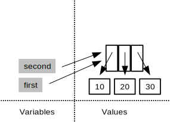
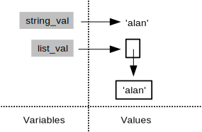
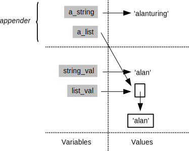
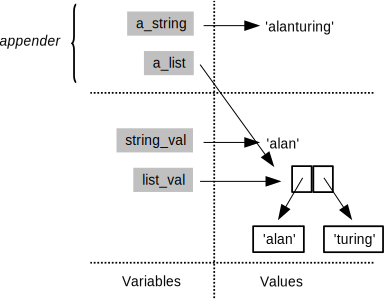
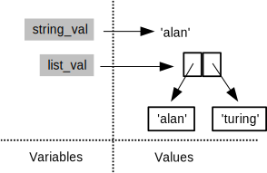

At this point,
we need to take a small side trip to explore something which is very useful,
but which can also be the source of some hard-to-find bugs.
Consider the following snippet of Python:

~~~
first = [10, 20, 30]
second = first
~~~

After these two lines have been executed,
the program's memory looks like this:

If we change the last value of the list that `first` refers to:

~~~
first[2] = 99
~~~

then `second`'s value changes as well:

~~~
print first
[10, 20, 99]
print second
[10, 20, 99]
~~~

This is called [aliasing](../gloss.html#alias),
and it is not a bug:
the program is supposed to work this way.
It doesn't have to, though;
Python's creator could have decided that:

~~~
second = first
~~~

would create a copy of `first`
and assign that to `second` instead.
That would be easier to understand&mdash;there would be no chance that
assigning to one variable would cause another variable's value to change&mdash;but
it would also be less efficient.
If our sublists contain a million elements each,
and we're assigning them to temporary variables
simply to make our program more readable,
copying would cause unnecessary slow-down.

When a programming language copies data,
and when it creates aliases instead,
is one of the most important things a programmer must know about it.
If we query a database,
is the result a copy of the data as it was when we made the query,
or a reference to the master copy?
In the first case,
we can now change the data however we want without affecting other people,
but we won't see any updates they make.
In the second case,
we will automatically see updates to the data,
but that means our program has to cope with changes at unpredictable times
(and also has to re-fetch the data each time it needs it,
which will reduce performance).
Neither approach is right or wrong:
there are simply engineering tradeoffs that we have to be aware of.

> #### Copying When You Want To
>
> Python has a library called (naturally enough) `copy`
> that knows how to copy complex data structures.

We said earlier that
values are copied into parameters whenever a function is called.
But variables don't actually store values:
they are actually just names that refer to values.
To see what this means for our programs,
here's a function that takes a string and a list as parameters,
and appends something to both:

~~~
def appender(a_string, a_list):
    a_string = a_string + 'turing'
    a_list.append('turing')
~~~

And here is some code to set up a pair of variables and call that function:

~~~
string_val = 'alan'
list_val = ['alan']
appender(string_val, list_val)
print 'string', string_val
print 'list', list_val
string alan
list ['alan', 'turing']
~~~

Why did the list change when the string didn't?
To find out,
let's trace the function's execution.
Just before the call,
the global frame has two variables
that refer to a string and a list:

The call creates a new stack frame with aliases for those values:

The `a_string + 'turing'` creates a new string `'alanturing'`;
assigning this to the variable `a_string`
changes what that local variable refers to,
but doesn't change what the global variable `string_val` refers to:

The statement `a_list.append('turing')`,
however,
actually modifies the list that `a_list` is pointing to:

But this is the same thing that the variable `list_val` in the caller is pointing to.
When the function returns and the call frame is thrown away,
the new string `'alanturing'` is therefore lost,
because the only reference to it was in the function call's stack frame.
The change to the list,
on the other hand,
is kept,
because the function actually modified the list in place:

Let's change one line in the function:

~~~
def appender(a_string, a_list):
    a_string = a_string + 'turing'
    a_list = a_list + ['turing']
~~~

and see what happens when we run the same experiment:

~~~
string_val = 'alan'
list_val = ['alan']
appender(string_val, list_val)
print 'string', string_val
print 'list', list_val
string alan
list ['alan']
~~~

The answer is different because
concatenating (adding) two lists creates a new list,
rather than modifying either of the lists being concatenated.
As a result,
the local variable `a_list` is the only thing that refers to the list
`['alan', 'turing']`,
so that value is discarded when the function finishes
and `list_val`'s value is undisturbed.

> #### Memory Models
>
> Python's treatment of lists and other mutable data
> isn't the only way to handle things.
> For example,
> MATLAB functions
> use a rule called [copy on write](../gloss.html#copy-on-write).
> Initially,
> it creates aliases for arrays that are passed into functions.
> The first time a function assigns to an array,
> though,
> MATLAB clones the array
> and changes the clone rather than the original.
> This saves it from copying data when it doesn't need to,
> while guaranteeing that functions don't have side effects
> (which makes them easier to think about).
> 
> Other languages have slightly different rules about scoping and aliasing.
> Together,
> those rules make up the language's
> [memory model](../gloss.html#memory-model).
> Understanding that model is perhaps the most important step
> in understanding how programs written in the language actually work,
> and more importantly,
> how to debug them when they don't.
