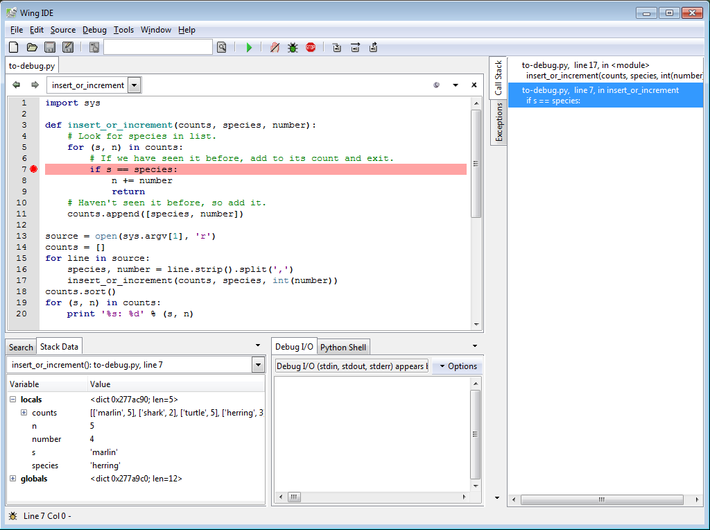

Programmers spend a lot of time debugging,
so it's worth learning how to do it systematically.
We'll talk about tools first,
since they'll make everything else less painful.
We'll then talk about some techniques.
Throughout,
we'll assume that we built the right thing the wrong way;
requirements errors are actually a major cause of software project failure,
but they're out of scope for now.

When something goes wrong in a program like this:

~~~
import sys

def insert_or_increment(counts, species, number):
    # Look for species in list.
    for (s, n) in counts:
        # If we have seen it before, add to its count and exit.
        if s == species:
            n += number
            return
    # Haven't seen it before, so add it.
    counts.append([species, number])

source = open(sys.argv[1], 'r')
counts = []
for line in source:
    species, number = line.strip().split(',')
    insert_or_increment(counts, species, int(number))
counts.sort()
for (s, n) in counts:
    print '%s: %d' % (s, n)
~~~

most people start debugging by adding `print` statements:

~~~
def insert_or_increment(counts, species, number):
    # Look for species in list.
    print 'insert_or_increment(', counts, ',', species, ',', number, ')'
    for (s, n) in counts:
        print '...checking against', s, n
        # If we have seen it before, add to its count and exit.
        if s == species:
            n += number
            print '...species matched, so returning with', counts
            return
    # Haven't seen it before, so add it.
    counts.append([species, number])
    print 'new species, so returning with', counts
~~~

and then paging through output like this:

~~~
insert_or_increment( [] , marlin , 5 )
new species, so returning with [['marlin', 5]]
insert_or_increment( [['marlin', 5]] , shark , 2 )
...checking against marlin 5
new species, so returning with [['marlin', 5], ['shark', 2]]
insert_or_increment( [['marlin', 5], ['shark', 2]] , marlin , 1 )
...checking against marlin 5
...species matched, so returning with [['marlin', 5], ['shark', 2]]
insert_or_increment( [['marlin', 5], ['shark', 2]] , turtle , 5 )
...checking against marlin 5
...checking against shark 2
new species, so returning with [['marlin', 5], ['shark', 2], ['turtle', 5]]
insert_or_increment( [['marlin', 5], ['shark', 2], ['turtle', 5]] , herring , 3 )
...checking against marlin 5
...checking against shark 2
...checking against turtle 5
new species, so returning with [['marlin', 5], ['shark', 2], ['turtle', 5], ['herring', 3]]
insert_or_increment( [['marlin', 5], ['shark', 2], ['turtle', 5], ['herring', 3]] , herring , 4 )
...checking against marlin 5
...checking against shark 2
...checking against turtle 5
...checking against herring 3
...species matched, so returning with [['marlin', 5], ['shark', 2], ['turtle', 5], ['herring', 3]]
insert_or_increment( [['marlin', 5], ['shark', 2], ['turtle', 5], ['herring', 3]] , marlin , 1 )
...checking against marlin 5
...species matched, so returning with [['marlin', 5], ['shark', 2], ['turtle', 5], ['herring', 3]]
herring: 3
marlin: 5
shark: 2
turtle: 5
~~~

This works for small problems&mdash;i.e.,
it gives the programmer enough insight into the problem to fix it&mdash;but
it doesn't scale to larger programs or harder problems.
First,
adding print statements is a good way to add typos,
particularly when we have to modify the block structure of the program
to fit them in.
It's also time-consuming to type things,
delete them,
type more in,
and so on.
It's especially tedious if we're working in a language like C++, Fortran, or Java
that requires compilation.
Finally,
if we're printing lots of information,
it's all too easy to miss the crucial bit as it flies by on the screen.

A [debugger](../gloss.html#debugger) is
a program that controls the execution of some
[target program](../gloss.html#target-program)&mdash;typically,
one that has a bug in it that we're trying to track down.
Debuggers are more properly called *symbolic* debuggers
because they show us the source code we wrote,
rather than raw machine instructions
(although debuggers exists to do that too).
While the target program is running,
the debugger can:

*   pause, resume, or restart it;
*   display or change values in it; and
*   watch for calls to particular functions or changes to particular variables.

Here's what a typical debugger looks like in action:

The most important parts of this display are
the source code window and the call stack display.
The former shows us where we are in the program;
the latter,
what variables are in scope and what their values are.
Most debuggers also display whatever the target program has printed to standard output recently.

We typically start a debugging session by setting
a [breakpoints](../gloss.html#breakpoint) in the target program.
This tells the debugger to suspend the target program whenever it reaches that line
so that we can inspect the program's state.
For example,
the image above shows the state of the program
when adding four herrings to the list of species' counts.
The program is paused while it processes the first entry in the list
to let us explore our data and call stack,
without having to modify the code in any way.
We can also use the debugger to:

*   [single-step](../gloss.html#single-step),
    i.e., execute one statement at a time;
*   [step into](../gloss.html#step-into) function calls;
*   [step over](../gloss.html#step-over) them; or
*   run to the end of the current function.

This allows us to see how values are changing,
which branches the program is actually taking,
which functions are actually being called,
and most importantly,
why.

But debuggers can do much more than this.
For example,
most debuggers let us move up and down the call stack,
so that when our program is halted,
we can see the current values of variables in *any* active function call,
not just the one we're in.

Most debuggers also support
[conditional breakpoint](../gloss.html#conditional-breakpoint),
which only takes effect if some condition is met.
For example,
we can set a breakpoint inside a loop so that the target program only halts
when the loop index is greater than 100.
This saves us having to step through 100 uninteresting iterations of the loop.

We can also use the debugger to modify values while the program is running.
For example,
suppose we have a theory about why a bug is occurring.
We can run the target program to that point,
change the value of a particular variable,
then resume the target program.
This trick is sometimes used to test out error-handling code,
since it's easier to change `time_spent_waiting` to 600 seconds in debugger
than to pull out the network cable and wait ten minutes&hellip;
