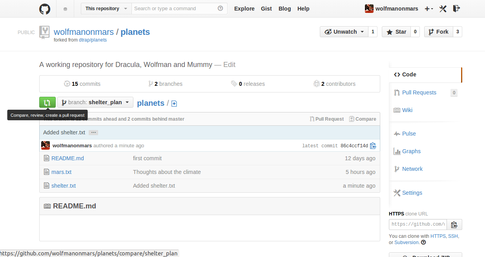
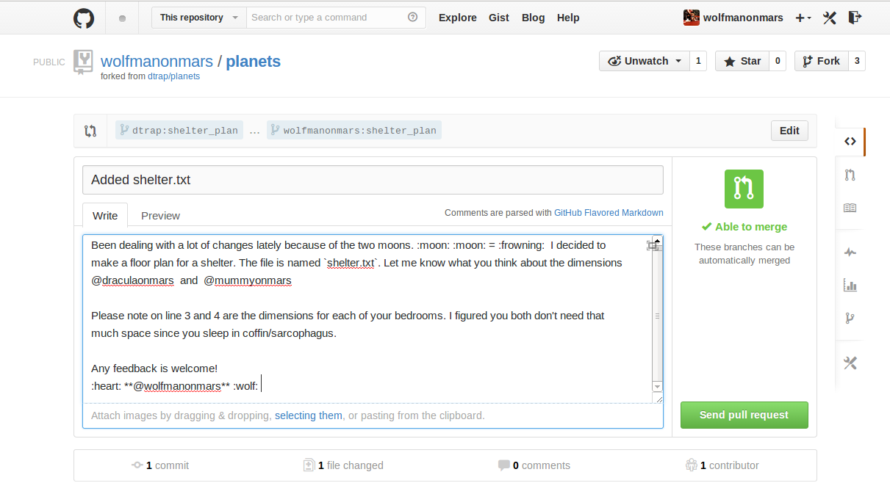
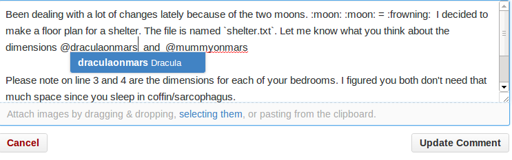
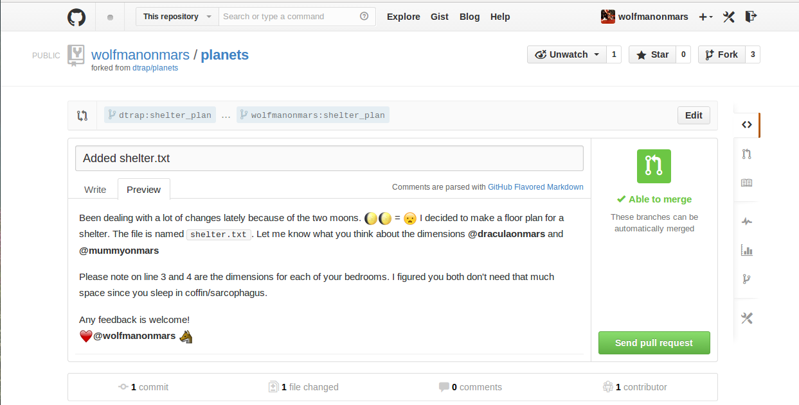
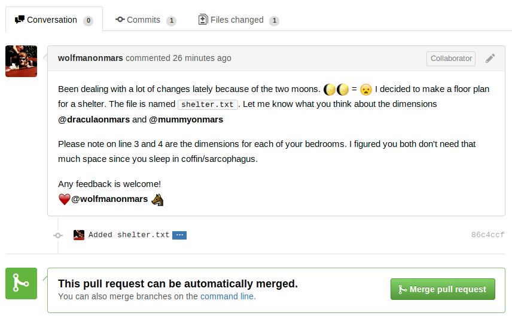

#####Objectives:
*	Explain what branches are and why they are helpful for individual and collaborative workflows.
*	Explain how to make a branch and navigate between branches.
*	Explain how to isolate work in a branch and merge it back to your main branch.

#####Branches defined: 

* Branching is a way for you to create a new working copy of a project without affecting the main project.

#####Benefits of branching:

* Branches allow you to develop a complicated feature privately on a local machine, using a series of commits, instead of lumping all the changes together in a single, monster commit.
* You can work on ideas while they are in their infancy, and commit them when you're ready.
* By collecting the related commits in a branch, it's easier to discuss them with your collaborator and incorporate their feedback without polluting the master branch. 
* Therefore, collaborators can modify the project without affecting the stable copy or each other.

Let's explore how this tool can help with Dracula, Mummy and Wolfman's new home, `mars.txt`.

While `mars.txt` is great for Dracula and Mummy, Wolfman is having a hard time with all the changes. The two moons are really cramping his style!He decides to fix the problem by proposing a new living shelter as detailed in a new file 'shelter.txt'

Follow along by typing the following into your terminal: 

~~~
$ touch shelter.txt
$ nano shelter.txt
~~~

**Copy and Paste the following into shelter.txt:**

~~~
Bedrooms:
3
* For Dracula: Coffin 10x10
* For Mummy: Sarcaphogus 10x10 
* For me: Bedroom with no windows 80x80
~~~

Let's check that our file is there.

~~~
ls
~~~

~~~
README.md shelter.txt
~~~

Wolfman isn't sure these dimensions will be agreeable, and Mummy and Dracula aren't the best people to upset when you're the only warm-blooded creature on Mars! So instead of pushing his changes to the main project, he can make his changes on a new "branch" to ask Dracula and Mummy for feedback before without disrupting their other work.

By using the following command, we can make a new branch so that Dracula and Mummy won't need to worry with Wolfman's changes, until he's ready to show them.

~~~
git branch shelter_plan
~~~

We just created a new branch, now we need to switch to it to start working. We do that by doing the following:

~~~
git checkout shelter_plan
~~~

If we type `git branch` again, we should see what branch we're on. Let's give that a try. We should get the following:

~~~
* shelter_plan
  master
~~~
 

We see that we are currently in our "shelter_plan" branch, currently, by observing the `*` next to it. 

Now that we're on our development branch `shelter_plan` we can make a commit and push the new branch to GitHub.

~~~
git add shelter.txt
git commit 
git push origin shelter_plan
~~~

So, we just pushed `shelter.txt` to our new branch of the main project, shelter_plan! Let's see if that worked.

~~~
git branch
~~~

We see that there are two branches possible:

~~~
* shelter_plan
  master
~~~

The utility of creating the `shelter_plan` branch is that Wolfman can make changes without calling Dracula and Mummy's attention, until he's ready to do so. This is especially helpful for Wolfman because Dracula and Mummy are rough around the edges and they don't like being disturbed unnecessarily. If Wolfman did his work on the `master` branch, this would clutter the planet repository, and interrupt Dracula and Mummy's documentation.

Now that Wolfman's first draft of `shelter.txt` is complete. Let's run the floor plan by Dracula and Mummy and get their feeback.

The way we inform collaborators of the work we've done in our development branch is by using something called a **pull request.** A pull request notifies our collaborators that we've added or changed files. It prompts them to comment or modify the work before it is accepted to the master repository.

To open a pull request we will go to our GitHub planets repository by entering the following link into our browser: https://github.com/yourusername/planets where `yourusername` is your GitHub username.

The first thing we need to do once on our planets repository's URL is to switch branches on GitHub. 

Click on the branch button and select the "shelter_plan" branch. The next step is to open the pull request. 

Click on the green button to the left of the branch button you just clicked in Step 1.

For Dracula and Mummy to understand what Wolfman is up to, he has to describe what he is adding to the `planets` repository in detail. 

Wolfman wants to get Dracula and Mummy's input directly so he tags them in the Pull Request using an `@` sign and their respective GitHub usernames. 

Wolfman has given a good description here, and clearly, Wolfman likes emoji. We can see how the Pull Request will preview by clicking the `preview` tab.

Everything looks great! Let's open the Pull Request.

Now, Dracula and Mummy have opportunities to comment about what Wolfman did. We can wait and see what they have to say.

Oh my! That was quick...

We can see the Dracula and Mummy would appreciate equal dimmensions for their rooms. 

Let's make some changes that will be more fair to everyone:

~~~
nano shelter.txt
~~~

Edit the numbers in shelter.txt to be more fair as so:

~~~
Bedrooms:
3
* For Dracula: Coffin 80x80
* For Mummy: Sarcaphogus 80x80 
* For me: Bedroom with no windows 80x80
~~~

Ah, that's much more fair. Wolfman is now ready to commit these changes to the main project. So he needs to switch branches to do so by using the command `git checkout`.

.....................................

Since Dracula and Mummy have given us 2 :thumbsup: we can now merge the two branches. This effectively takes what we have done in our development branch, `shelter_plan` and merges our commit history there with the `master` branch. 

~~~
git merge shelter_plan
~~~

Great! Now we can "push our changes to the master branch!"

~~~
git add shelter.txt
git commit sheter.txt
git push origin master
~~~

Remember, you can always use `git status` to check in if there's anything in your working directory to commit. If your working directory is clean, git will tell you. 

Let's checkout our repository online to ensure we have added the right dimensions to shelter.txt!
Fill in your github username in the following link to YOUR planets repo as so: https://github.com/yourusername/planets and navigate to shelter.txt. 
