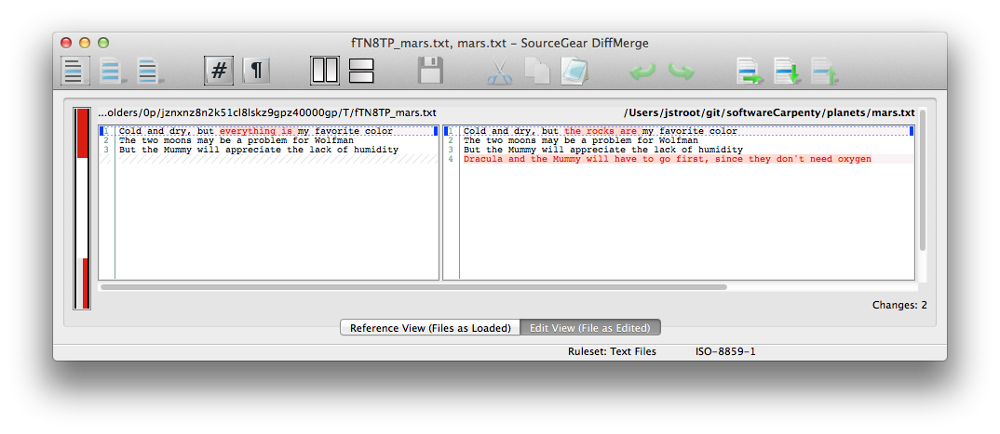
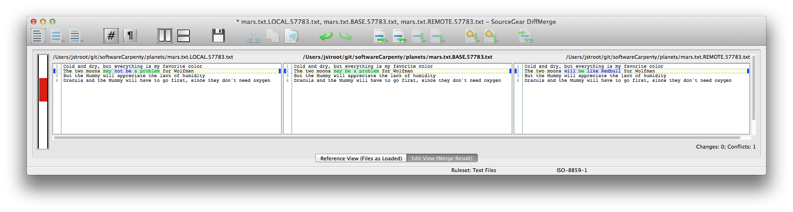
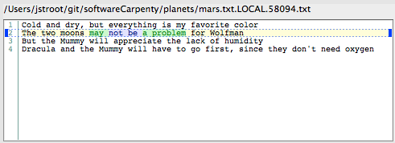
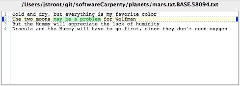
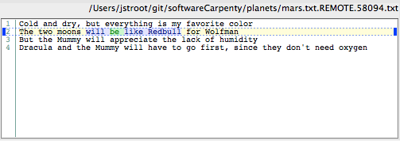

#### Objectives
*   Configure Git to use a third party graphical diff/merge tool.
*   Demonstrate how to use third party diff/merge tools in the Git workflow.

### Intro

Git allows you to integrate 3rd party tools for various tasks. You may have already changed Git's default editor to _nano_. 
In this lesson, we will configure Git to use a tool called <a href="https://sourcegear.com/diffmerge/">DiffMerge</a> to help us 
view file changes and resolve merge conflicts.

The Git commands we will be using are `git difftool` and `git mergetool`. 
If you try to use these command before configuring them, Git attempts to use some default diff/merge tools:

~~~
$ git mergetool

This message is displayed because 'merge.tool' is not configured.
See 'git mergetool --tool-help' or 'git help config' for more details.
'git mergetool' will now attempt to use one of the following tools:
tortoisemerge emerge vimdiff
No files need merging

$ git difftool

This message is displayed because 'diff.tool' is not configured.
See 'git difftool --tool-help' or 'git help config' for more details.
'git difftool' will now attempt to use one of the following tools:
kompare emerge vimdiff
~~~
{:class="in"}

So, let's go ahead and configure Git to use [DiffMerge](https://sourcegear.com/diffmerge/)!

### Installation
To install _DiffMerge_ for Windows, OS X, or Linux go to [https://sourcegear.com/diffmerge/](https://sourcegear.com/diffmerge). There are directions for each system.  

### Integration

To configure Git to use _DiffMerge_, we have to update our `.gitconfig` (similar to when we first used `.gitconfig` when we initially set up Git). 
To do this we simply have to enter a few commands into our command line. Be careful to enter the commands correctly, especially when a command is longer than a single line. 
The exact commands depend on which system you are working on and can be found at 

For Mac: [https://sourcegear.com/diffmerge/webhelp/sec__git__mac.html](https://sourcegear.com/diffmerge/webhelp/sec__git__mac.html)

For Linux: [https://sourcegear.com/diffmerge/webhelp/sec__git__linux.html](https://sourcegear.com/diffmerge/webhelp/sec__git__linux.html)

For Windows: [https://sourcegear.com/diffmerge/webhelp/sec__git__windows.html](https://sourcegear.com/diffmerge/webhelp/sec__git__windows.html)

The DiffMerge documentation does not specifically cover Git Bash integration. To integrate DiffMerge with Git Bash on windows, please use the commands below:

~~~
$ git config --global diff.tool diffmerge
$ git config --global difftool.diffmerge.cmd "sgdm \$LOCAL \$REMOTE"
$ git config --global merge.tool diffmerge
$ git config --global mergetool.diffmerge.trustExitCode true
$ git config --global mergetool.diffmerge.cmd "sgdm --merge --result=\$MERGED \$LOCAL \$BASE \$REMOTE"
~~~
{:class="in"}

### Viewing Changes

Remember that you can find information on git commands by adding a `--help` to the end of the command. 
To learn more about `git difftool`, we use the following command:

~~~
$ git difftool --help
~~~
{:class="in"}

From our previous lesson, we have the file `mars.txt`.

~~~
Cold and dry, but everything is my favorite color
The two moons may be a problem for Wolfman
But the Mummy will appreciate the lack of humidity
~~~
{:class="in"}

Let's alter the file and use `git diff` to see the changes.

~~~
$ nano mars.txt
~~~
{:class="in"}

~~~
Cold and dry, but the rocks are my favorite color
The two moons may be a problem for Wolfman
But the Mummy will appreciate the lack of humidity
Dracula and the Mummy will have to go first, since they don't need oxygen
~~~
{:class="in"}

~~~
$ git diff
diff --git a/mars.txt b/mars.txt
index b36abfd..0e383e3 100644
--- a/mars.txt
+++ b/mars.txt
@@ -1,3 +1,4 @@
-Cold and dry, but everything is my favorite color
+Cold and dry, but the rocks are my favorite color
 The two moons may be a problem for Wolfman
 But the Mummy will appreciate the lack of humidity
+Dracula and the Mummy will have to go first, since they don't need oxygen
~~~
{:class="in"}

`git diff` is useful, but it isn't always clear exactly what we have changed. For a more visual depiction of what `git diff` is doing let's now use `git difftool` to see how this looks in _DiffMerge_.

~~~
$ git difftool
Viewing: 'mars.txt'
Launch 'diffmerge' [Y/n]:
~~~
{:class="in"}

By default, Git will prompt you to launch. Type `Y` and hit `Enter`.  
If you don't want to be prompted each time you use this command, simply add a `-y` to the end of the command:  
`git difftool -y`.  

If you run `git difftool` in a repository which contains changes to multiple files, _DiffMerge_ will be
opened for one file at a time. Once you close the window for the first file, then Git will run
_DiffMerge_ for the next changed file. 
This is why it is a good idea to pass the `-y` flag, otherwise you will be prompted at the command line each time
Git tries to open _DiffMerge_ on the next file. 

 

Here we see the current version of the `mars.txt` file on the right and the previous version of the same file on the left. Text that differs in the two versions is highlighted in both panels. This provides the same information as `git diff`, but allows us to compare the documents side by side with convenient way to denote the differences between files. 

### Resolving Conflicts
Create some conflicts by repeating the steps from the [conflicts lesson](03-conflict.html).

Consider the following conflict:

~~~
$ git diff
diff --cc mars.txt
index 8bbfbcd,2267d7b..0000000
--- a/mars.txt
+++ b/mars.txt
@@@ -1,4 -1,4 +1,8 @@@
  Cold and dry, but everything is my favorite color
++<<<<<<< HEAD
 +The two moons may not be a problem for Wolfman
++=======
+ The two moons will be like Redbull for Wolfman
++>>>>>>> conflict
  But the Mummy will appreciate the lack of humidity
  Dracula and the Mummy will have to go first, since they don't need oxygen
~~~
{:class="in"}

Review the [conflicts lesson](03-conflict.html) for help interpreting the diff above. 
Ok, let's use `git mergetool` to see how it displays the conflict above. 

~~~
$ git mergetool
Merging:
mars.txt

Normal merge conflict for 'mars.txt':
  {local}: modified file
  {remote}: modified file
Hit return to start merge resolution tool (diffmerge): 
~~~
{:class="in"}

Git presents us with a prompt, and will do this for every conflicted file. This can get extremely annoying, but git has provided a shortcut.

~~~
$ git mergetool -y # Don't prompt before each invocation of the merge resolution program.
~~~
{:class="in"}

Next, _DiffMerge_ will be opened.

Notice how this differs from the textual diff shown above. 
There are 3 different panes. The diff above shows two changes.

Let's take a look at each pane.
 

<table>
<caption align="bottom"><b><i>Left Pane</i></b></caption>
<tr><td>

</td></tr>
</table>

The left pane shows the local (i.e. your repo) changes which could not be automatically merged. 
In this example, this is your local `HEAD` commit.
Notice how the affected line is highlighted in yellow, with the specific conflict highlighted in green. 
The purple highlighting denotes the most recent text that was committed, but couldn't be merged.  

<table>
<caption align="bottom"><b><i>Center Pane</i></b></caption>
<tr><td>

</td></tr>
</table>

The center pane shows the _BASE_ file. This is what your file looked like _*before*_ the commit which has the conflict,
which would be the `HEAD~1` commit in this example. 

<table>
<caption align="bottom"><b><i>Right Pane</i></b></caption>
<tr><td>

</td></tr>
</table>

The right pane shows the remote _(i.e. the changes you tried to merge into your repo)_ changes which could not be
automatically merged. 
Here the purple highlighting denotes the difference between your _BASE_ file (see above) and the remote's vesion of the file. 

_DiffMerge_ allows you to pull changes from the left or right to your unchanged version in the middle. 
This is very helpful for complex conflicts.

For now, let's resolve the conflict by using the change from the _right_ pane. 
*    Right-click on line 2 in the _right_ pane and select the _"Replace with This"_ option. 
*    After you have made your changes, save the file and close _DiffMerge_. 

The contents of the center panel will be saved to disk. After the window closes, go back to your command prompt and run `git status`.
    
~~~
$ git status
On branch master
Your branch and 'origin/master' have diverged,
and have 1 and 1 different commit each, respectively.
  (use "git pull" to merge the remote branch into yours)

All conflicts fixed but you are still merging.
  (use "git commit" to conclude merge)

Changes to be committed:

    modified:   mars.txt

Untracked files:
  (use "git add <file>..." to include in what will be committed)

    mars.txt.orig
~~~
{:class="in"}

You have already seen the output above from the [conflicts lesson](03-conflict), with one exception.
There is a new untracked file, `mars.txt.orig`. When you use teh `git mergetool` command, git creates a copy of the conflicted file (with all of the conflict markers) and appends `.orig`. It is perfectly safe to remove this file. 

It is possible to configure git to stop generating these backup files, but that will be left as an exercise for the reader! Hint: `git mergetool --help`

In this example, we've demonstrated `git mergetool` with only 1 conflicted file. 
When the command is run in a repository with multiple conflicted files, _git_ will open one instance of the _DiffMerge_ tool at a time. 
When you are done resolving conflicts with one file and close the window, another window will be opened for the next conflicted file until there are not more conflicted files.

----

### Summary
We've demonstrated how to integrate a 3rd party diff/merge tool with Git. There are lots of tools which can be 
integrated with Git. The primary reason why we use _DiffMerge_ for this lesson is that it installs and has identical
feature sets for Linux, Mac and Windows.

At this point, it's best to let you explore _DiffMerge_ on your own,
Please refer to the the _DiffMerge_ documentation which may be found through the app itself or online at 
[http://www.sourcegear.com/diffmerge/webhelp/](http://www.sourcegear.com/diffmerge/webhelp/). 

Also, `git difftool --help` and `git mergetool --help` contain most (if not all) of the information you will need
to start integrating other tools.  
The same documentation is also available online: 
[git difftool](http://git-scm.com/docs/git-difftool) 
[git mergetool](http://git-scm.com/docs/git-mergetool)

