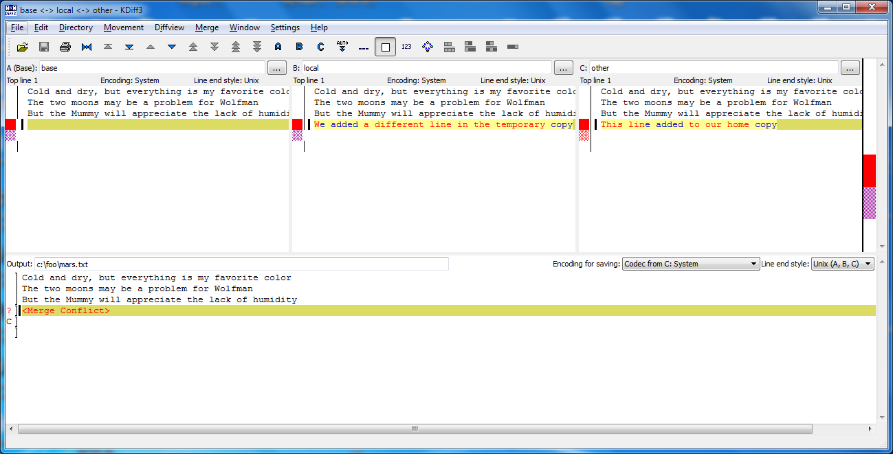
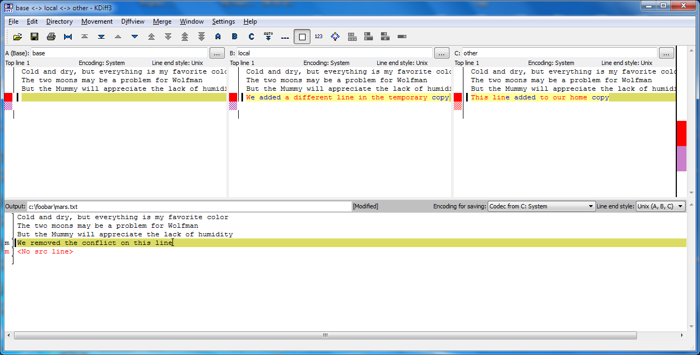

#### Objectives
* Explain what conflicts are and when they can occur.
* Resolve conflicts resulting from a merge.

As soon as people can work in parallel,
someone's going to step on someone else's toes.
This will even happen with a single person:
if we are working on a piece of software on both our laptop and a server in the lab,
we could make different changes to each copy.
Version control helps us manage these [conflicts](../../gloss.html#conflict)
by giving us tools to [resolve](../../gloss.html#resolve) overlapping changes.

To see how we can resolve conflicts,
we must first create one.
The file `mars.txt` currently looks like this
in both local copies of our `planets` repository
(the one in our home directory and the one in `/tmp`):

~~~
$ cat mars.txt
~~~
{:class="in"}
~~~
Cold and dry, but everything is my favorite color
The two moons may be a problem for Wolfman
But the Mummy will appreciate the lack of humidity
~~~
{:class="out"}

Let's add a line to the copy under our home directory:

~~~
$ nano mars.txt
$ cat mars.txt
~~~
{:class="in"}
~~~
Cold and dry, but everything is my favorite color
The two moons may be a problem for Wolfman
But the Mummy will appreciate the lack of humidity
This line added to our home copy
~~~
{:class="out"}

and then push the change to Bitbucket:

~~~
$ hg commit -m "Adding a line in our home copy"
~~~
{:class="in"}
~~~
$ hg push
~~~
{:class="in"}
~~~
pushing to https://bitbucket.org/vlad/planets
searching for changes
adding changesets
adding manifests
adding file changes
added 1 changesets with 1 changes to 1 files
~~~
{:class="out"}

Our repositories are now in this state:

Now let's switch to the copy under `/tmp`
and make a different change there
*without* updating from Bitbucket:

~~~
$ cd /tmp/planets
$ nano mars.txt
$ cat mars.txt
~~~
{:class="in"}
~~~
Cold and dry, but everything is my favorite color
The two moons may be a problem for Wolfman
But the Mummy will appreciate the lack of humidity
We added a different line in the temporary copy
~~~
{:class="out"}

We can commit the change locally:

~~~
$ hg commit -m "Adding a line in the temporary copy"
~~~
{:class="in"}

but hg won't let us push it to Bitbucket:

~~~
$ hg push
~~~
{:class="in"}
~~~
pushing to https://bitbucket.org/vlad/planets
searching for changes
abort: push creates new remote head 9f82bc5a1e80!
(merge or see "hg help push" for details about pushing new heads)
~~~
{:class="out"}

Mercurial detects that our changes conflict with the changes
in the remote server and stops us from creating a
confusing situation in that server. What we have to do is pull the
changes from Bitbucket, [merge](../../gloss.html#repository-merge)
them into the copy we're currently working in, and then push that.
Let's start by pulling:

~~~
$ hg pull
~~~
{:class="in"}
~~~
pulling from https://bitbucket.org/vlad/planets
searching for changes
adding changesets
adding manifests
adding file changes
added 1 changesets with 1 changes to 1 files (+1 heads)
(run 'hg heads' to see heads, 'hg merge' to merge)
~~~
{:class="out"}

`hg pull` tells us there's an extra head and suggests that we use `hg
heads` to inspect the situation and `hg merge` to resolve it. Let's
first attempt to understand the situation:

~~~
$ hg heads
~~~
{:class="in"}
~~~
changeset:   6:721158ca243d
user:        Vlad Dracula <vlad@tran.sylvan.ia>
date:        Sun May 18 12:40:33 2014 -0400
summary:     Adding a line in our home copy

changeset:   5:9f82bc5a1e80
tag:         tip
parent:      4:2e9c23a9090d
user:        Vlad Dracula <vlad@tran.sylvan.ia>
date:        Sun May 18 12:41:10 2014 -0400
summary:     Adding a line in the temporary copy
~~~
{:class="out"}

This shows us that our repository currently has two heads. Looking at
the graph of our log with `hg log --graph` or `hg log -G` may be more
informative:

~~~
$ hg log -G
~~~
{:class="in"}
~~~
o  changeset:   6:721158ca243d
|  tag:         tip
|  parent:      4:2e9c23a9090d
|  user:        Vlad Dracula <vlad@tran.sylvan.ia>
|  date:        Sun May 18 12:40:33 2014 -0400
|  summary:     Adding a line in our home copy
|
| @  changeset:   5:9f82bc5a1e80
|/   user:        Vlad Dracula <vlad@tran.sylvan.ia>
|    date:        Sun May 18 12:41:10 2014 -0400
|    summary:     Adding a line in the temporary copy
|
o  changeset:   4:2e9c23a9090d
|  user:        Vlad Dracula <vlad@tran.sylvan.ia>
|  date:        Sun May 18 12:29:08 2014 -0400
|  summary:     Some notes about Pluto
|
o  changeset:   3:4f37bac61e73
|  user:        Vlad Dracula <vlad@tran.sylvan.ia>
|  date:        Sun May 18 12:25:57 2014 -0400
|  summary:     Add the ignore file
|
~~~
{:class="out"}

With the graph, we can see more details at a glance. The `@` marker
shows the commit we're currently standing on, `5:9f82bc5a1e80`. We
have just pulled changeset `6:721158ca243d`, which added a head to our
clone, because it was also based off `4:2e9c23a9090d`. Herein lies the
potential conflict, since two different changesets branched off from
the same starting commit.

It is important to note something about revision numbers here (the `5`
and the `6` before the `:`). The same commits may have different
revision numbers in different clones. These revision numbers are
assigned in the order that a clone acquires new commits. On the other
hand, the identifiers (`9f82bc5a1e80` and `721158ca243d` in this case)
uniquely identify the changeset no matter in which clone it is. When
we communicate with other people, it is important to use identifiers.
When we work alone, however, we may use revision numbers as a
convenience that is local to a clone.

Let us now proceed to resolve this situation by merging the two heads.
To do that we'll use the [`kdiff3`](http://kdiff3.sourceforge.net/)
merge tool which gives us an interface that makes it easier to
understand what it happening.

~~~
$ hg merge --tool=kdiff3
~~~
{:class="in"}
~~~
merging mars.txt
~~~
{:class="out"}

It may take a few seconds for Mercurial to pass the necessary information
to `kdiff3`, but soon you should see a window that looks like this:

The pane labelled `base` refers to how this file looked like at
revision `4`, where our conflicting revisions `5` and `6` are based
on. Since we were standing on `5` when we started the merge, that is
the pane labelled `local`. We're attempting to merge this with
revision `6`, which is labelled `other`. kdiff3
has buttons for moving from one conflict to
another. In this case, there is only one conflict. At each conflict we
can select either the `local` or the `other` change or to write
something completely different in the result at the bottom.

It is now up to us to edit this file to
reconcile the changes. We can do anything we want: keep the change in
this branch, keep the change made in the other, write something new to
replace both, or get rid of the change entirely. Let's resolve the
conflict so it looks like this:

Once we've finished merging, let us inspect the working directory
before we finalize the merge:

~~~
$ hg summary
~~~
{:class="in"}
~~~
parent: 5:9f82bc5a1e80
 Adding a line in the temporary copy
parent: 6:721158ca243d tip
 Adding a line in our home copy
branch: default
commit: 1 modified (merge)
update: (current)
~~~
{:class="out"}

This tells us that right now our working directory is in a merge state.
We see that the working directory has two parents, and one file is
about to get merged.

Let us look at the graph again:

~~~
$ hg log -G
~~~
{:class="in"}
~~~
@  changeset:   6:721158ca243d
|  tag:         tip
|  parent:      4:2e9c23a9090d
|  user:        Vlad Dracula <vlad@tran.sylvan.ia>
|  date:        Sun May 18 12:40:33 2014 -0400
|  summary:     Adding a line in our home copy
|
| @  changeset:   5:9f82bc5a1e80
|/   user:        Vlad Dracula <vlad@tran.sylvan.ia>
|    date:        Sun May 18 12:41:10 2014 -0400
|    summary:     Adding a line in the temporary copy
|
o  changeset:   4:2e9c23a9090d
|  user:        Vlad Dracula <vlad@tran.sylvan.ia>
|  date:        Sun May 18 12:29:08 2014 -0400
|  summary:     Some notes about Pluto
|
o  changeset:   3:4f37bac61e73
|  user:        Vlad Dracula <vlad@tran.sylvan.ia>
|  date:        Sun May 18 12:25:57 2014 -0400
|  summary:     Add the ignore file
|
~~~
{:class="out"}

The `@` marker is now at *two* locations at once. This indicates that
our working directory is in a merge state. Let us finalise this merge:

~~~
$ hg commit -m "Merging changes from Bitbucket"
~~~
{:class="in"}

Our repositories now look like this:

or in terms of the graph,

~~~
$ hg log -G
~~~
{:class="in"}
~~~
@    changeset:   7:84eea3b489a6
|\   tag:         tip
| |  parent:      5:9f82bc5a1e80
| |  parent:      6:721158ca243d
| |  user:        Vlad Dracula <vlad@tran.sylvan.ia>
| |  date:        Sun May 18 21:33:11 2014 -0400
| |  summary:     Merging changes from Bitbucket
| |
| o  changeset:   6:721158ca243d
| |  parent:      4:2e9c23a9090d
| |  user:        Vlad Dracula <vlad@tran.sylvan.ia>
| |  date:        Sun May 18 12:40:33 2014 -0400
| |  summary:     Adding a line in our home copy
| |
o |  changeset:   5:9f82bc5a1e80
|/   user:        Vlad Dracula <vlad@tran.sylvan.ia>
|    date:        Sun May 18 12:41:10 2014 -0400
|    summary:     Adding a line in the temporary copy
|
o  changeset:   4:2e9c23a9090d
|  user:        Vlad Dracula <vlad@tran.sylvan.ia>
|  date:        Sun May 18 12:29:08 2014 -0400
|  summary:     Some notes about Pluto
|
~~~
{:class="out"}

so we push our changes to Bitbucket:

~~~
$ hg push
~~~
{:class="in"}
~~~
pushing to https://bitbucket.org/vlad/planets
searching for changes
adding changesets
adding manifests
adding file changes
added 2 changesets with 2 changes to 1 files
~~~
{:class="out"}

to get this:

Mercurial keeps track of what we've merged with what, so we don't have
to fix things by hand again if we switch back to the repository in our
home directory and pull from Bitbucket:

~~~
$ cd ~/planets
$ hg pull
~~~
{:class="in"}
~~~
pulling from https://bitbucket.org/vlad/planets
searching for changes
adding changesets
adding manifests
adding file changes
added 2 changesets with 2 changes to 1 files
(run 'hg update' to get a working copy)
~~~
{:class="out"}

This only pulled new changes into our history, but did not touch our
files. After we run `hg update` to update the files to the new
changes,

~~~
$ hg update
~~~
{:class="in"}
~~~
1 files updated, 0 files merged, 0 files removed, 0 files unresolved
~~~
{:class="out"}

we get the merged file:

~~~
$ cat mars.txt
~~~
{:class="in"}
~~~
Cold and dry, but everything is my favorite color
The two moons may be a problem for Wolfman
But the Mummy will appreciate the lack of humidity
We removed the conflict on this line
~~~
{:class="out"}

We don't need to merge again because Bitbucket knows someone has
already done that.

Version control's ability to merge conflicting changes is another
reason users tend to divide their programs and papers into multiple
files instead of storing everything in one large file. There's another
benefit too: whenever there are repeated conflicts in a particular
file, the version control system is essentially trying to tell its
users that they ought to clarify who's responsible for what, or find a
way to divide the work up differently.

#### Key Points
* Conflicts occur when two or more people change the same file(s) at
  the same time.
* The version control system does not allow people to blindly
  overwrite each other's changes. Instead, it highlights conflicts
  so that they can be resolved.

#### Challenges

1.  Clone the repository created by your instructor.
    Add a new file to it,
    and modify an existing file (your instructor will tell you which one).
    When asked by your instructor,
    pull her changes from the repository to create a conflict,
    then resolve it.

2.  What does hg do
    when there is a conflict in an image or some other non-textual file
    that is stored in version control?

