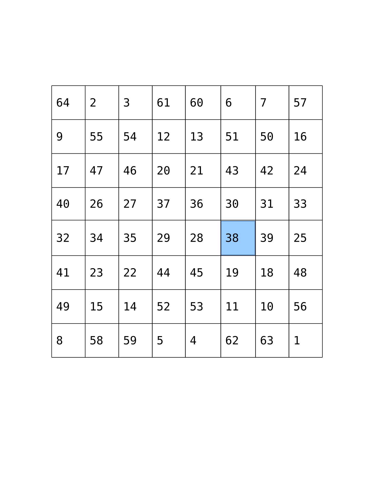
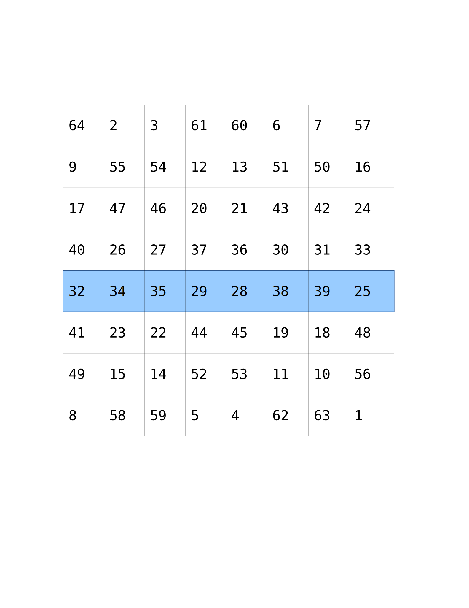
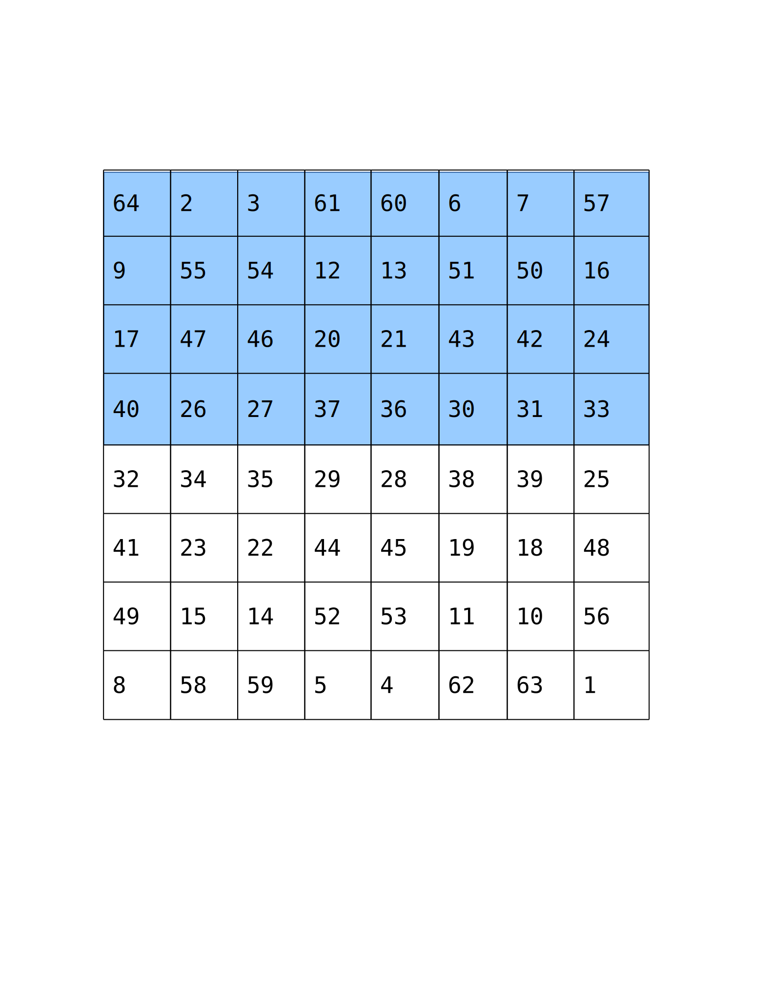
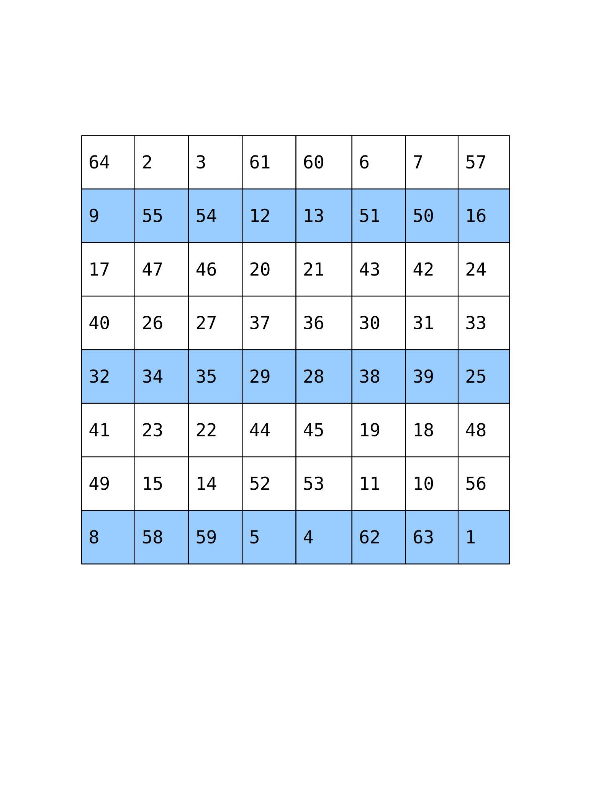
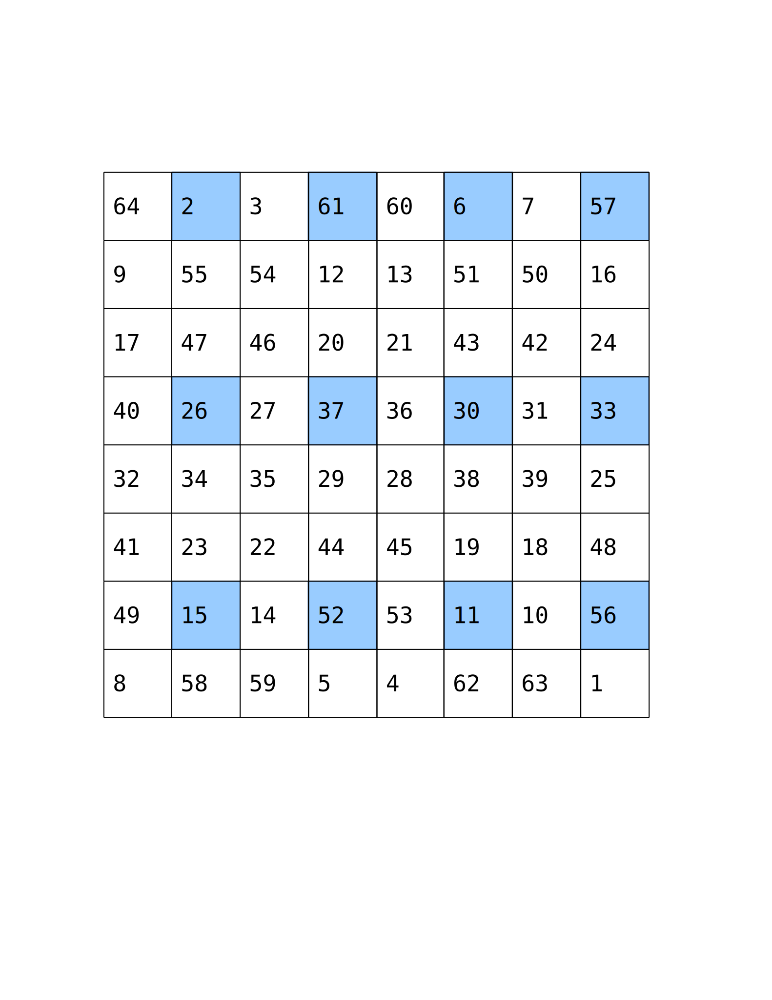
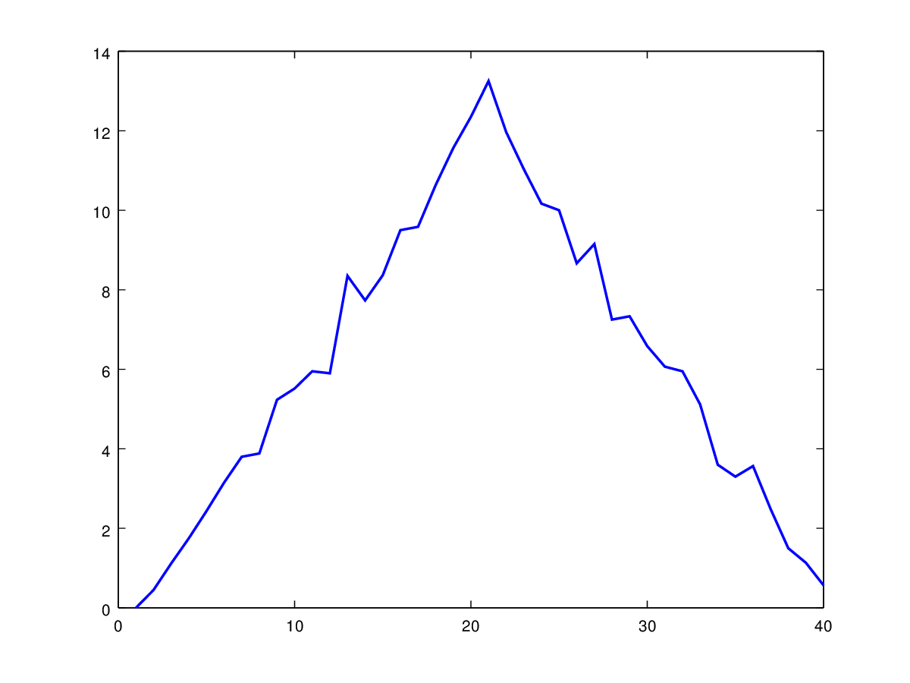
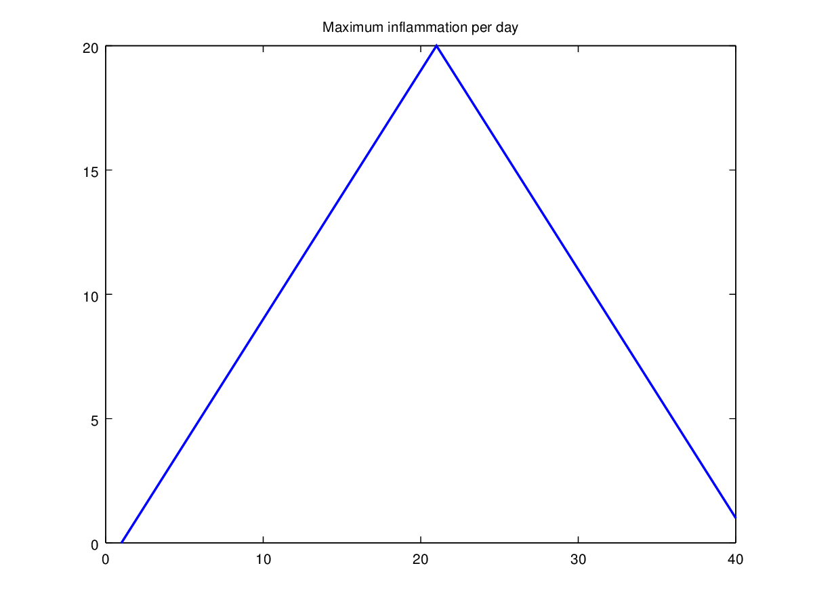
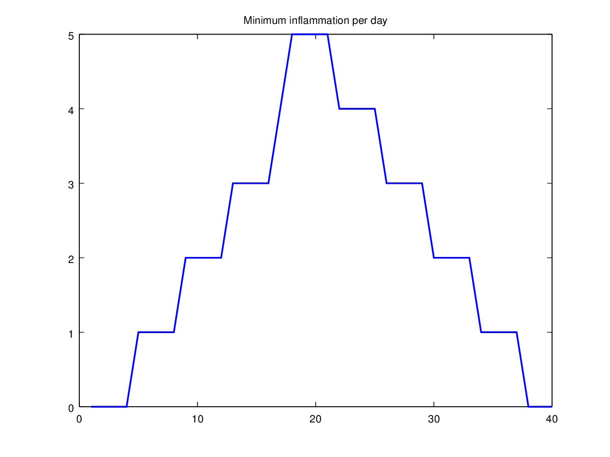
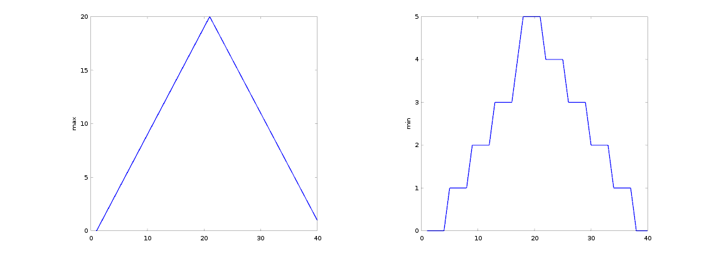

We are studying inflammation in patients who have been given a new treatment for arthritis,
and need to analyze the first dozen data sets.
The data sets are stored in
[Comma Separated Values (CSV)](../../gloss.html#comma-separated-values) format:
each row holds information for a single patient,
and the columns represent successive days.
The first few rows of our first file,
`inflammation-01.csv`, look like this:

~~~
0,0,1,3,1,2,4,7,8,3,3,3,10,5,7,4,7,7,12,18,6,13,11,11,7,7,4,6,8,8,4,4,5,7,3,4,2,3,0,0
0,1,2,1,2,1,3,2,2,6,10,11,5,9,4,4,7,16,8,6,18,4,12,5,12,7,11,5,11,3,3,5,4,4,5,5,1,1,0,1
0,1,1,3,3,2,6,2,5,9,5,7,4,5,4,15,5,11,9,10,19,14,12,17,7,12,11,7,4,2,10,5,4,2,2,3,2,2,1,1
0,0,2,0,4,2,2,1,6,7,10,7,9,13,8,8,15,10,10,7,17,4,4,7,6,15,6,4,9,11,3,5,6,3,3,4,2,3,2,1
0,1,1,3,3,1,3,5,2,4,4,7,6,5,3,10,8,10,6,17,9,14,9,7,13,9,12,6,7,7,9,6,3,2,2,4,2,0,1,1
~~~

We want to:

* load that data into memory,
* calculate the average inflammation per day across all patients, and
* plot the result.

To do all that, we'll have to learn a little bit about programming.

#### Objectives
* Learn about MATLAB arrays.
* Read tabular data from a file into a program.
* Assign values to variables.
* Select individual values and subsections from data.
* Perform operations on arrays of data.
* Display simple graphs.

### Loading Data

Reading data from files and writing data to them
are essential tasks in scientific computing,
and admittedly, something that we'd rather not spend a lot of time
thinking about. Fortunately, MATLAB comes with a number of high-level
tools to do these things
efficiently, sparing us the grisly detail.

To load the data from our CSV file into MATLAB, type following
command into the MATLAB shell, and press `Enter`:

~~~
csvread('inflammation-01.csv')
~~~
{:class="in"}

You should see a wall of numbers on the screen---these are the values
from the CSV file.
It can sometimes
be useful to see the output from MATLAB commands, but it is often not.
To suppress the
output, simply put a semicolon at the end of your command:

~~~
csvread('inflammation-01.csv');
~~~
{:class="in"}

The expression `csvread(...)` is a
[function call](../../gloss.html#function-call).
Functions generally need [parameters](../../gloss.html#parameter)
to run.
In the case of the `csvread` function, we need to provide a single
parameter: the name of the file we want to read data from. This
parameter needs to be a character string or
[string](../../gloss.html#string), so we put it in quotes.

Our call to `csvread` read our file, and printed the data inside
to the screen. And adding a semicolon rendered it even less useful---
we have no way to modify those values
or compute with them. To do that, we need to assign the array to a
[variable](../../gloss.html#variable).

~~~
patient_data = csvread('inflammation-01.csv');
~~~
{:class="in"}

A variable is just a name for a piece of data or *value*.
Variable names must begin with a letter, and can contain
numbers or underscores. Examples of valid variable names are
`x`, `f_0` or `current_temperature`.

We can create a new variable simply by assigning a value to it using
`=`:

~~~
weight_kg = 55;
~~~
{:class="in"}

Once a variable has a value, we can print it using the `disp` function:

~~~
disp(weight_kg);
~~~
{:class="in"}

~~~
55
~~~
{:class="out"}

and do arithmetic with it:

~~~
weight_in_pounds = 2.2 * weight_kg;
disp(['Weight in pounds: ', num2str(weight_in_pounds)]);
~~~
{:class="in"}

~~~
Weight in pounds: 121.0
~~~
{:class="out"}

The `disp` function takes a single parameter -- the value to print. To
print more than one value on a single line, we could print an *array*
of values. All values in this array need to be the same type. So, if
we want to print a string and a numerical value together, we *have* to
convert that numerical value to a string with the `num2str` function.

### Understanding Assignment

If we imagine the variable as a sticky note with a name written on
it, assignment is like putting the sticky note on a particular value:

  

Assigning a value to one variable does not change the values of other
variables.
For example,

~~~
weight_kg = 57.5;
weight_lb = 2.2 * weight_in__kg;
disp(['Weight in kg: ', num2str(weight_kg); 'Weight in pounds: ', num2str(weight_lb)]);
~~~
{:class="in"}

~~~
Weight in kg: 57.5
Weight in pounds: 126.5
~~~
{:class="out"}

  

Let's update the value of one of our variable, and print the values
of both:

~~~
weight_kg = 100;
disp(['Weight in kg: ', num2str(weight_kg); 'Weight in pounds: ',
num2str(weight_lb)]);
~~~
{:class="in"}

~~~
Weight in kg: 100
Weight in pounds: 126.5
~~~
{:class="out"}

  

Since `weight_lb` doesn't "remember" where its value came from, it isnt
automatically updated when `weight_kg` changes. This is important to
remember, and different from the way spreadsheets work.

Now that we know how to assign things to variables, let's re-run
`csvread` and save its result.

~~~
patient_data = csvread('inflammation-01.csv');
~~~
{:class="in"}

MATLAB provides a command
to list all variables that have been assigned data.

~~~
who
~~~
{:class="in"}

~~~
Variables in the current scope:

patient_data
weight_kg
weight_lb

~~~
{:class="out"}

To remove a variable from MATLAB, use the `clear` command:

~~~
clear weight_lb
who
~~~
{:class="in"}

~~~
Variables in the current scope:

patient_data
weight_kg

~~~
{:class="out"}

#### Challenges

1.  Draw diagrams showing what variables refer to what values after each statement in the following program:

~~~
mass = 47.5
age = 122
mass = mass * 2.0
age = age - 20
~~~
{:class="in"}

### MATLAB Arrays

Now that our data is in memory, we can start doing things with it.
First, let's find out its size or [shape](../../gloss.html#shape):

~~~
size(patient_data)
~~~
{:class="in"}

~~~
ans =

    60 40
~~~
{:class="out"}

The output tells us that the variable `patient_data`
refers to a table of values
that has 60 rows and 40 columns.

MATLAB stores *all* data in the form of arrays. For example:

* Numbers, or *scalars* are arrays of zero dimensions, as are single
characters,
* Lists of numbers, or *vectors* are arrays of one dimension,
* Tables of numbers, or *matrices* are arrays of two dimensions,
* Even character strings, like sentences, are stored as an "array
of characters".

Normally, MATLAB arrays can't store elements of different data types. For
instance, a MATLAB array can't store both a `float` and a `char`. To do that,
you have to use a [Cell Array](http://www.mathworks.com/help/matlab/cell-arrays.html).

We can use the `class` function to find out what kind of data lives
inside an array:

~~~
class(patient_data)
~~~
{:class="in"}

~~~
ans = double
~~~
{:class="out"}

This output tells us that `patient_data` refers to an array of
double precision floating-point numbers. This is the default numeric
data type in MATLAB. If you want to store other numeric data types,
you need to tell MATLAB explicitly. For example, the command,

~~~
x = int16(325);
~~~
{:class="in"}

assigns the value `325` to the name `x`, storing it as a 16-bit signed
integer.

### Accessing Array Elements

Let's create an 8-by-8 "magic" Matrix:

~~~
M = magic(8)
~~~
{:class="in"}

~~~
ans =

   64    2    3   61   60    6    7   57
    9   55   54   12   13   51   50   16
   17   47   46   20   21   43   42   24
   40   26   27   37   36   30   31   33
   32   34   35   29   28   38   39   25
   41   23   22   44   45   19   18   48
   49   15   14   52   53   11   10   56
    8   58   59    5    4   62   63    1
~~~
{:class="out"}

We want to access a single value from the matrix:

  

To do that, we must provide
its [index](../../gloss.html#index) in brackets:

~~~
M(5, 6)
~~~
{:class="in"}

~~~
ans = 38
~~~
{:class="out"}

Indices are provided as (row, column). So the index `(5, 6)` selects the element
on the fifth row and sixth column.

An index like `(5, 6)` selects a single element of
an array, but we can also access sections of the matrix, or [slices](../../gloss.html#slice).
To access a row of values:

  

we can do:

~~~
M(5, :)
~~~
{:class="in"}

~~~
ans =

   32   34   35   29   28   38   39   25

~~~
{:class="out"}

Providing `:` as the index for a dimension selects *all* elements
along that dimension.
So, the index `(5, :)` selects
the elements on row `5`, and *all* columns---effectively, the entire row.
We can also
select multiple rows,

  

~~~
M(1:4, :)
~~~
{:class="in"}

~~~
ans =

   64    2    3   61   60    6    7   57
    9   55   54   12   13   51   50   16
   17   47   46   20   21   43   42   24
   40   26   27   37   36   30   31   33
~~~
{:class="out"}

and columns:

  

~~~
M(:, 6:end)
~~~
{:class="in"}

~~~
ans =

    6    7   57
   51   50   16
   43   42   24
   30   31   33
   38   39   25
   19   18   48
   11   10   56
   62   63    1
~~~
{:class="out"}

To select a submatrix,

  

we have to take slices in both dimensions:

~~~
M(4:6, 5:7)
~~~
{:class="in"}

~~~
ans =

   36   30   31
   28   38   39
   45   19   18

~~~
{:class="out"}

We don't have to take all the values in the slice---if we provide
a [stride](../../gloss.html#stride). Let's say we want to start with row `2`,
and subsequently select every third row:

  

~~~
M(2:3:end, :)
~~~
{:class="in"}

~~~
ans =

    9   55   54   12   13   51   50   16
   32   34   35   29   28   38   39   25
    8   58   59    5    4   62   63    1
~~~
{:class="out"}

And we can also select values in a "checkerboard",

  

by taking appropriate strides in both dimensions:

~~~
M(1:3:end, 2:2:end)
~~~
{:class="in"}

~~~
ans =

    2   61    6   57
   26   37   30   33
   15   52   11   56
~~~
{:class="out"}

#### Challenges

A subsection of an array is called a [slice](../../gloss.html#slice). We can take slices of character strings as well:

~~~
element = 'oxygen';
disp(['first three characters: ', element(1:3)])
disp(['last three characters: ', element(4:6)])
~~~
{:class="in"}

~~~
first three characters: oxy
last three characters: gen
~~~
{:class="out"}

1. What is the value of `element(4:end)`? What about `element(1:2:end)`? Or `element(2:end - 1)`? 

1. For any size array, Matlab allows us to index with a single colon operator (`:`). This can have surprising effects. For instance, compare `element` with `element(:)`. What is `size(element)` versus `size(element(:))`? Finally, try using the single colon on the matrix `M` above: `M(:)`. What seems to be happening when we use the single colon operator for slicing?

### Computing With Arrays

Now that we know how to access data we want to compute with, we're
ready to analyze `patient_data`. MATLAB knows how to perform common mathematical
operations on arrays.
If we want to find the average inflammation for all patients on all days,
we can just ask for the mean of the array:

~~~
mean(patient_data(:))
~~~
{:class="in"}

~~~
ans = 6.1487
~~~
{:class="out"}

We couldn't just do `mean(patient_data)` becase, that
would compute the mean of *each column* in our table, and return an array
of mean values. The expression `patient_data(:)` *flattens* the table into a
one-dimensional array.

To get details about what a function, like `mean`,
does and how to use it, use MATLAB's `help` command.

~~~
help mean
~~~
{:class="in"}

~~~
 -- Function File: mean (X)
 -- Function File: mean (X, DIM)
 -- Function File: mean (X, OPT)
 -- Function File: mean (X, DIM, OPT)
     Compute the mean of the elements of the vector X.

          mean (x) = SUM_i x(i) / N

     If X is a matrix, compute the mean for each column and return them
     in a row vector.

     The optional argument OPT selects the type of mean to compute.  The
     following options are recognized:

     "a"
          Compute the (ordinary) arithmetic mean.  [default]

     "g"
          Compute the geometric mean.

     "h"
          Compute the harmonic mean.

     If the optional argument DIM is given, operate along this
     dimension.

     Both DIM and OPT are optional.  If both are supplied, either may
     appear first.

     See also: median, mode.
~~~
{:class="out"}

We can also compute other statistics, like the maximum, minimum and
standard deviation.

~~~
disp(['Maximum inflammation: ', num2str(max(patient_data(:)))]);
disp(['Minimum inflammation: ', num2str(min(patient_data(:)))]);
disp(['Standard deviation: ', num2str(std(patient_data(:)))]);
~~~
{:class="in"}

~~~
Maximum inflammation: 20
Minimum inflammation: 0
Standard deviation: 4.6148
~~~
{:class="out"}

When analyzing data, though, we often want to look at partial statistics,
such as the maximum value per patient or the average value per day.
One way to do this is to assign the data we want to a new temporary
array, then ask it to do the calculation:

~~~
patient_1 = patient_data(1, :)
disp(["Maximum inflation for patient 1: ", max(patient_1));
~~~
{:class="in"}

~~~
Maximum inflation for patient 1: 18
~~~
{:class="out"}

We don't actually need to store the row in a variable of its own.
Instead, we can combine the selection and the function call:

~~~
max(patient_data(1, :))
~~~
{:class="in"}

~~~
ans = 18
~~~
{:class="out"}

What if we need the maximum inflammation for *all* patients, or the
average for each day?
As the diagram below shows, we want to perform the operation across an
axis:

  

To support this, MATLAB allows us to specify the *dimension* we
want to work on. If we ask for the average across the dimension 1,
we get:

~~~
mean(patient_data, 1)
~~~
{:class="in"}

~~~
ans =

 Columns 1 through 13:

    0.00000    0.45000    1.11667    1.75000    2.43333    3.15000    3.80000    3.88333    5.23333    5.51667    5.95000    5.90000    8.35000

 Columns 14 through 26:

    7.73333    8.36667    9.50000    9.58333   10.63333   11.56667   12.35000   13.25000   11.96667   11.03333   10.16667   10.00000    8.66667

 Columns 27 through 39:

    9.15000    7.25000    7.33333    6.58333    6.06667    5.95000    5.11667    3.60000    3.30000    3.56667    2.48333    1.50000    1.13333

 Column 40:

    0.56667

~~~
{:class="out"}

As a quick check, we can check the shape of this array:

~~~
size(mean(patient_data, 1))
~~~
{:class="in"}

~~~
ans =
    1    40
~~~
{:class="out"}

The shape tells us we have a 1-by-40 vector, so this is the average
inflammation per day for all patients. If we average across axis 2, we
get:

~~~
mean(patient_data, 2)
~~~
{:class="in"}

~~~
ans =

   5.4500
   5.4250
   6.1000
   5.9000
   5.5500
   6.2250
   5.9750
   6.6500
   6.6250
   6.5250
   6.7750
   5.8000
   6.2250
   5.7500
   5.2250
   6.3000
   6.5500
   5.7000
   5.8500
   6.5500
   5.7750
   5.8250
   6.1750
   6.1000
   5.8000
   6.4250
   6.0500
   6.0250
   6.1750
   6.5500
   6.1750
   6.3500
   6.7250
   6.1250
   7.0750
   5.7250
   5.9250
   6.1500
   6.0750
   5.7500
   5.9750
   5.7250
   6.3000
   5.9000
   6.7500
   5.9250
   7.2250
   6.1500
   5.9500
   6.2750
   5.7000
   6.1000
   6.8250
   5.9750
   6.7250
   5.7000
   6.2500
   6.4000
   7.0500
   5.9000
~~~
{:class="out"}

which is the average inflammation per patient across
all days.

### Plotting

The mathematician Richard Hamming once said,
"The purpose of computing is insight, not numbers," and the best
way to develop insight is often to visualize data. Visualization
deserves an entire lecture (or course) of its own, but we can
explore a few features of MATLAB here.

Let's display a heat map of our data:

~~~
imagesc(patient_data)
~~~
{:class="in"}

The `imagesc` function represents the matrix as a color image. Every
value in the matrix is *mapped* to a color. Blue regions in this heat map
are low values, while red shows high values.
As we can see,
inflammation rises and falls over a 40 day period.
Let's take a look at the average inflammation over time:

~~~
ave_inflammation = mean(patient_data, 1);
plot(ave_inflammation);
~~~
{:class="in"}

Here, we have put the average per day across all patients in the
variable `ave_inflammation`, then used the `plot` function to display
a line graph of those values.
The result is roughly a linear rise and fall,
which is suspicious:
based on other studies, we expect a sharper rise and slower fall.
Let's have a look at two other statistics: the maximum and minimum
inflammation per day across all patients.

~~~
plot(max(patient_data, [], 1));
title("Maximum inflammation per day");
~~~
{:class="in"}

~~~
plot(min(patient_data, [], 1));
title("Minimum inflammation per day");
~~~
{:class="in"}

Like `mean()`, the functions
`max()` and `min()` can also operate across a specified dimension of
the matrix. However, the syntax is slightly different. To see why,
run a `help` on each of these functions.

From the figures, we see that the maximum value rises and falls perfectly
smoothly, while the minimum seems to be a step function. Neither result
seems particularly likely, so either there 's a mistake in our
calculations or something is wrong with our data.

#### Challenges

1. Why do our graphs stop just short of 0 at their left edge? Why are the vertical lines in our plot of the minimum inflammation per day not perfectly vertical? 

1. Create a plot showing the standard deviation of the inflammation data for each day across all patients.

### Wrapping up

It's common to put multiple figures "side-by-side" in a single
window for presentation and convenience. Here's how to use
the `subplot` function to do this:

~~~
subplot(1, 2, 1);
plot(max(patient_data, [], 1));
ylabel('max')

subplot(1, 2, 2);
plot(min(patient_data, [], 2));
ylabel('min')
~~~
{:class="in"}

#### Key Points

* A value is a piece of data that a program works with. In MATLAB,
values are always stored as arrays. Values can be numbers, vectors,
matrices, characters, strings, or a number of other things, but they are
*always* represented by an array.
* The "size" of an array is the number of elements it has in each
dimension.
* Use `variable = value` to assign a value to a variable. The "value"
is always an array in MATLAB, and can contain different kinds
of data, like integers, floats or characters.
* Use the `disp()` function to print things to screen. If you want
to print many things on the same line, print an array of things.
* Use `array(x, y)` to select a single element from an array.
* Array indices in MATLAB start at 1, not 0 like in C or Python.
* Use `low:high` to specify a slice that includes the indices
from `low` to `high`.
* `mean()`, `max()` and `min()` can be used to calculate simple
statistics about an array, or along specified dimensions of that
array.
* The `imagesc()` function produces a heat map
from a matrix (2-D array), and the `plot()` function can
be used to produce a line graph from a vector (1-D array).

#### Next Steps
Our work so far has convinced us that something is wrong with our
first data file. We would like to check the other 11 the same way,
but typing in the same commands repeatedly is tedious and error-prone.
Since computers don't get bored (that we know of), we should create a
way to do a complete analysis with a single command, and then figure out
how to repeat that step once for each file. These operations are the
subjects of the next two lessons.

