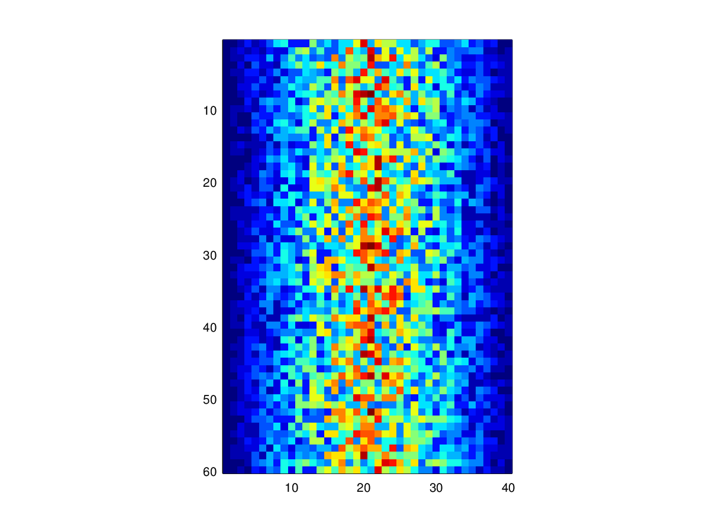

Our previous lessons have shown us how to manipulate
data, define our own functions, and repeat things.
However, the programs we have written so far always do
the same things, regardless of what data they're given.
We want programs to make choices based on the values
they are manipulating.

### Conditionals

The tool that MATLAB gives us for doing this is called
a [conditional statement](../../gloss.html#conditional-statement),
and it looks like this:

~~~
num = 37;

if num > 100
    disp('greater');
else
    disp('not greater');
end

disp('done');
~~~
{:class="in"}

~~~
not greater
done
~~~
{:class="out"}

The second line of this code uses the keyword `if` to tell MATLAB
that we want to make a choice. If the test that follows is true,
the body of the `if` (i.e., the lines between `if` and `else`) are
executed. If the test is false, the body of the `else` (i.e.,
the lines between `else` and `end`) are executed instead. Only one
or the other is ever executed.

Conditional statements don't have to have an `else` block. If there
isn't one, MATLAB simply doesn't do anything if the test is false:

~~~
num = 53
disp('before conditional...')

if num > 100:
    print '53 is greater than 100'
end

disp('...after conditional')
~~~
{:class="in"}

~~~
before conditional...
...after conditional
~~~
{:class="out"}

We can also chain several tests together using `elseif`. This makes it
simple to write a function that returns the sign of a number:

~~~
% function sign_of.m

function out = sign_of(num)

    if num > 0
        out = 1;

    elseif num == 0
        out = 0;

    else
        out = -1;
end
~~~

One important thing to notice in the code above is that we use
a double equals sign `==` to test for equality rather than a
single equals sign. This is because the latter is used to mean
assignment. In our test, we want to check for the equality of `num`
and `0`, not *assign* 0 to `num`. This convention was inherited
from C, and it does take a bit of getting used to...

We can also combine tests, using `&&` (and) and `||` (or). `&&`
is true if both tests are true:

~~~
if ((i > 0) && (-1 > 0))
    disp('both parts are true');
else
    disp('one part is not true');
end
~~~
{:class="in"}

~~~
one part is not true
~~~
{:class="out"}

`||` is true if either test is true:

~~~
if (1 < 0) || (3 < 4)
    disp('at least one part is true');
end
~~~
{:class="in"}

~~~
at least one part is true
~~~
{:class="out"}

In this case, "either" means "either or both", not
"either one or the other but not both".

### Challenges

1. `1` and `0` aren't the only values
   in MATLAB that are true or false. In fact, *any* value
   can be used in an `if` or `elseif`. After reading and
   running the code below, explain what the rule is for
   which values that are considered true and which are
   considered false.

   1.

   ~~~
   if
       disp('empty string is true')
   end
   ~~~

   2.

   ~~~
   if 'foo'
       disp('non empty string is true')
   end
   ~~~

   3.

   ~~~
   if []
       disp ('empty array is true')
   end
   ~~~

   4.

   ~~~
   if [22.5, 1.0]
       disp ('non empty array is true')
   end
   ~~~

   5.

   ~~~
   if [0, 0]
       disp ('array of zeros is true')
   end
   ~~~

   6.

   ~~~
   if true
       disp('true is true')
   end
   ~~~

2. Write a function called `near` that returns `1`
   when its first parameter is within 10% of its second
   and `0` otherwise. Compare your implementation with
   your partner's: do you return the same answer for
   all possible pairs of numbers?

### Nesting

Another thing to realize is that `if` statements can
be combined with loops just as easily as they can be
combined with functions. For example, if we want
to sum the positive numbers in a list, we can write
this:

~~~
numbers = [-5, 3, 2, -1, 9, 6];
total = 0;

for n = numbers
    if n >= 0
        total = total + n;
    end
end

disp(['sum of positive values: ', num2str(total)])
~~~
{:class="in"}

~~~
sum of positive values: 20
~~~
{:class="out"}

With a little extra effort, we can calculate the
positive and negative sums in a loop:

~~~
pos_total = 0;
neg_total = 0;

for n = numbers
    if n >= 0
        pos_total = total + n;
    else
        neg_total = neg_total + n;
    end
end

disp(['sum of positive values: ', num2str(pos_total)]);
disp(['sum of negative values: ', num2str(neg_total)]);
~~~
{:class="in"}

~~~
sum of positive values: 26
sum of negative values: -6
~~~

We can even put one loop inside another:

~~~
for consonant = 'bcd'
    for vowel = 'ae'
        disp (strcat(consonant, vowel));
    end
end
~~~
{:class="in"}

~~~
ba
be
ca
ce
da
de
~~~
{:class="out"}

### Challenges

1. Will changing the order of nesting in the above loop change
the output? Why? Write down the output you might expect from
changing the order of the loops, then rewrite the code to test
your hypothesis.

2. MATLAB (and most other languges in the C family) provides
[in-place operators](../../gloss.html#in-place-operator) that
work like this:

~~~
x = 1;
x += 1;
x *= 3;
~~~

Rewrite the code that sums the positive and negative values
in an array using these in-place operators. Do you think that
the result is more or less readable than the original?

### Creating a Heat Map

The last step is to turn our data into something we can see
and make sense of. As in previous lessons, we need to first
get the data in memory:

~~~
patient_data = csvread('inflammation-01.csv');
~~~
{:class="in"}

The heatmap from lesson 1 is useful, but fairly hard to read:

~~~
imagesc(patient_data);
colorbar();
~~~
{:class="in"}

Let's write some code to give us a plot that's a little more useful:

~~~
[height, width] = size(patient_data);
heatmap = zeros(height, width);

for y = 1:height
    for x = 1:width
        if patient_data(y, x) > mean(patient_data(:))
            heatmap(y, x) = 1;
        elseif patient_data(y, x) < mean(patient_data(:))
            heatmap(y, x) = -1;
        else
            heatmap(y, x) = 0;
        end
    end
end

imagesc(heatmap);
colorbar();
~~~

This is slightly better, but there are still a few things
wrong with it:

1. Red against blue is pretty hard on the eyes.

2. The heatmap shows only two colors because none of the (integer)
   measurements has the exact value as the mean.

3. We are calculating the mean of the data each time we go through
   the loop. On our 40 &times; 60 dataset, this means we are performing
   the same calculation 2400 times.

Here's how we can improve it:

1. We can pick better colors, and create our own
[colormap](../../gloss.html#colormap)

2. Instead of hecking if values are exactly equal to the mean,
we can check if they are close to it.

3. We can calculate the mean once, before the loop, and use
that value over and over. The cost of computing the mean is much
more than retrieving its value from memory.

Our modified code looks like this:

~~~
[height, width] = size(patient_data);
heatmap = zeros(height, width);
center = mean(patient_data(:));

for y = 1:height
    for x = 1:width

        if patient_data(y, x) > 1.9*center
            heatmap(y, x) = 1;
        elseif patient_data(y, x) < 0.9*mean(patient_data(:))
            heatmap(y, x) = -1;
        else
            heatmap(y, x) = 0;
        end
    end
end

imagesc(heatmap);
colorbar();
~~~

This is better, but we might want to widen the band around the mean
that gets that color.

But to do that, we'll have to go back to our
code and change some numerical values (`1.9` and `0.9` in the
code above). This is almost certainly a bad idea. Let's write a
function to make things easier:

~~~
% make_heatmap.m

function heatmap = make_heatmap(data, low_band, high_band)

    % Make a 3-colored heatmap from
    % a 2D array of data.

    heatmap = zeros(height, width);
    center = mean(patient_data(:));

    for y = 1:height
        for x = 1:width
            if patient_data(y, x) > high_band*center
                heatmap(y, x) = 1;
            elseif patient_data(y, x) < low_band*mean(patient_data(:))
                heatmap(y, x) = -1;
            else
                heatmap(y, x) = 0;
            end
        end
    end

end
~~~

To test this function, we can run it with the settings we just
used:

~~~
heatmap = make_heatmap(patient_data, 0.8, 1.2);
imagesc(heatmap);
colorbar();
~~~
{:class="in"}

~~~

~~~
{:class="out"}

That seems right, so let's widen the band:

~~~
heatmap = make_heatmap(patient_data, 0.6, 1.4);
imagesc(heatmap);
colorbar();
~~~
{:class="in"}

~~~

~~~
{:class="out"}

### Colormaps

<!-- FIXME: add a section on colormaps -->
<!-- is this required? -->

#### Challenges

1. Why does the `make_heatmap` function return an array instead
of displaying it immediately? Do you think this is a good
design choice?

### Next Steps

<!--FIXME: add next steps here-->

Before we're ready to publish our `make_heatmap` function, we need
to learn how to test whether our code is doing what we need it to do.
