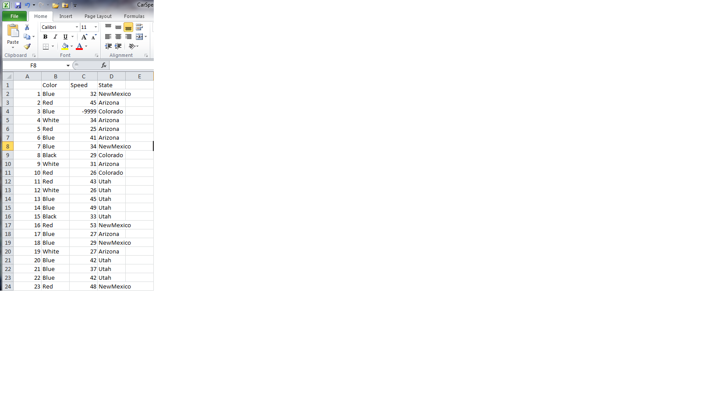
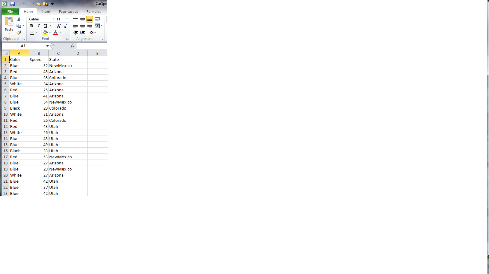

```{r, include = FALSE}
source('chunk-options.R')
```


## Reading and writing .csv

The most common way that scientists store data is in Excel spreadsheets. While there are R packages designed to access data from Excel spreadsheets (e.g., gdata, RODBC, XLConnect, xlsx, RExcel), users often find it easier to save their spreadsheets in [comma-separated values](../../gloss.html#comma-separeted-values) files (CSV) and then use R's built in functionality to read and manipulate the data. In this short lesson, we'll learn how to read data from a .csv and write to a new .csv, and explore the [arguments](../../gloss.html#argument) that allow you read and write the data correctly for your needs.


#### Objectives

  * Read in a .csv, and explore the arguments of the csv reader
  *	Write the altered data set to a new .csv, and explore the arguments


### Read a .csv and explore the arguments

Let's start by opening a .csv file containing information on the speeds at which cars of different colors were clocked in 45 mph zones in the four-corners states (`CarSpeeds.csv`). We will use the built in `read.csv(...)` [function call](../../gloss.html#function-call), which reads the data in as a data frame, and assign the data frame to a variable (using `<-`) so that it is stored in R's memory. Then we will explore some of the basic arguments that can be supplied to the function.

```{r setwd, eval=FALSE}
#First, set a working directory (see lesson 'Analyzing Patient Data' for more info)
setwd('~/swc')
```

```{r readData}
#Import the data and look at the first six rows
carSpeeds <- read.csv(file='car-speeds.csv')
head(carSpeeds) 
```

> **Tip:** The default delimiter of the read.csv() function is a comma, but you can use other delimiters by supplying the 'sep' argument to the function (e.g., typing `sep = ';'` allows a semi-colon separated file to be correctly imported -see ?read.csv() for more information on this and other options for working with different file types).

The call above will import the data, but we have not taken advantage of several handy arguments that can be helpful in loading the data in the format we want. Let's explore some of these arguments.


#### The header argument

The default for `read.csv(...)` is to set the `header` argument to `TRUE`. This means that the first row of values in the .csv is set as header information (column names). If your data set does not have a header, set the `header` argument to `FALSE`:

```{r headerFALSE}
#The first row of the data without setting the header argument:
carSpeeds[1,]

#The first row of the data if the header argument is set to FALSE:
carSpeeds <- read.csv(file='car-speeds.csv', header=FALSE)

carSpeeds[1,]
```

Clearly this is not the desired behavior for this data set, but it may be useful if you have a dataset without headers.


#### The stringsAsFactors argument
This is perhaps the most important argument in `read.csv()`, particularly if you are working with categorical data. This is because the default behavior of R is to convert character [string](../../gloss.html#string)s into factors, which may make it difficult to do such things as replace values. For example, let's say we find out that the data collector was color blind, and accidentally recorded green cars as being blue. In order to correct the data set, let's replace 'Blue' with 'Green' in the `$Color` column:

```{r stringsAsFactorsTRUE}
#Here we will use R's ifelse function, in which we provide the test phrase, the outcome if the 
# result of the test is 'TRUE', and the outcome if the result is 'FALSE'. We will also assign 
# the results to the Color column, using '<-'

#First - reload the data with a header
carSpeeds <- read.csv(file='car-speeds.csv')

carSpeeds$Color<- ifelse(carSpeeds$Color=='Blue', 'Green', carSpeeds$Color)
carSpeeds$Color
```

What happened?!? It looks like 'Blue'  was replaced with 'Green', but every other color was turned into a number (as a character string, given the quote marks before and after). This is because the colors of the cars were loaded as factors, and the factor level was reported following replacement.

Now, let's load the dataset using `stringsAsFactors=FALSE`, and see what happens when we try to replace 'Blue' with 'Green' in the `$Color` column:

```{r StringsAsFactorFALSE}
carSpeeds <- read.csv(file='car-speeds.csv', stringsAsFactors=FALSE)

carSpeeds$Color<- ifelse(carSpeeds$Color=='Blue', 'Green', carSpeeds$Color)
carSpeeds$Color
```

That's better!


#### The as.is argument
This is an extension of the `stringsAsFactors` argument, but gives you control over individual columns. For example, if we want the colors of cars imported as strings, but we want the names of the states imported as factors, we would load the data set as:

```{r as.is1}
carSpeeds <- read.csv(file='car-speeds.csv', as.is = 1) 

#Note, the 1 applies as.is to the first column only
```

Now we can see that if we try to replace 'Blue' with 'Green' in the `$Color` column everything looks fine, while trying to replace 'Arizona' with 'Ohio' in the `$State` column returns the factor numbers for the names of states that we haven't replaced:

```{r as.isResults}
carSpeeds$Color<- ifelse(carSpeeds$Color=='Blue', 'Green', carSpeeds$Color)
carSpeeds$Color

carSpeeds$State<- ifelse(carSpeeds$State=='Arizona','Ohio',carSpeeds$State)
carSpeeds$State
```

#### Challenge:
Suppose we want to keep the colors of cars as factors for some other operations we want to perform. Write code for replacing 'Blue' with 'Green' in the `$Color` column of the cars dataset without importing the data with `stringsAsFactors=FALSE`.

```{r Challenge, include=FALSE}
carSpeeds <- read.csv(file='car-speeds.csv')

#Replace 'Blue' with 'Green' in cars$Color without using the stringsAsFactors or as.is arguments
carSpeeds$Color<- ifelse(as.character(carSpeeds$Color)=='Blue', 'Green', as.character(carSpeeds$Color))

#Convert colors back to factors
carSpeeds$Color<-as.factor(carSpeeds$Color)
```


#### The strip.white argument
It is not uncommon for mistakes to have been made when the data were recorded, for example a space (whitespace) may have been inserted before a data value. By default this whitespace will be kept in the R environment, such that ' Red' will be recognized as a different value than 'Red'. In order to avoid this type of error, use the `strip.white` argument. Let's see how this works by checking for the unique values in the `$Color` column of our dataset:

Here, the data recorder added a space before the color of the car in one of the cells:

```{r strip.whiteFALSE}
#We use the built in unique() function to extract the unique colors in our dataset
 
unique(carSpeeds$Color)
```

Oops, we see two values for red cars.

Let's try again, this time importing the data using the `strip.white` argument. NOTE - this argument must be accompanied by the `sep` argument, by which we indicate the type of delimiter in the file (the comma for most .csv files)

```{r strip.whiteTRUE}
carSpeeds<-read.csv(file='car-speeds.csv',stringsAsFactors=FALSE,strip.white=TRUE,sep=',')
 
unique(carSpeeds$Color)
```

That's better!


### Write a new .csv and explore the arguments

After altering our cars dataset by replacing 'Blue' with 'Green' in the `$Color` column, we now want to save the output. There are several arguments for the `write.csv(...)` [function call](../../gloss.html#function-call), a few of which are particularly important for how the data are exported.  Let's explore these now.

```{r writeData}
#Export the data. The write.csv() function requires a minimum of two arguments, the data to be saved and the name of the output file.

write.csv(carSpeeds, file='car-speeds-cleaned.csv')
```

If you open the file, you'll see that it has header names, because the data had headers within R, but that there are numbers in the first column.




#### The row.names argument
This argument allows us to set the names of the rows in the output data file. R's default for this argument is `TRUE`, and since it does not know what else to name the rows for the cars data set, it resorts to using row numbers. To correct this, we can set `row.names` to `FALSE`:

```{r row.namesFALSE}
write.csv(carSpeeds, file='car-speeds-cleaned.csv', row.names=FALSE)
```

Now we see: 



> **Tip:** there is also a `col.names` argument, which can be used to set the column names for a data set without headers. If the data set already has headers (e.g., we used the headers = TRUE argument when importing the data) then a `col.names` argument will be ignored.


#### The na argument
There are times when we want to specify certain values for `NA`s in the data set (e.g., we are going to pass the data to a program that only accepts -9999 as a nodata value). In this case, we want to set the `NA` value of our output file to the desired value, using the `na` argument. Let's see how this works:

```{r naDefault}
#First, replace the speed in the 3rd row with NA, by using an index (square brackets to indicate the position of the value we want to replace)
carSpeeds$Speed[3]<-NA
head(carSpeeds)

write.csv(carSpeeds, file='car-speeds-cleaned.csv', row.names=FALSE)
```

Now we'll set `NA` to -9999 when we write the new .csv file:

```{r naUserSelected}
#Note - the na argument requires a string input
write.csv(carSpeeds, file='car-speeds-cleaned.csv', row.names=FALSE, na= '-9999')
```

And we see:


#### Key Points

  * Import data from a .csv file using the  `read.csv(...)` function.
  * Understand some of the key arguments available for importing the data properly
    + `header`
    + `stringsAsFactors`
    + `as.is`
    + `strip.white`
  * Write data to a new .csv file using the `write.csv(...)` function
  * Understand some of the key arguments available for exporting the data properly
    + `row.names` / `col.names`
    + `na`

#### Next Steps
We have now explored data import and export from .csv files. There are several more arguments available for both the `read.csv(...)` and `write.csv(...)` functions, as well as similar options for working with data that are stored in other text formats (e.g., .txt).  To find out more, use the R help commands '?read.csv()' and '?write.csv()'.

In the next lessons, we'll explore how to work with and analyze data in the R environment.
