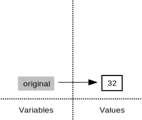
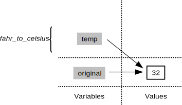
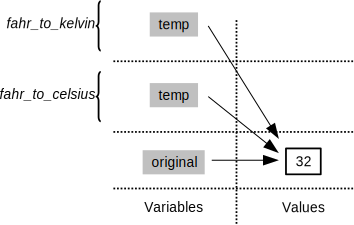
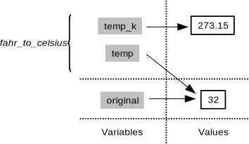
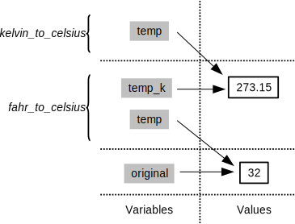
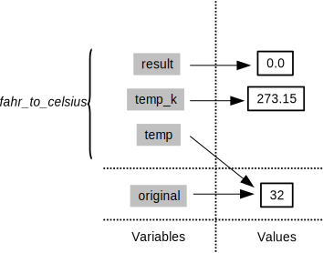
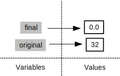

```{r, include = FALSE}
source("chunk_options.R")
opts_chunk$set(fig.path = "figure/02-func-R-")
```

## Creating Functions

If we only had one data set to analyze, it would probably be faster to load the file into a spreadsheet and use that to plot some simple statistics. 
But we have twelve files to check, and may have more in the future.
In this lesson, we'll learn how to write a function so that we can repeat several operations with a single command.

#### Objectives

* Define a function that takes arguments.
* Return a value from a function.
* Test a function.
* Explain what a call stack is, and trace changes to the call stack as functions are called.
* Set default values for function arguments.
* Explain why we should divide programs into small, single-purpose functions.

### Defining a function

Let's start by defining a function `fahr_to_kelvin` that converts temperatures from Fahrenheit to Kelvin:

```{r}
fahr_to_kelvin <- function(temp) {
  kelvin <- ((temp - 32) * (5 / 9)) + 273.15
  return(kelvin)
}
```

We define `fahr_to_kelvin` by assigning it to the output of `function`.
The list of argument names are containted within parentheses.
Next, the [body](../../gloss.html#function-body) of the function--the statements that are executed when it runs--is contained within curly braces (`{}`).
The statements in the body are indented by two spaces.
This makes the code easier to read but does not affect how the code operates. 

When we call the function, the values we pass to it are assigned to those variables so that we can use them inside the function.
Inside the function, we use a [return statement](../../gloss.html#return-statement) to send a result back to whoever asked for it.

> **Tip:** One feature unique to R is that the return statement is not required.
R automatically returns whichever variable is on the last line of the body of the function.
Since we are just learning, we will explicitly define the return statement.

Let's try running our function.
Calling our own function is no different from calling any other function:

```{r}
# freezing point of water
fahr_to_kelvin(32)
# boiling point of water
fahr_to_kelvin(212)
```

We've successfully called the function that we defined, and we have access to the value that we returned.

### Composing Functions

Now that we've seen how to turn Fahrenheit into Kelvin, it's easy to turn Kelvin into Celsius:

```{r}
kelvin_to_celsius <- function(temp) {
  celsius <- temp - 273.15
  return(celsius)
}

#absolute zero in Celsius
kelvin_to_celsius(0)
```

What about converting Fahrenheit to Celsius?
We could write out the formula, but we don't need to.
Instead, we can [compose](../../gloss.html#function-composition) the two functions we have already created:

```{r}
fahr_to_celsius <- function(temp) {
  temp_k <- fahr_to_kelvin(temp)
  result <- kelvin_to_celsius(temp_k)
  return(result)
}

# freezing point of water in Celsius
fahr_to_celsius(32.0)
```

This is our first taste of how larger programs are built: we define basic operations, then combine them in ever-large chunks to get the effect we want. 
Real-life functions will usually be larger than the ones shown here--typically half a dozen to a few dozen lines--but they shouldn't ever be much longer than that, or the next person who reads it won't be able to understand what's going on.

#### Challenges

  + In the last lesson, we learned to **c**oncatenate elements into a vector using the `c` function, e.g. `x <- c("A", "B", "C")` creates a vector `x` with three elements.
  Furthermore, we can extend that vector again using `c`, e.g. `y <- c(x, "D")` creates a vector `y` with four elements.
  Write a function called `fence` that takes two vectors as arguments, called `original` and `wrapper`, and returns a new vector that has the wrapper vector at the beginning and end of the original:
  
```{r, include=FALSE}
fence <- function(original, wrapper) {
  answer <- c(wrapper, original, wrapper)
  return(answer)
}
```
  
```{r}
best_practice <- c("Write", "programs", "for", "people", "not", "computers")
asterisk <- "***"  # R interprets a variable with a single value as a vector
                   # with one element.
fence(best_practice, asterisk)
```

  + If the variable `v` refers to a vector, then `v[1]` is the vector's first element and `v[length(v)]` is its last (the function `length` returns the number of elements in a vector).
    Write a function called `outer` that returns a vector made up of just the first and last elements of its input:
    
```{r, include=FALSE}
outer <- function(v) {
  first <- v[1]
  last <- v[length(v)]
  answer <- c(first, last)
  return(answer)
}
```

```{r}
dry_principle <- c("Don't", "repeat", "yourself", "or", "others")
outer(dry_principle)
```

### The Call Stack

Let's take a closer look at what happens when we call `fahr_to_celsius(32)`. To make things clearer, we'll start by putting the initial value 32 in a variable and store the final result in one as well:

```{r}
original <- 32
final <- fahr_to_celsius(original)
```

The diagram below shows what memory looks like after the first line has been executed:



When we call `fahr_to_celsius`, R *doesn't* create the variable `temp` right away.
Instead, it creates something called a [stack frame](../../gloss.html#stack-frame) to keep track of the variables defined by `fahr_to_kelvin`.
Initially, this stack frame only holds the value of `temp`:



When we call `fahr_to_kelvin` inside `fahr_to_celsius`, R creates another stack frame to hold `fahr_to_kelvin`'s variables:



It does this because there are now two variables in play called `temp`: the argument to `fahr_to_celsius`, and the argument to `fahr_to_kelvin`.
Having two variables with the same name in the same part of the program would be ambiguous, so R (and every other modern programming language) creates a new stack frame for each function call to keep that function's variables separate from those defined by other functions.

When the call to `fahr_to_kelvin` returns a value, R throws away `fahr_to_kelvin`'s stack frame and creates a new variable in the stack frame for `fahr_to_celsius` to hold the temperature in Kelvin:



It then calls `kelvin_to_celsius`, which means it creates a stack frame to hold that function's variables:



Once again, R throws away that stack frame when `kelvin_to_celsius` is done
and creates the variable `result` in the stack frame for `fahr_to_celsius`:



Finally, when `fahr_to_celsius` is done, R throws away *its* stack frame and puts its result in a new variable called `final` that lives in the stack frame we started with:



This final stack frame is always there;
it holds the variables we defined outside the functions in our code.
What it *doesn't* hold is the variables that were in the various stack frames.
If we try to get the value of `temp` after our functions have finished running, R tells us that there's no such thing:

```{r}
temp
```

> **Tip:** The explanation of the stack frame above was very general and the basic concept will help you understand most languages you try to program with.
However, R has some unique aspects that can be exploited when performing more complicated operations.
We will not be writing anything that requires knowledge of these more advanced concepts.
In the future when you are comfortable writing functions in R, you can learn more by reading the [R Language Manual][man] or this [chapter][] from [Advanced R Programming][adv-r] by Hadley Wickham.
For context, R uses the terminology "environments" instead of frames.

[man]: http://cran.r-project.org/doc/manuals/r-release/R-lang.html#Environment-objects
[chapter]: http://adv-r.had.co.nz/Environments.html
[adv-r]: http://adv-r.had.co.nz/

Why go to all this trouble? Well, here's a function called `span` that calculates the difference between the mininum and maximum values in an array:

```{r}
span <- function(a) {
  diff <- max(a) - min(a)
  return(diff)
}

dat <- read.csv(file = "inflammation-01.csv", header = FALSE)
# span of inflammation data
span(dat)
```

Notice `span` assigns a value to variable called `diff`. We might very well use a variable with the same name (`diff`) to hold the inflammation data:

```{r}
diff <- read.csv(file = "inflammation-01.csv", header = FALSE)
# span of inflammation data
span(diff)
```

We don't expect the variable `diff` to have the value `r span(diff)` after this function call, so the name `diff` cannot refer to the same variable defined inside `span` as it does in as it does in the main body of our program (which R refers to as the global environment).
And yes, we could probably choose a different name than `diff` for our variable in this case, but we don't want to have to read every line of code of the R functions we call to see what variable names they use, just in case they change the values of our variables.

The big idea here is [encapsulation](../../gloss.html#encapsulation), and it's the key to writing correct, comprehensible programs.
A function's job is to turn several operations into one so that we can think about a single function call instead of a dozen or a hundred statements each time we want to do something.
That only works if functions don't interfere with each other; if they do, we have to pay attention to the details once again, which quickly overloads our short-term memory.

#### Challenges

  + We previously wrote functions called `fence` and `outer`.
    Draw a diagram showing how the call stack changes when we run the following:

```{r, results="hide"}
inside <- "carbon"
outside <- "+"
result <- outer(fence(inside, outside))
```

### Testing and Documenting

Once we start putting things in functions so that we can re-use them, we need to start testing that those functions are working correctly.
To see how to do this, let's write a function to center a dataset around a particular value:

```{r}
center <- function(data, desired) {
  new_data <- (data - mean(data)) + desired
  return(new_data)
}
```

We could test this on our actual data, but since we don't know what the values ought to be, it will be hard to tell if the result was correct.
Instead, let's create a vector of 0s and then center that around 3.
This will make it simple to see if our function is working as expected:

```{r, }
z <- c(0, 0, 0, 0)
z
center(z, 3)
```

That looks right, so let's try center on our real data. We'll center the inflammation data from day 4 around 0:

```{r}
dat <- read.csv(file = "inflammation-01.csv", header = FALSE)
centered <- center(dat[, 4], 0)
head(centered)
```

It's hard to tell from the default output whether the result is correct, but there are a few simple tests that will reassure us:

```{r}
# original min
min(dat[, 4])
# original mean
mean(dat[, 4])
# original max
max(dat[, 4])
# centered min
min(centered)
# centered mean
mean(centered)
# centered max
max(centered)
```

That seems almost right: the original mean was about `r round(mean(dat[, 4]), 2)`, so the lower bound from zero is now about `r -round(mean(dat[, 4]), 2)`.
The mean of the centered data is `r mean(centered)`.
We can even go further and check that the standard deviation hasn't changed:

```{r}
# original standard deviation
sd(dat[, 4])
# centerted standard deviation
sd(centered)
```

Those values look the same, but we probably wouldn't notice if they were different in the sixth decimal place.
Let's do this instead:

```{r}
# difference in standard deviations before and after
sd(dat[, 4]) - sd(centered)
```

Sometimes, a very small difference can be detected due to rounding at very low decimal places.
R has a useful function for comparing two objects allowing for rounding errors, `all.equal`:

```{r}
all.equal(sd(dat[, 4]), sd(centered))
```

It's still possible that our function is wrong, but it seems unlikely enough that we should probably get back to doing our analysis.
We have one more task first, though: we should write some [documentation](../../gloss.html#documentation) for our function to remind ourselves later what it's for and how to use it.

A common way to put documentation in software is to add [comments](../../gloss.html#comment) like this:

```{r}
center <- function(data, desired) {
  # return a new vector containing the original data centered around the
  # desired value.
  # Example: center(c(1, 2, 3), 0) => c(-1, 0, 1)
  new_data <- (data - mean(data)) + desired
  return(new_data)
}
```

> **Tip:** Formal documentation for R functions is written in separate `.Rd` using a markup language similar to [LaTeX][].
You see the result of this documentation when you look at the help file for a given function, e.g. `?read.csv`.
The [roxygen2][] package allows R coders to write documentation alongside the function code and then process it into the appropriate `.Rd` files.
You will want to switch to this more formal method of writing documentation when you start writing more complicated R projects.

[LaTeX]: http://www.latex-project.org/
[roxygen2]: http://cran.r-project.org/web/packages/roxygen2/vignettes/rd.html

#### Challenges

  + Write a function called `analyze` that takes a filename as a argument and displays the three graphs produced in the [previous lesson][01] (average, min and max inflammation over time).
  `analyze("inflammation-01.csv")` should produce the graphs already shown, while `analyze("inflammation-02.csv")` should produce corresponding graphs for the second data set. Be sure to document your function with comments.

[01]: 01-starting-with-data.html

```{r, include=FALSE}
analyze <- function(filename) {
  # Plots the average, min, and max inflammation over time.
  # Input is character string of a csv file.
  dat <- read.csv(file = filename, header = FALSE)
  avg_day_inflammation <- apply(dat, 2, mean)
  plot(avg_day_inflammation)
  max_day_inflammation <- apply(dat, 2, max)
  plot(max_day_inflammation)
  min_day_inflammation <- apply(dat, 2, min)
  plot(min_day_inflammation)
}
```

  + Write a function `rescale` that takes a vector as input and returns a corresponding vector of values scaled to lie in the range 0 to 1.
  (If $L$ and $H$ are the lowest and highest values in the original vector, then the replacement for a value $v$ should be $(v-L) / (H-L)$.)
  Be sure to document your function with comments.

```{r, include=FALSE}
rescale <- function(v) {
  # Rescales a vector, v, to lie in the range 0 to 1.
  L <- min(v)
  H <- max(v)
  result <- (v - L) / (H - L)
  return(result)
}
```

  + Test that your `rescale` function is working properly using `min`, `max`, and `plot`.

```{r rescale-test, include=FALSE}
answer <- rescale(dat[, 4])
min(answer)
max(answer)
plot(answer)
plot(dat[, 4], answer)  # This hasn't been introduced yet, but it may be
                        # useful to show when explaining the answer.
```

### Defining Defaults

We have passed arguments to functions in two ways: directly, as in `dim(dat)`, and by name, as in `read.csv(file = "inflammation-01.csv", header = FALSE)`.
In fact, we can pass the arguments to `read.csv` without naming them:

```{r}
dat <- read.csv("inflammation-01.csv", FALSE)
```

However, the position of the arguments matters if they are not named.

```{r}
dat <- read.csv(header = FALSE, file = "inflammation-01.csv")
dat <- read.csv(FALSE, "inflammation-01.csv")
```

To understand what's going on, and make our own functions easier to use, let's re-define our `center` function like this:

```{r}
center <- function(data, desired = 0) {
  # return a new vector containing the original data centered around the
  # desired value (0 by default).
  # Example: center(c(1, 2, 3), 0) => c(-1, 0, 1)
  new_data <- (data - mean(data)) + desired
  return(new_data)
}
```

The key change is that the second argument is now written `desired = 0` instead of just `desired`.
If we call the function with two arguments, it works as it did before:

```{r}
test_data <- c(0, 0, 0, 0)
center(test_data, 3)
```

But we can also now call `center()` with just one argument, in which case `desired` is automatically assigned the default value of `0`:

```{r}
more_data <- 5 + test_data
more_data
center(more_data)
```

This is handy: if we usually want a function to work one way, but occasionally need it to do something else, we can allow people to pass an argument when they need to but provide a default to make the normal case easier.

The example below shows how R matches values to arguments

```{r}
display <- function(a = 1, b = 2, c = 3) {
  result <- c(a, b, c)
  names(result) <- c("a", "b", "c")  # This names each element of the vector
  return(result)
}

# no arguments
display()
# one argument
display(55)
# two arguments
display(55, 66)
# three arguments
display (55, 66, 77)
```

As this example shows, arguments are matched from left to right, and any that haven't been given a value explicitly get their default value.
We can override this behavior by naming the value as we pass it in:

```{r}
# only setting the value of c
display(c = 77)
```

> **Tip:** To be precise, R has three ways that arguments supplied by you are matched to the *formal arguments* of the function definition
>
> 1. by complete name, 
> 2. by partial name (matching on initial *n* characters of the argument name), and
> 3. by position.
>
> Arguments are matched in the manner outlined above in *that order*: by complete name, then by partial matching of names, and finally by position.

With that in hand, let's look at the help for `read.csv()`:

```{r, eval=FALSE}
?read.csv
```

There's a lot of information there, but the most important part is the first couple of lines:

```{r, eval=FALSE}
read.csv(file, header = TRUE, sep = ",", quote = "\"",
         dec = ".", fill = TRUE, comment.char = "", ...)
```

This tells us that `read.csv()` has one argument, `file`, that doesn't have a default value, and six others that do.
Now we understand why the following gives an error:

```{r, results="hide"}
dat <- read.csv(FALSE, "inflammation-01.csv")
```

It fails because `FALSE` is assigned to `file` and the filename is assigned to the argument `header`.

#### Challenges

  + Rewrite the `rescale` function so that it scales a vector to lie between 0 and 1 by default, but will allow the caller to specify lower and upper bounds if they want.
  Compare your implementation to your neighbor's: do the two functions always behave the same way?

```{r, include=FALSE}
rescale <- function(v, lower = 0, upper = 1) {
  # Rescales a vector, v, to lie in the range lower to upper.
  L <- min(v)
  H <- max(v)
  result <- (v - L) / (H - L) * (upper - lower) + lower
  return(result)
}
answer <- rescale(dat[, 4], lower = 2, upper = 5)
min(answer)
max(answer)
answer <- rescale(dat[, 4], lower = -5, upper = -2)
min(answer)
max(answer)
```

#### Key Points

* Define a function using `name <- function(...args...)`.
* The body of a function should be surrounded by curly braces (`{}`).
* Call a function using `name(...values...)`.
* Each time a function is called, a new stack frame is created on the [call stack](../../gloss.html#call-stack) to hold its arguments and local variables.
* R looks for variables in the current stack frame before looking for them at the top level.
* Use `help(thing)` to view help for something.
* Put comments at the beginning of functions to provide help for that function.
* Annotate your code!
* Specify default values for arguments when defining a function using `name = value` in the argument list.
* Arguments can be passed by matching based on name, by position, or by omitting them (in which case the default value is used).

#### Next Steps

We now have a function called analyze to visualize a single data set.
We could use it to explore all 12 of our current data sets like this:

```{r, eval=FALSE}
analyze("inflammation-01.csv")
analyze("inflammation-02.csv")
#...
analyze("inflammation-12.csv")
```

but the chances of us typing all 12 filenames correctly aren't great, and we'll be even worse off if we get another hundred files.
What we need is a way to tell R to do something once for each file, and that will be the subject of the next lesson.
