When working at the command line, you might not recognise your
prompt.  On this page you will find tips to discover where you are and how to
exit if you are not where you want to be.

### Shell

- If your shell prompt is `$` you are at `bash`.

  

  To exit from `bash` type `exit` and press `ENTER`.

- If your shell prompt is `>` you may have typed `'` or `"`, to specify a
  string, as part of a shell command but have not typed another `'` or `"` to
  close the string.

  

  To interrupt the current command press `CTRL-C`.

- If the bottom-left of your shell window shows `--More--` you are viewing
  a file using `more`.

  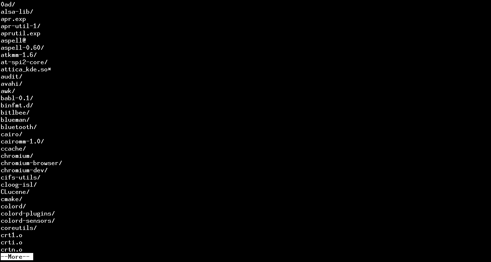

  To exit from `more` press `q`.

- If the bottom-left of your shell window shows `filename`, `:` or `(END)` you
  are viewing a file using `less`.

  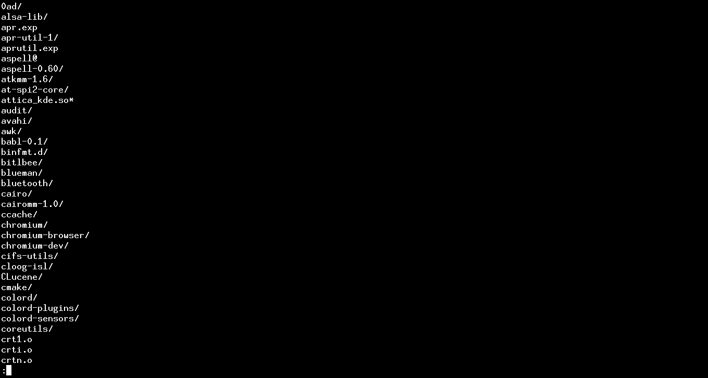

  To exit from `less` press `q`.

- If the bottom-left of your shell window shows `Manual page` you are
  viewing a `man` page.

  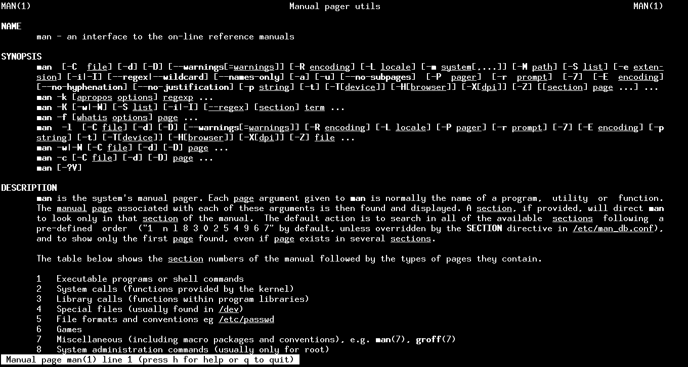

  To exit from `man` press `q`.

- If the top of your shell window shows "GNU nano" you are in the `nano` text editor.

  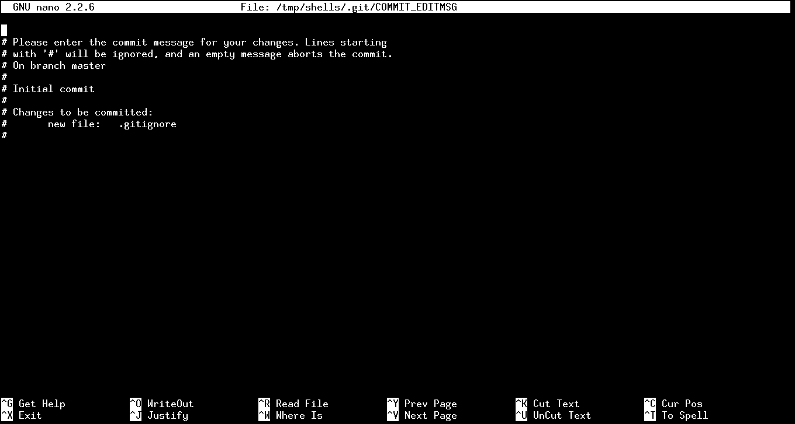

  To exit from `nano` press `CTRL-X`. If you have unsaved changes, you will be
  asked to save these - press `y` to save, or `n` to quit without saving.

- If your shell window shows `~` at the beginning of each lines you are in the `vi`
  text editor.

  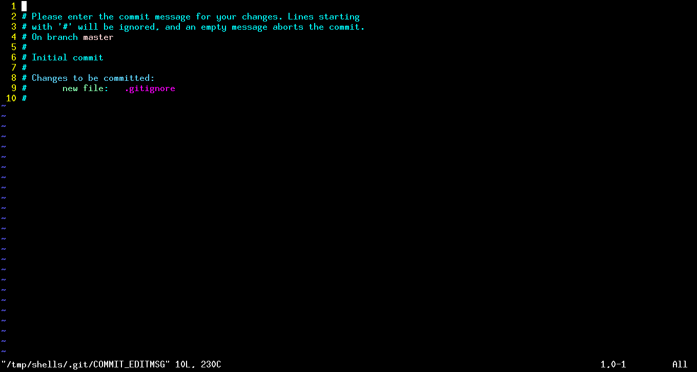

  To exit from `vi` type `:q!` to exit without saving. If this text just appears
  on screen then press `ESC` then type `:q!`.

- If the bottom of your shell window shows `(Fundamental) ----`
  you are in the `emacs` or `xemacs` text editor.

  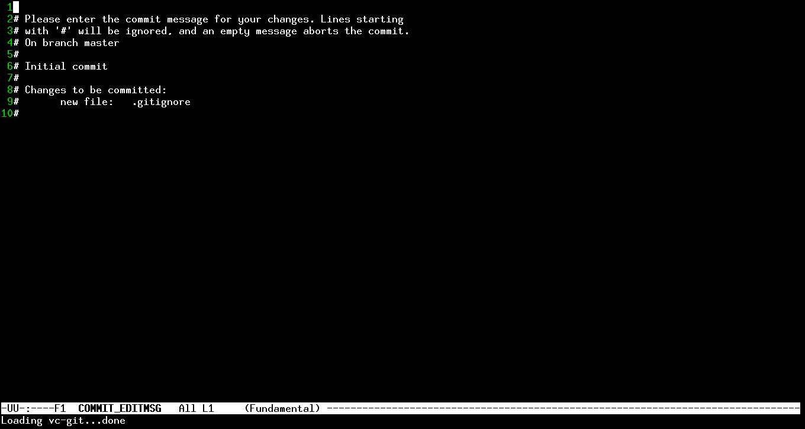

  To exit from `emacs` or `xemacs` press `CTRL-X CTRL-C`. If you have unsaved
  changes, you will be asked to save these - press `y` to save, or `n` then type
  `yes` to quit without saving.

  > #### Calling GUI from console
  >
  > Emacs has a graphical user interface mode. When you call it from the prompt,
  > the prompt will stop responding to your commands until you close Emacs.
  >
  > 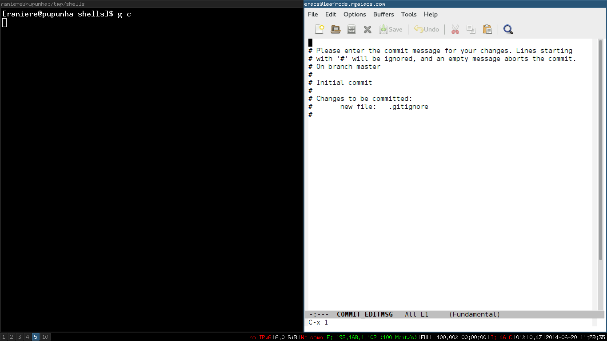

### Python

- If your shell prompt is `>>>` you are in `python`.

  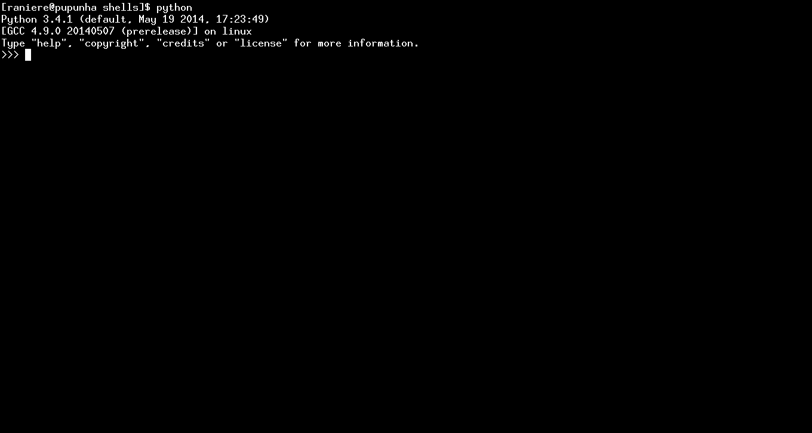

  To exit from `python` type `exit()` or `CTRL-D`.

- If your shell prompt is `...` you have an unclosed environment inside
  `python`.

  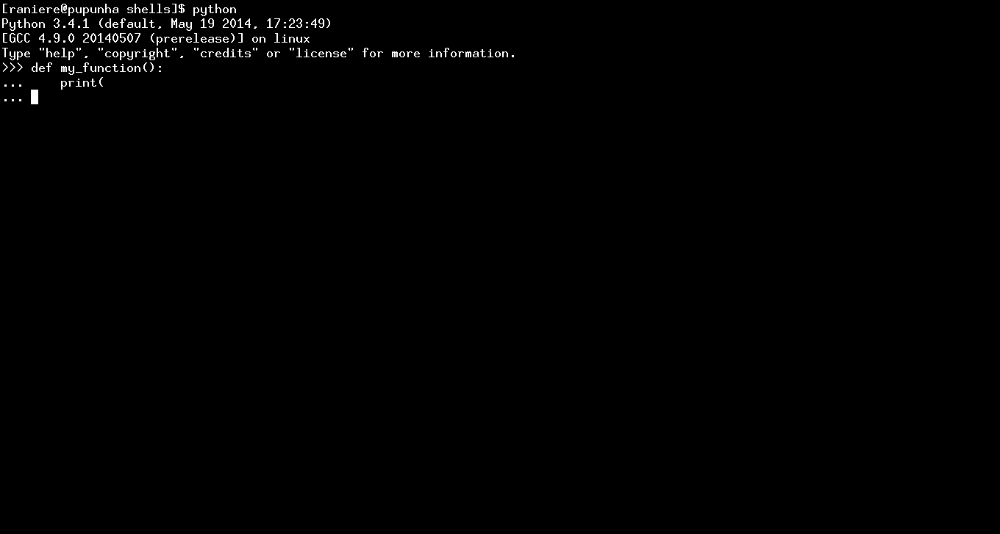

  To interrupt the environment type `CTRL-C`.

- If your shell prompt is `In [123]:` you are in `ipython`.

  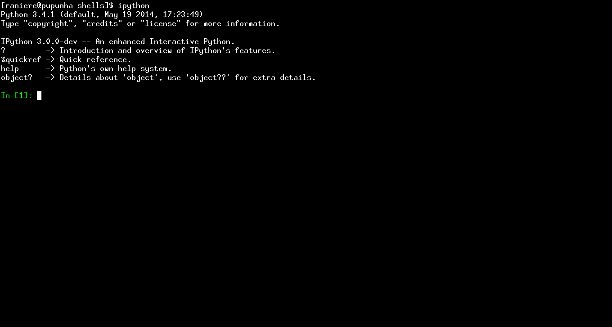

  To exit from `ipython` type `exit()`, or `CTRL-D` then press `y`.

- If your shell prompt is `...:` you have an unclosed environment inside
  `ipython`.

  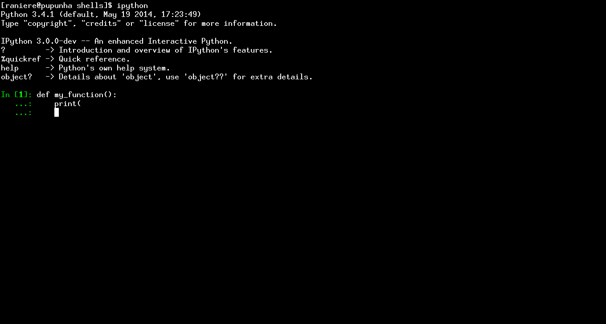

  To interrupt the environment type `CTRL-C`.

### R

- If your shell prompt is `>` you are in `R`.

  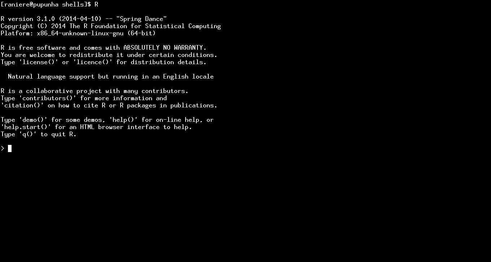

  To exit from `R` type `q()`. It will ask if you want to save the workspace and
  you should type `y` for yes and `n` for no.

- If your shell prompt is `+` you have a unclosed environment inside `R`.

  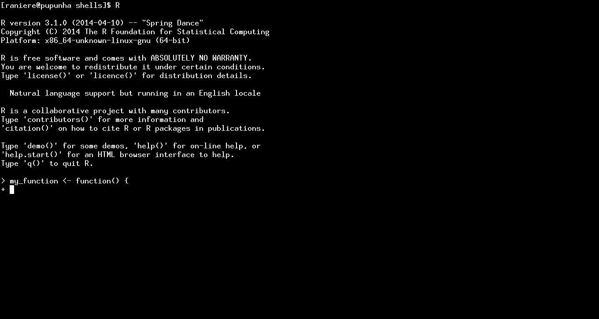

  To interrupt the environment type `CTRL-C`.
